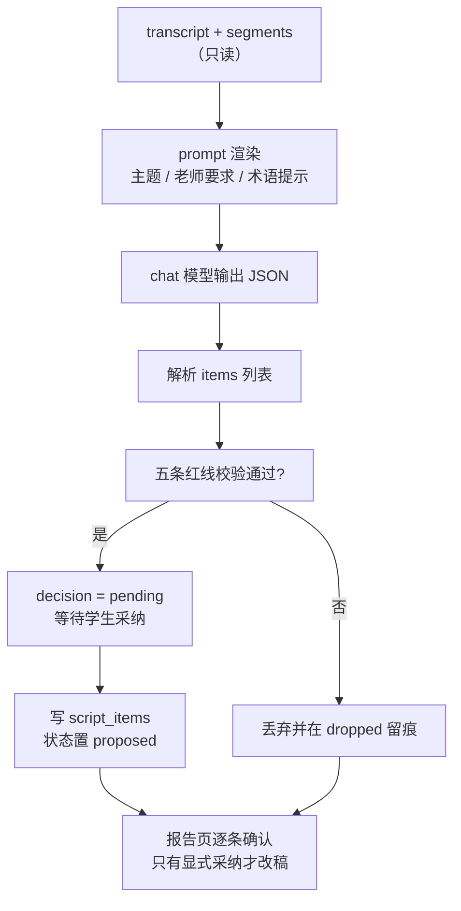
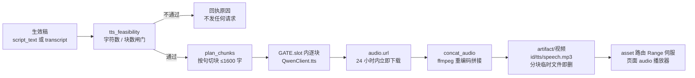
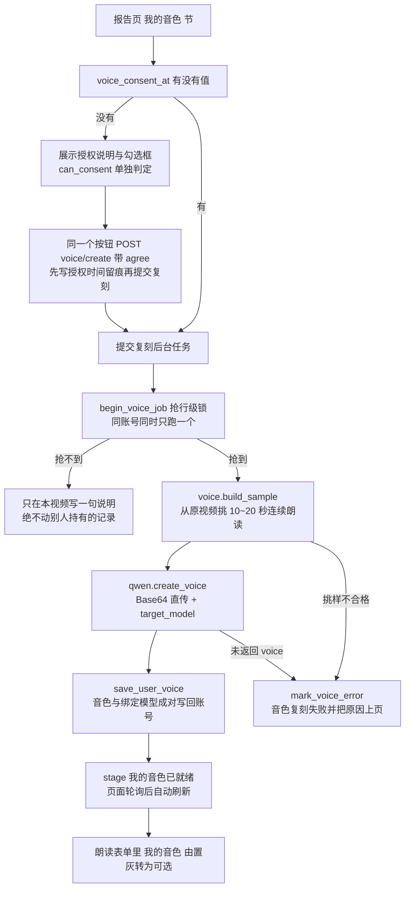

# 演讲视频评价系统 · 文字稿纠错与朗读合成方案

## 目录

- 1. 结论先行
  - 1.1 先回答那个问题：这三件事都没做过
  - 1.2 三条硬结论
  - 1.3 需要拍板的四个决策点
- 2. 现状调研
  - 2.1 转写链路有什么
  - 2.2 transcript 在下游只被"读"，从不被"写"
  - 2.3 模型调用抽象只有一个端点
  - 2.4 可以直接复用的现成件
  - 2.5 缺口清单
- 3. 百炼 TTS 能力盘点（选型依据）
  - 3.1 三条候选通道
  - 3.2 四条硬约束
  - 3.3 选型结论与降级链
- 4. A 线 · 文字稿纠错
  - 4.1 数据流
  - 4.2 只收 diff，不收整稿
  - 4.3 五条改幅红线
  - 4.4 评分口径不随之改变
  - 4.5 改动清单与自测
- 5. B 线 · 结合主题的小改 + 学生确认门
  - 5.1 一次调用，两类标签
  - 5.2 默认不采纳 = 不修改
  - 5.3 页面与交互
  - 5.4 改动清单与自测
- 6. C 线 · 在线 TTS 朗读合成
  - 6.1 instructions 的四源拼装
  - 6.2 分块合成与无缝拼接
  - 6.3 产物落盘与伺服
  - 6.4 后台任务与进度
  - 6.5 失败与降级
  - 6.6 改动清单与自测
- 7. 配置、成本与闸门
  - 7.1 新增环境变量
  - 7.2 量级估算
  - 7.3 朗读合成的可行性闸门
  - 7.4 磁盘影响
  - 7.5 修订调用的实测口径（耗时与 token）
- 8. 实施顺序、工作量与验收
- 9. D 线 · 声音复刻（学生本人音色）
  - 9.1 为什么要做，以及它的边界
  - 9.2 授权与留痕：先勾同意，才碰录音
  - 9.3 样本只能从本段视频里挑
  - 9.4 建音色：账号级一个音色，进度借用视频轮询
  - 9.5 与 C 线接合：选「我的音色」时的四条硬规则
  - 9.6 三条路由与闸门差异
  - 9.7 关闭与降级行为
  - 9.8 改动清单与自测
- 10. 明确不做的事
- 11. 风险与待确认

---

## 1. 结论先行

### 1.1 先回答那个问题：这三件事都没做过

「纠错 + 小范围改稿 + 学生确认 + 在线 TTS」这条链路，当前代码库里**一个字节都没有**。三条独立证据：

| 取证方式 | 结果 | 含义 |
|---|---|---|
| 全仓检索 `TTS` / `tts` / `语音合成` / `合成音频` / `text_to_speech` | **零命中**（0 个文件） | 没有任何朗读合成的代码、配置、文档 |
| `app/qwen.py` 全文（506 行）通读 | 只有 `chat` / `chat_content` / `vision` / `audio` / `asr` 五个方法，全部打 `POST {base_url}/chat/completions` | 连一条音频合成端点都没有封装，不存在"半成品" |
| `app/db.py` 的 `videos` 表定义 + `_EXTRA_VIDEO_COLUMNS` | 有 `transcript` / `segments` / `engine` / `model`，**无任何改稿、确认状态、合成产物列** | 数据模型层面从没为"回写"预留过位置 |

补充两条：`docs/设计报告.md` 检索「朗读 / TTS / 改稿 / 润色 / 学生确认」无相关规划；`templates/report.html` 只有**视频回放**（`/videos/{id}/play`），系统能让学生"听见自己"，但从未产生过任何音频文件。

所以这不是"做了但没做好"，而是**从零开一条新链路**。好消息是它的所有支撑件（后台任务、进度、并发闸、token 记账、资产伺服、可编辑提示词、设置页自列举）都已经在了，新增部分是"填空"而不是"打地基"。

### 1.2 三条硬结论

**结论一：给 transcript 开写路径，必须先立一条不可违反的规矩——原稿永不覆盖。**

`transcript` 现在是**评分的唯一文字依据**（文本通道打分、`verify_quote` 证据核验、评语、导师出题全都读它），也被 `check_timing` 的口径间接锚定。一旦允许就地改写，"AI 给这份演讲打的 78 分"和"学生确认过的那份稿子"就会互相污染：改完再评分，分数会变；不重评分，页面上的 quote 就可能在稿子里找不到。

设计上把两者物理分开：`transcript` 只读不改，新增 `script_text` 存"采纳后的成稿"，`script_items` 存每一条改动与其采纳状态。评分永远指向 `transcript`，朗读永远指向 `script_text`（为空则回退 `transcript`）。这条规矩同时天然实现了"不认可则不修改"——不采纳的条目根本不进入成稿。

**结论二：TTS 不能复用现有模型通道，必须新增一条原生 DashScope 端点，但并发闸与记账可以直接搬。**

现有 `qwen.py` 走的是 **OpenAI 兼容模式**（`https://dashscope.aliyuncs.com/compatible-mode/v1/chat/completions`）。语音合成不在兼容模式上：Qwen-TTS 走原生 `multimodal-generation`，CosyVoice 走独立 `SpeechSynthesizer`。所以要新增一个 `QwenClient.tts()`（或独立 `app/tts.py` 自带 HTTP 客户端），复用 `GATE.slot()`（限并发）、`_track()`（记账，但按 **characters** 而非 tokens）、`_try_models()`（同族降级）。另外兼容模式返回 `audio.url` **只有 24 小时有效期**，服务端必须立即下载落盘，绝不把该 URL 透给浏览器。

**结论三：「语速和情感符合演讲现场及主题」这一条，只有 `qwen3-tts-instruct-flash` 能一步做到；数值化精确语速要换通道，而那个通道有地域前提。**

自然语言指令（"课堂答辩场景，语速沉稳每分钟约 130 词，句与句之间留呼吸，情绪自信但克制"）这个能力，官方只在 **Instruct 系列**上开：`input.instructions`（≤1600 Token，仅中英）+ `optimize_instructions`。数值化的 `rate/pitch/volume`（0.5~2.0/0.5~2.0/0~100）与 SSML、情感标签在 **CosyVoice / Qwen-Audio-TTS** 一侧，但新版非实时接口要求 **华北2（北京）+ workspace 专属域名**，无法从现有 `base_url` 推导。

这构成整个方案唯一真正的外部依赖风险：**客户的 API Key 属于哪个地域、开通没开通 Instruct 模型，决定 C 线走哪条通道**。§11 把它列为实施前必须先跑的一次验证调用。

### 1.3 需要拍板的四个决策点

| # | 决策点 | 选项 | 推荐 | 理由 |
|---|---|---|---|---|
| D1 | 纠错/改写的输出形态 | A：让模型返回整篇改后稿<br>B：只返回 diff 条目（原句/改句/类型/理由） | **B** | 整稿返回时无法判断模型偷偷改了什么，"小范围修改"无从约束，也无法逐条确认；diff 可做长度/数字/命中等硬校验，并能直接渲染成确认 UI |
| D2 | 何时生成修订建议 | A：分析流水线里自动跑<br>B：报告页点按钮按需生成 | **B** | 每份稿子多一次 LLM 调用与等待（初版按 5~10 秒估，**实测 1600 字稿子要 349 秒**，见 §7.5），但多数学生只看分数；按需生成把成本和时延交给用户，失败也不污染主流程（与"导师提问"同一范式，已验证） |
| D3 | TTS 通道 | A：`qwen3-tts-instruct-flash`（自然语言指令）<br>B：CosyVoice v3.5/v2（数值 rate/pitch + SSML） | **A 为主，B 为备** | 要求里"符合演讲现场及主题"本质是语义化诉求，A 一句 instructions 覆盖语速/情绪/正式度；B 精确但受北京地域与 workspace 端点限制。A 不可用时用 `TTS_MODEL` 切 B |
| D4 | 确认 UI 落点 | A：新建 `/videos/{id}/script` 页<br>B：就地加进 `report.html` 一节 | **B** | 学生动线是"看分→看稿→听朗读"，同页闭环；新页要多一条路由、导航与权限判断，收益不大 |

一句话方案：**A 线产出可校验的 diff，B 线把 diff 变成"默认不生效"的确认门，C 线用 Instruct TTS 把成稿读成一段贴合主题与现场的音频。**

---

## 2. 现状调研

### 2.1 转写链路有什么

`app/transcribe.py`（151 行）：

```python
@dataclass
class TranscriptResult:
    text: str = ""
    segments: list[dict] = field(default_factory=list)
    engine: str = ""; model: str = ""
    warnings: list[str] = field(default_factory=list)
    credible: bool = True
```

- `credibility()` 用三条判据（tokens<8、字母/词比<1.8、长音频词密度<0.4 词/秒）识别 ASR 幻觉，不可信时 `credible=False`；
- `_split_wav(chunk=175.0, ≤24 块)` 把音频切块喂 `qwen3-asr-flash`，每块产出 `{"start","ts","text","chars"}`；
- 也就是说：**我们手里不只是一坨纯文本，而是带时间戳的分段数组**。这对 C 线的"按句分块合成"和 A 线的"定位到时间点"都是现成的抓手。

### 2.2 transcript 在下游只被"读"，从不被"写"

`run_analysis`（`app/pipeline.py` L150-288）的实际顺序：压缩 → probe → 抽音频/抽帧/正脸率 → `transcribe`(进度22) → `check_timing` → 三通道评审(45→80) → `aggregate`(84) → `build_narrative`(91) → `build_report` → `save_evaluation` + `update_video(transcript=…, segments=…)`(97) → `build_questions`(99) → 完成(100)。

下游消费点：文本通道评分、`verify_quote` 证据核验、评语叙述、导师出题（`/qa/generate` 传 `video["transcript"]`）。**没有任何一处把文字写回 `transcript`**（除分析时那一次 ASR 落库）。这是"改稿"功能从未存在的结构性证据，也是 §1.2 结论一的由来。

### 2.3 模型调用抽象只有一个端点

`app/qwen.py` 关键件：`GATE = RequestGate()`（`BoundedSemaphore(max_llm_requests)`，等待超 `timeout*3` 报错）、`FALLBACKS = {chat, vision, audio, asr}` + `_try_models()` + `_RESOLVED` 进程内记忆、`is_model_error()`、`_track()/usage_summary()`（无 usage 时按 `estimate_tokens` 估：CJK 1 字 1 token、其余 4 字符 1 token）、`data_url()`（base64 内联）、`asr()`（`asr_options:{language, enable_itn:False}`）。

所有请求都拼 `self.base_url + "/chat/completions"`，而 `DEFAULT_BASE_URL = "https://dashscope.aliyuncs.com/compatible-mode/v1"`。原生端点同 host 不同 path（`/api/v1/...`），所以 `QwenClient` 里加一个 `_native_url(path)`：从 `base_url` 去掉 `/compatible-mode/v1` 得到 host 再拼，客户如果自定义了网关也只需改一处。

### 2.4 可以直接复用的现成件

| 现成件 | 位置 | 在本方案里怎么用 |
|---|---|---|
| `POST /videos/{id}/qa/generate` 范式 | `app/main.py` L348-371 | 状态门（`status != "done"` 直接回执）→ `QwenClient().mark("阶段名")` → `try/finally: db.add_usage(...)` → `_xx_redirect(msg)`。C 线的"生成修订建议"照抄 |
| `POST /videos/{id}/qa/answer` 范式 | L374-397 | `await request.form()` → 逐条读 `form.get(f"answer_{idx}")` → 落库 → 带 msg 重定向。B 线的"逐条采纳/驳回"照抄 |
| 资产伺服路由 | `GET /videos/{id}/asset/{name:path}` L442-450 | 合成音频放 `settings.artifact_dir/{id}/tts/…mp3`，浏览器用 Range 拖动进度条（`_stream` 已支持 206）。只需扩 `ASSET_RE` 与 mime |
| `_EXTRA_VIDEO_COLUMNS` 迁移钩子 | `app/db.py` L135-147 | 加列即用，老库自动 `ALTER TABLE`，无需手工迁移脚本 |
| `EnvField` + `ENV_GROUPS` | `app/config.py` L151 起 | 新增配置项自动出现在 `/settings` 并支持四态取值（.env / 环境变量 / api_key.txt / 内置默认）。当前 31 项 |
| `PromptField` + `PROMPT_GROUPS` | `app/prompts.py` L36 起 | 新增提示词块自动出现在 `/settings` 提示词区，`strict_braces` + `tokens` 校验防改坏。改稿模板、instructions 模板都走这里，教师可自行调 |
| 压缩可行性闸门 | `app/compress.py` `feasibility()` | "装不下就开压前失败、绝不自动放宽目标"的口径，直接搬到"稿子太长就不合成" |
| 后台线程池 + 进度 | `pipeline.enqueue/_worker/_active/is_running` + `set_progress` | C 线要 10~60 秒，不能同步占请求；复用池与 `_active` 单视频互斥 |
| 版本指纹 | `app/buildinfo.py` + `BUILD_INFO.json` | 新包上线后用 `/health` 指纹确认线上确实带 TTS 代码 |

### 2.5 缺口清单

1. 无写回路径与状态模型（列、校验、UI 全无）→ A/B 线；
2. 无 TTS 客户端与音频拼接（`media.py` 只有 `probe / extract_audio / extract_frames_timed / video_thumbnail`，**没有 concat**）→ C 线；
3. `ASSET_RE = ^(?:cover\.jpg|audio\.wav|frames/frame_\d{1,3}\.jpg)$` 白名单不含 mp3，`_stream` 只判 `wav/jpeg` → C 线要改两处；
4. 无"演讲真实语速"数据：`check_timing(duration, topic, requirements)` 不统计词速，`_WORD_RE` 只在 `credibility()` 内部用 → instructions 校准要新增一个小函数；
5. 无 per-item 决策存储（`qa_turns` 的"一问一答"形态不适合 diff 条目）→ 用 `script_items` JSON 承载。

---

## 3. 百炼 TTS 能力盘点（选型依据）

### 3.1 三条候选通道

| 通道 | 端点形态 | 表现力控制 | 单次文本上限 | 返回 |
|---|---|---|---|---|
| **Qwen-TTS**（`qwen3-tts-flash` / **`qwen3-tts-instruct-flash`**） | 原生 `multimodal-generation/generation`，`input{text, voice, language_type, instructions, optimize_instructions}` | **自然语言 instructions**（≤1600 Token，仅中英，**Instruct 系列独有**）+ 语义增强开关 | **512 Token**（其他模型 600 字符） | `output.audio.url`（**24h**）/ `audio.data`，`usage.characters` |
| **Qwen-Audio-TTS / CosyVoice 非实时**（`qwen-audio-3.0-tts-plus`、`cosyvoice-v3.5-plus/flash`、`v2` 等） | 独立 `POST …/api/v1/services/audio/tts/SpeechSynthesizer`，**新版要求 `{WorkspaceId}.cn-beijing.maas.aliyuncs.com`（仅华北2）** | 数值 `rate 0.5~2.0` / `pitch 0.5~2.0` / `volume 0~100`、`enable_ssml`、`instruction`、`hot_fix`、`seed`、`word_timestamp_enabled`；**情感与富语言标签仅 `qwen-audio-3.0-tts` 系列** | 长文本流式友好，`X-DashScope-SSE: enable` | 音频（`format mp3/wav/pcm/opus`，默认 22050，最高 48kHz） |
| 声音设计（Voice Design） | `voice_prompt` + `preview_text` 文本描述造音色 | 定制音色（CosyVoice v3.5/v3 仅北京；`qwen3-tts-vd-*` 北京+新加坡） | — | 音色 id |

### 3.2 四条硬约束

1. **512 Token/次**：6 分钟英语演讲约 4500 字符，一次调用绝对装不下 → 必须分块合成再拼接（§6.2）。这是 C 线最大的工程复杂度来源。
2. **URL 24 小时过期**：必须服务端下载落盘为本地资产，否则第二天学生点开就是 404；signed URL 外泄也不合规。
3. **地域与开通**：CosyVoice 新链路绑定北京 workspace；Instruct 模型是否对客户 key 可见需实测 → §11 的验证前置步骤。
4. **按字符计费**：`usage.characters`，与现有 token 记账不同口径 → `_track()` 需要一个 characters 变体，`/settings` 的用量表要能显示"合成 N 字符"。

### 3.3 选型结论与降级链

主选 `qwen3-tts-instruct-flash`（唯一能用一句话描述"演讲现场 + 主题 + 情绪"的通道）；`FALLBACKS["tts"] = ["qwen3-tts-instruct-flash", "qwen3-tts-flash"]`，同族降级后只是丢掉 instructions、保留朗读；若 key 不通过，管理员把 `TTS_MODEL` 切成 CosyVoice 并填 `TTS_ENDPOINT`（新增一项，默认空=从 `base_url` 推导 host）。这条降级链保证"通道 A 不可用"不变成代码返工。

### 3.4 步骤 0 通道实测记录（已完成）

用生产同款内地百炼 key（即设置页解析的 `api_key.txt`）对 `qwen3-tts-instruct-flash` 发起 3 次真实非流式调用，全部 HTTP 200，样例为 67 词英语演讲稿（`voice=Cherry`，`language_type=English`）：

| 对照组 | 参数 | API 往返 | `usage` | 返回产物 |
|---|---|---|---|---|
| A | 不带 instructions | 8.4 秒 | `characters=367` | wav ≈ 1.40 MB（约 29 秒） |
| B | instructions + `optimize_instructions=true` | 11.9 秒 | `characters=367` | wav ≈ 1.39 MB（约 29 秒） |
| C | 仅 instructions | 7.6 秒 | `characters=367` | wav ≈ 1.27 MB（约 26.5 秒） |

实测确认的落地事实：

1. **端点推导成立**：`https://dashscope.aliyuncs.com/compatible-mode/v1` 去掉 `/compatible-mode/v1` 拼 `/api/v1/services/aigc/multimodal-generation/generation`，即 `_native_url()` 的实现口径；
2. **返回字段与文档一致**：`output.audio{url, data, id, expires_at}`、`finish_reason="stop"`；非流式下 `data` 为**空串**、音频只在 `url` 里；`output.text` / `output.choices` 恒为 `null`，代码可忽略——K3 消解，`tts()` 仍按"url 优先、data 回退"双兼容写；
3. **记账口径**：`usage` 只有 `characters`（367），无 `input_tokens/output_tokens` → `track_characters()` 是唯一正解；
4. **`voice="Cherry"` 在非实时 Instruct-Flash 上实测可用**（官方文档快速开始即用该音色），`TTS_VOICE` 默认值据此填 `Cherry`，其余音色实现期按需扩验；
5. **注意 url 是 `http://` 的 OSS 北京域名**：服务端下载须容忍 http 明文，且**绝不把 url 透传给前端**（24h 过期 + 非 https 混合内容）——`asset` 路由走本地落盘文件的既有设计不变；
6. **产物规格**：`audio/x-wav`，按体积推算为 24 kHz / 16 bit / 单声道（≈ 48 KB/秒）→ §6.4 `concat_audio()` 统一重编码 mp3 的计划不变；
7. **instructions 确实改变输出**：C 组比 A 组短约 9%（语速/停顿不同），B 组时长接近 A 但往返更久（语义增强多一步处理）；语速与情感是否达到"课堂示范"水准需人耳验收（样音已存 `dist/tts-probe/`，文件名见 §8 步骤 0 行）。

**补充实测（按用户拍板：采用 B 模式 + 男声新闻腔 + 情感跟主题走）**：用 `voice=Neil`（阿闻，字正腔圆新闻主持人）跑三组中文演讲样例，全部 HTTP 200：

| 组 | 样例 | 参数 | API 往返 | 产物（约） |
|---|---|---|---|---|
| D | 主题《在奋斗中绽放青春》 | 无 instructions（基线） | 10.9 秒 | 41 秒 wav（319 字符计费） |
| E | 同上 | instructions（沉稳→激昂推进、结尾放慢加重）+ `optimize_instructions=true` | 13.3 秒 | 37 秒 wav |
| F | 主题《造纸术的发明与传播》 | instructions（沉稳理性、讲述感、克制内敛）+ 语义增强 | 11.8 秒 | 34 秒 wav |

两个落地修正：
1. **同音色、不同主题指令，产出的时长/节奏确实分化**（E 与 F 对同一基线做了不同方向的压缩），"主题→情感→调音"路线成立，据此把 §6.1 升级为"情感推断两级拼装"；
2. **绝对数值语速指令收效率低**：E 组要求"约每分钟 220 字"，实测约 270+ 字/分钟——`instructions` 里写"每分钟 N 字/词"只能当弱参考，**语速控制要靠相对词**（"从容放慢""层层推进""结尾明显放慢"）；`speech_rate()` 算出的 wpm 改用于**选相对档**（比学生原速慢一档/快一档/同档），不再把数值直接塞进指令（K6 据此修订）。

模式定型：`optimize_instructions=true` 常开（即用户拍板的 B 模式），由配置 `TTS_INSTRUCTIONS=1` 映射，填 0 可关。

**复测（用户人耳反馈：E 方向可以，"还要再抑扬顿挫一点"）**：同一份 243 字《在奋斗中绽放青春》稿、Neil + 语义增强，只加码节奏指令，两组均 HTTP 200：

| 组 | 指令策略 | API 往返 | `usage` | 产物 |
|---|---|---|---|---|
| G | 抽象节奏描述：抑扬顿挫鲜明可感、关键词饱满有力、句末上扬收束干脆、结尾一字一顿放慢 | 15.6 秒 | `characters=459` | 47.6 秒 wav |
| H | 逐句演绎脚本：设问后停顿、斩钉截铁、排比递进、情绪顶点延长 | 16.3 秒 | `characters=459` | 49.7 秒 wav |

两条新发现：

- **相对节奏描述能有效放缓节奏**：同样 243 字正文，G/H 约 4.9~5.1 字/秒，而 E 组（319 字 / 37 秒）约 8.6 字/秒——"抑扬顿挫鲜明""结尾一字一顿"这类相对词把时长拉长了近一倍节奏，再次佐证第 2 条修正（只写相对档，别写绝对数值）；
- **instructions 计入 `characters` 计费**：正文 243 字却计 459 字符，即计费 ≈ 正文 + 展开后的指令文本（G/H 两条长度不同的指令最终同计 459，疑为语义增强展开后归一）。这对成本口径有两个含义：页面"本次字符数"必须按 `usage` 返回值显示而非正文字数；分块合成时**每一块都要带上同一段指令**，指令开销按块数累积，指令模板宜控制在百字量级（K7 据此补充）。

**验收结论（用户人耳定论）**：选定 **H（逐句演绎脚本）**——"设问后停顿、斩钉截铁、排比递进、情绪顶点延长"这类**逐句点节奏**的写法抑扬顿挫最好，定为 §6.1 第二级 `structure` 字段的拼装模板基底；G 的抽象节奏描述作为降级兜底文案。

---

## 4. A 线 · 文字稿纠错

### 4.1 数据流



新增 `app/revise.py`，纯函数优先（便于自测，和 `compress.pick_plan` 同一套打法）：

```python
@dataclass
class RevisionItem:
    idx: int
    before: str          # 必须能在原稿中唯一定位
    after: str
    kind: str            # homophone | term | grammar | filler | style
    reason: str
    confidence: float
    decision: str = "pending"   # pending | accepted | rejected

@dataclass
class RevisionResult:
    items: list[RevisionItem] = field(default_factory=list)
    dropped: list[str] = field(default_factory=list)
    model: str = ""
    warnings: list[str] = field(default_factory=list)
```

### 4.2 只收 diff，不收整稿

模型只被允许返回 items；**成稿由代码用精确字符串替换生成**（`apply_revisions(text, items)`）：

- `before` 在原文中出现 0 次 → 丢弃并记 `unmatched`（模型幻觉出的句子）；
- 出现多次且未给位置 → 丢弃（不敢猜）；
- 命中后按顺序替换，并做**区间重叠检测**（两条改动不能改同一段字符，后到的丢弃）。

这样"改了什么"永远是可枚举、可展示、可回滚的，而不是"两篇稿子自己比"。

### 4.3 五条改幅红线

对应要求里的**"小范围修改"**——不靠 prompt 里恳求，靠代码硬卡，越界条目直接丢：

| # | 红线 | 判据（实现） | 越界处置 |
|---|---|---|---|
| R1 | 单条改动幅度 | `\|len(after)-len(before)\| ≤ 20` 字符 | 丢弃 + `dropped` 记原因 |
| R2 | 全篇改幅上限 | `Σ|after|-|before| ≤ 原文 8%`（`REVISE_MAX_CHANGE_RATIO`） | 超线后停止采纳后续条目 |
| R3 | 数字/时间守恒 | `before` 中的数字序列必须与 `after` 完全一致 | 丢弃（防止把"30%提升"改成"50%"= 改事实） |
| R4 | 不新增句子 | `after` 的句末标点数量 ≤ `before` | 丢弃（禁止扩写、续写） |
| R5 | `style` 类条目配额 | `kind=style` 最多 `REVISE_MAX_STYLE_ITEMS`（默认 5）条 | 超额的 style 丢弃，其余 kind 不受影响 |

`kind` 的语义写进提示词（可编辑）：`homophone`（ASR 听错的同音/近音词）、`term`（术语与专名，参考学生填的术语提示）、`grammar`（明显语法口误的最小改动）、`filler`（口头禅与重复，**仅为朗读流畅服务，默认不采纳**）、`style`（结合主题的小幅润色，**默认不采纳**）。

### 4.4 评分口径不随之改变

- `check_timing` 与三通道评分继续用 `transcript`（评的是学生**真实说出的话**，不是改后稿）；
- 页面明确标注："以下修订用于字幕与朗读，**不影响得分**"；
- `verify_quote` 校验评分证据时，若 quote 只存在于修订稿则视为证据失效（防止"改稿—再评分"闭环造假）。

### 4.5 改动清单与自测

| 文件 | 改动 | 量级 |
|---|---|---|
| `app/revise.py` | 新增：`RevisionItem/Result`、`build_messages()`、`parse_items()`、`validate_items()`（R1~R5）、`apply_revisions()` | ~200 行 |
| `app/prompts.py` | 新增分组「文字稿修订」：`revise_head`（tokens: topic/requirements/glossary/transcript）、`revise_tail`（tokens: kinds/schema，`strict_braces=True`） | ~50 行；设置页自动列举，零 UI 成本 |
| `app/db.py` | `_EXTRA_VIDEO_COLUMNS` + 4 列（见 §5.2） | ~10 行 |
| `app/config.py` | `REVISE_ENABLED / REVISE_MODEL / REVISE_MAX_CHANGE_RATIO / REVISE_MAX_STYLE_ITEMS` + `ENV_GROUPS` | ~25 行 |
| `tests/selfcheck` | 新增 6 条：unmatched 丢弃、多命中丢弃、区间重叠、R3 数字守恒、R2 比例闸门、apply 结果幂等 | +6 |

---

## 5. B 线 · 结合主题的小改 + 学生确认门

### 5.1 一次调用，两类标签

"纠错"（A 线）和"结合主题的小改"（本线）共用**一次** LLM 调用，靠 `kind` 区分——省一半时延与费用，且两类建议本来就需要同一个上下文（主题 + 老师要求 + 全稿）。区别只在**默认勾选状态**：

- `homophone / term / grammar` → 归为「听写订正」，界面提示"建议采纳"；
- `filler / style` → 归为「表达润色」，**默认不勾选**，学生主动点才生效。

"结合主题"体现在 prompt：注入 `topic` + `requirements`，并要求 style 条目必须"与主题呼应、只调词不调意"，同时给 R5 配额硬约束。

### 5.2 默认不采纳 = 不修改

新增 4 列（走 `_EXTRA_VIDEO_COLUMNS`，老库自动 ALTER）：

| 列 | 声明 | 含义 |
|---|---|---|
| `script_status` | `TEXT NOT NULL DEFAULT ''` | `''` 未生成 / `proposed` 有待确认建议 / `decided` 学生已处理 |
| `script_items` | `TEXT NOT NULL DEFAULT '[]'` | JSON 数组，每条含 `before/after/kind/reason/confidence/decision` |
| `script_text` | `TEXT NOT NULL DEFAULT ''` | 采纳后的成稿；**空串 = 完全等同原稿** |
| `script_meta` | `TEXT NOT NULL DEFAULT '{}'` | `{source_hash, model, glossary, dropped[], applied_count}`，`source_hash` 用于"重新分析后旧建议失效"判定 |

**"如果他不认可则不修改"的三条实现保证**：

1. `decision` 初值 `pending`，而 `pending` 在应用时**等同于 rejected**（只有显式 `accepted` 才进成稿）——不动鼠标 = 不改；
2. 页面上唯一的默认按钮是"保持原稿"，"全部采纳"必须多点一次；
3. 只要 `script_text == ''`，全链路（字幕、朗读、导出）读到的都是 `transcript` 原文；学生随时可点"撤销全部修订"把 `script_text` 清空、`script_items` 全部置 rejected，原稿因为从未被覆盖而 100% 可恢复。

`POST /videos/{id}/script/decide`（form 里 `accept_<idx>` 复选框 + `glossary` 文本域）落库时**不调模型**，纯本地 `apply_revisions()`，即时返回。

### 5.3 页面与交互

在 `report.html` 评分区之后加一节「文字稿与朗读」（`#script` + `#tts` 两个锚点）：

- 顶部：原文/成稿切换视图 + 一句状态"已采纳 3 处 / 共 7 条建议"；
- 主体表格：`类型徽标 | 原句片段 → 建议 | 理由 | ☐采纳 | 时间点`（时间点取自 `segments`，点击跳到视频对应位置听自己原来怎么说的——这是"证据"，不是装饰）；
- 术语提示输入框（"把可能听错的人名/术语用逗号列出"）+「重新生成建议」（`POST /script/propose`，**提交后台任务**并回执"已提交生成"，页面靠 `GET /videos/{id}/status` 轮询进度；实测 1600 字稿子这一步要 349 秒，所以早期"同步等几秒"的做法必然被网关掐断）；
- 底部：「保持原稿」/「采纳勾选项」/「撤销全部修订」；
- 无 API Key（mock 模式）时：整节显示为"需在线模式"占位，不出错。

### 5.4 改动清单与自测

| 文件 | 改动 | 量级 |
|---|---|---|
| `app/main.py` | `POST /videos/{id}/script/propose`、`.../decide`、`.../reset`（路由 29 → 32） | ~70 行 |
| `app/templates/report.html` | 新增「文字稿与朗读」节（表格 + 复选框 + 播放器） | ~110 行模板 |
| `app/pipeline.py` | 导出 `run_revision(video_id, glossary)` 供路由调用（复用 client/usage 记账） | ~30 行 |
| `tests/selfcheck` | 新增 4 条：pending 等同不修改、decide 后可恢复原稿、`source_hash` 失配时建议失效、style 配额生效 | +4 |

---

## 6. C 线 · 在线 TTS 朗读合成

### 6.1 情感推断 + instructions 两级拼装（按拍板升级）

要求「语音语速以及情感符合演讲现场及主题」，且用户明确"**根据演讲主题分析出情感，然后根据情感再来调**"。据此把原"四源直接拼装"升级为**两级**：

**第一级 · 主题情感推断**（新增 1 次廉价 chat 调用，与 A 线修订调用同模型不同用途）：`tts_style` 模板（可编辑，`strict_braces=True`）输入 `topic + requirements + tts_scene + 成稿前 200 字`，输出 JSON：

```json
{"tone": "庄重而激昂", "pace_band": "偏快但结尾放慢",
 "structure": "设问开场留白；排比层层推进；结尾放慢加重收束",
 "avoid": "不喊叫、不煽情"}
```

约束：≤80 字、只描述演绎不评价内容、失败/超时**降级为规则模板**（按 scene 给中性新闻腔基线），绝不让推断失败阻塞合成。

**第二级 · 拼装 instructions**（纯字符串，无额外调用），四个来源合成一段（模板 `tts_instructions`，实际约 200 Token，上限 1600）：

| 来源 | 具体取值 | 对朗读的作用 |
|---|---|---|
| **情感基调** | 第一级输出的 `tone/structure/avoid`；`structure` 按 §3.4 验收选定的 **H 样逐句演绎脚本**格式产出（设问后停顿、斩钉截铁、排比递进、情绪顶点延长） | 主题决定情绪，情绪决定调法——用户拍板的核心链路 |
| **现场** | 学生合成时选一次 `tts_scene`：`class 课堂展示 / contest 演讲比赛 / defense 毕业答辩 / report 工作汇报` | 定正式度与节奏：比赛偏抑扬顿挫、答辩偏沉稳克制 |
| **相对语速档** | `speech_rate(text, duration) → wpm` 与学生原速比较，映射成**相对词**（"从容放慢一档 / 保持你原本的紧凑感 / 比日常稍快、字字清楚"） | §3.4 实测教训：绝对数值（"每分钟 N 字"）收效率低，**只用相对档位** |
| **短板导向** | 从 `evaluations.payload` 取 fluency/delivery 维度得分与 `notes` 关键词 | 弱则"清晰平稳、句间留呼吸"，强则"更自然松弛"，让朗读成为一次"标准示范" |

`optimize_instructions=true` 常开（用户拍板的 B 模式，`TTS_INSTRUCTIONS=0` 可关），让模型把粗线条指令细化为演绎。**注意**：数值 `rate` 在这个通道不存在，语速靠相对词 + 标点停顿实现；若实测明显不满足，切 D3 的备选通道（CosyVoice 数值 rate）。

### 6.2 分块合成与无缝拼接

512 Token 上限决定了"一次调用"不可能。切块算法（`app/tts.py`，纯函数 `plan_chunks(text, segments) -> list[str]`）：

- 以 `segments`（带 `start`/`text`）为句级边界，**绝不在句中切开**——句中被切开的韵律断裂是拼接最主要瑕疵来源；
- 累积到 `TTS_CHUNK_CHARS`（默认 **1600 字符**，对英语约 400 Token，给 512 Token 留足余量）就封块；
- 块数上限 `TTS_MAX_CHUNKS`（默认 8），超限走 §7.3 闸门直接拒绝并说明原因，不偷偷放宽；
- 每块带**同一份** instructions + 同一 voice +（若通道支持）同一 `seed`，抑制跨块的音色/情绪漂移。

拼接（`app/media.py` 新增 `concat_audio(paths, dest, ...)`，ffmpeg 已有封装 `_exe/ffmpeg_exe` 可复用）：统一重编码为 `24kHz 单声道 mp3 48kbps`，块间插入 ~250ms 静音垫片；产出单文件 `tts/speech.mp3`。分块临时 mp3 用后即删（磁盘友好），仅保留整段。



### 6.3 产物落盘与伺服

- `audio.url`（24h）→ 服务端 `requests.get(stream=True)` 立即落盘到 `settings.artifact_dir/{video_id}/tts/speech.mp3`；**URL 不写库、不进模板**（避免过期 404 与签名外泄）。
- 伺服复用 `GET /videos/{id}/asset/{name:path}`，需改两处：
  - `ASSET_RE` → `^(?:cover\.jpg|audio\.wav|frames/frame_\d{1,3}\.jpg|tts/speech\.mp3)$`
  - mime 判定 → 加 `.mp3 → audio/mpeg`（现有 `_stream` 已支持 Range，浏览器可拖进度条）
- 页面用原生 `<audio controls src="/videos/{id}/asset/tts/speech.mp3">`，并显示"本段朗读依据：原始稿 / 修订稿（已采纳 N 处）"。
- 成稿变更后音频标记过期：存 `tts_meta.text_hash`，与当前生效稿哈希不符时页面提示"稿子已改，建议重新合成"（不自动重跑，不自动花钱）。

### 6.4 后台任务与进度

一次合成 = 1~8 次网络调用 + 下载 + ffmpeg，**不能同步占住 HTTP 请求**。`pipeline.py` 做一处 ~12 行的最小扩展：

```python
def submit(fn, video_id: int) -> bool:   # 与 enqueue 同构，_active 互斥沿用
    if video_id in _active:
        return False
    _active.add(video_id)
    _pool_instance().submit(_job_worker, fn, video_id)
    return True
```

`_job_worker` 复用现有异常兜底（失败写 `tts_status=failed` + `tts_error[:1500]`）。前端沿用 `progress.html` 已经在轮询的 `GET /videos/{id}/status`，新增进度点：`排队 5 → 分块 i/N 递增到 90 → 拼接 95 → 完成 100`。`_active` 的语义是"一个视频同时只跑一个后台任务"，正好防止"分析中点合成"。

### 6.5 失败与降级

| 情况 | 行为 |
|---|---|
| 无 API Key / mock 模式 | 不合成，回执"需在线模式"；**绝不用 ffmpeg 生噪声伪造音频**（与压缩 mock 不同，朗读没有可信的假产物） |
| 模型名不可用（403/model not found） | `is_model_error()` → `_try_models` 降级 `qwen3-tts-flash`（丢 instructions 但保留朗读），warning 留痕 |
| 单块失败且无降级模型 | 整次合成失败并删除已下载分块，不产出"缺一截"的残缺音频 |
| 下载超时 / URL 已过期 | 该块重试一次（`_post` 现有退避只对 408/409/429/5xx，下载单独处理） |
| ffmpeg 缺失 | 保留第一块为整段并 warning（明确标注"仅含前 N 字"） |

### 6.6 改动清单与自测

| 文件 | 改动 | 量级 |
|---|---|---|
| `app/tts.py` | 新增：`TtsResult`、`plan_chunks()`、`infer_style()`（第一级情感推断 + 规则降级）、`QwenClient.tts()` 调用封装、`download_audio()`、`build_instructions()`（第二级拼装） | ~230 行 |
| `app/qwen.py` | 加 `_native_url()`、`tts()`、`FALLBACKS["tts"]`、`track_characters()` | ~60 行 |
| `app/media.py` | 加 `concat_audio()` | ~35 行 |
| `app/pipeline.py` | 加 `submit/_job_worker` + `run_tts(video_id, scene, style)` | ~70 行 |
| `app/main.py` | `POST /videos/{id}/tts/synthesize`；扩 `ASSET_RE` 与 mime（路由 32 → 33） | ~45 行 |
| `app/config.py` | 6 项 TTS 配置 + `ENV_GROUPS`（31 项 → 43 项，D 线再 +2 → 45 项，修订超时 +1 → 46 项，见 §9.8） | ~35 行 |
| `app/db.py` | +4 列：`tts_status / tts_path / tts_error / tts_meta` | ~6 行 |
| `app/prompts.py` | 两个可编辑块：`tts_style`（第一级情感推断，tokens: topic/requirements/scene/opening，`strict_braces=True`）+ `tts_instructions`（第二级拼装模板） | ~35 行 |
| `tests/selfcheck` | +6 条：切块不破句、块数闸门、instructions 含相对语速档与场景、`infer_style()` 输出异常时落规则模板不阻塞、`concat_audio` 用 ffmpeg `anullsrc` 生成两块后真实拼接（校验时长≈两块和）、mock 模式不产出音频且不报错 | +6 |
| `tests/smoke` | +5 条：三条 script 路由 + 合成路由 + `asset/tts/speech.mp3`（含 Range 206） | +5 |

自测基线：selfcheck **189 → 约 205**，smoke **258 → 约 268**（条数以实现为准，全绿为验收线）。实际交付口径（含 D 线声音复刻与修订超时修复）：selfcheck **277/277**、smoke_web **297/297**，见 §9.8。

---

## 7. 配置、成本与闸门

### 7.1 新增环境变量（`ENV_GROUPS` 31 → 46 项，设置页自动列举）

| Key | 标签 | 默认 | 说明 |
|---|---|---|---|
| `REVISE_ENABLED` | 文字稿修订 | 1 | 填 0 时报告页隐藏该节（沿用"新开关默认开、填 0 退旧行为"惯例） |
| `REVISE_MODEL` | 修订模型 | 沿用 `CHAT_MODEL` | 留空跟随文本通道 |
| `REVISE_TIMEOUT` | 修订请求超时(秒) | 600（下限 60 / 上限 1800） | 比对全稿是整条链路最慢的一次调用（实测 1600 字 349 秒），单独一条预算，不跟随 `REQUEST_TIMEOUT=180`；填小了会稳定卡在 35% 后报超时 |
| `REVISE_MAX_CHANGE_RATIO` | 全篇改幅上限(%) | 8 | R2 红线 |
| `REVISE_MAX_STYLE_ITEMS` | 润色条目上限 | 5 | R5 红线 |
| `TTS_ENABLED` | 朗读合成 | 1 | 同上 |
| `TTS_MODEL` | 合成模型 | `qwen3-tts-instruct-flash` | 换 `cosyvoice-*` 即切 B 通道 |
| `TTS_VOICE` | 音色 | `Neil` | 男声·字正腔圆新闻腔（用户拍板），非实时 Instruct-Flash 实测可用（§3.4）；需女声改 `Cherry` |
| `TTS_ENDPOINT` | 合成端点 | 空=从 `base_url` 推导 host | 仅 CosyVoice 北京 workspace 需要填 |
| `TTS_CHUNK_CHARS` | 分块字数 | 1600 | 必须 < 512 Token 的物理上限 |
| `TTS_MAX_CHUNKS` | 分块数上限 | 8 | §7.3 闸门 |
| `TTS_INSTRUCTIONS` | 表现力指令增强 | 1 | 映射 `optimize_instructions` |
| `TTS_TIMEOUT` | 合成超时(秒) | 300（下限 30 / 上限 1800） | 单块 HTTP 超时 |
| `VOICE_CLONE_ENABLED` | 声音复刻 | 1 | 站点级总开关：填 0 收起报告页「我的音色」节并锁死三条复刻路由的入口（**删除音色除外**，见 §9.6）。开启只是放出入口，处理学生录音仍要每个学生单独勾选授权 |
| `TTS_VC_MODEL` | 复刻合成模型 | `qwen3-tts-vc-2026-01-22` | 建音色时写进 `target_model`、合成时必须完全一致的那个模型。官方口径：音色与模型死绑、不可跨模型使用；改这一项会让账号里的旧音色判作废（§9.5 规则 4），值本身按 `MODEL_KEYS` 统一小写归一 |

同步改仓库根 `.env.example` 与 `deploy/env.production`（各 15 行，其中复刻 2 行见 §9），并在 `/settings` 的「文字稿与朗读」分组里自动列举。

### 7.2 量级估算

英语演讲按 ~150 词/分钟、平均 5 字符/词（含空格）估：

| 演讲时长 | 字符数 | 分块数 | 计费字符 | 合成 HTTP 调用 | 预计耗时 | mp3 体积 |
|---|---|---|---|---|---|---|
| 2 分钟 | 1,500 | 1 | 1,500 | 1 | 20~50 秒 | 0.7 MB |
| 4 分钟 | 3,000 | 2 | 3,000 | 2 | 40~100 秒 | 1.4 MB |
| 6 分钟 | 4,500 | 3 | 4,500 | 3 | 60~150 秒 | 2.2 MB |
| 10 分钟 | 7,500 | 5 | 7,500 | 5 | 100~250 秒 | 3.6 MB |
| 15 分钟 | 11,000 | 7 | 11,000 | 7 | 140~350 秒 | 5.4 MB |
| 16 分钟+ | >12,800 | 8 | 闸门拒绝 | 0 | — | — |

耗时列已按 §3.4 实测锚点校准：367 字符（约 29 秒音频）单块实测 7.6~11.9 秒，Neil 中文满块约 280~320 字符实测 10.9~13.3 秒；G/H 复测（243 字 + 抑扬顿挫指令）往返 15.6~16.3 秒、产物被节奏指令拉长到 ~50 秒。线性外推到 1,600 字符满块约 35~52 秒。另加第一级情感推断 1 次 chat（与"导师提问"同量级，几秒）。**这比初版拍脑袋的"~4 秒/块"高一个量级**——因此合成必须走后台任务 + 进度轮询（§6.5 设计不变，正好接住），页面提示"约需 1~5 分钟，可离开本页"；`TTS_TIMEOUT` 单块 300 秒仍然够用。计费列需按 §3.4 新发现上修口径：**实际 `characters` ≈ 正文字数 + 展开后指令**（实测 243 字正文计 459），且指令开销按块数累积——表中"计费字符"理解为下限，页面向学生展示时以 `usage` 返回值为准。

### 7.3 朗读合成的可行性闸门

把压缩闸门的口径（**"装不下就提前失败，绝不自动放宽"**）搬过来，在**发起任何一次合成调用之前**算清楚：

1. **装不下**：`len(effective_text) > TTS_MAX_CHUNKS × TTS_CHUNK_CHARS` → 不合成，回执"稿件约 N 字符，超过 M 字符上限，请缩短或提高 `TTS_MAX_CHUNKS`"（原稿与成稿都不动）；
2. **跑不完**：`预计耗时 = 块数 × 单块预算` 超过 `TTS_TIMEOUT` → 回执并给出建议的 `TTS_TIMEOUT` 值（只提示，不自动改配置）；
3. **不可用**：mock 模式 / 无 key / `TTS_ENABLED=0` → 回执对应原因，不发请求。

三条判据写成纯函数 `tts_feasibility(text, settings) -> (ok, note)`，与 `compress.feasibility()` 一样可单测。

### 7.4 磁盘影响

生产机约 40GB 盘、3Mbps 带宽。视频压缩后 ≤50 MB/个，朗读 mp3 ≤5.4 MB/个（约增加 10%），且 mp3 是**唯一新增的持久产物**（分块临时文件即删）。删除视频时 `artifact_dir/{id}/` 整目录清理已覆盖，无需额外回收逻辑。下载音频走 `3Mbps ≈ 375 KB/s`，一个 2 MB 的 mp3 学生端约 6 秒下完——可接受，但**不建议**在列表页批量预取。

### 7.5 修订调用的实测口径（耗时与 token）

初版设计把「比对全稿」按 5~10 秒估（见 §2 决策 D2），真实云端复测证明估低了两三个量级。实测条件：1,606 字文字稿、`qwen3.8-flash`、一次完整 `chat` 调用——

| 指标 | 实测值 | 说明 |
|---|---|---|
| 往返耗时 | **349.4 秒** | 11:17:51 发起 → 11:23:40 返回，约 5.8 分钟 |
| prompt token | 887 | 提示词本身很短，慢的不是输入 |
| completion token | **25,745** | 可见输出只有 2,158 字，其余是思维链——模型在"想"，不是在"写" |
| total token | 26,632 | 一次调用约两万六千 token |
| 建议条数 | 原始 11 条 → 过红线 9 条 | 丢 2 条，原因均为 R1「单条幅度超过 20 字」 |

这组数字直接解释了用户反馈的「进度条跑到 35% 就卡住、然后突然没了」：35% 之后到 75% 之间就是这一次调用，而它原先跟随全局 `REQUEST_TIMEOUT=180` 秒——**1,600 字上下的稿子必然被读超时掐死**，且旧口径 retries=3 会再白等两轮（合计 551 秒才落败）。修复口径：

1. 新增 `REVISE_TIMEOUT`（默认 **600 秒**，范围 60~1800），只给修订调用用。600 ≈ 实测 349 秒的 1.7 倍，给更长的稿子留余量；下限 60 防止误填出比旧值更糟的配置。
2. 修订调用 retries 收成 **2**：超时多半是模型真在慢慢想，重复发请求只会白等三倍时间、白付三倍 token。
3. 进度文案与页面计时条改为实测口径（「一千字上下要五六分钟，别关页面」），35% 停留属正常。
4. 排障噪音修正：探针日志里那句「网关排队 349s 后才发出请求」是旧计时口径的产物（起点取在排队前、终点取在请求完成后，量到的其实是「排队 + 整次请求」）。`RequestGate.slot` 已改为只量到 `acquire()` 成功为止，并且超过 5 秒才打印——以后再见这个数字就是真排队。

---

## 8. 实施顺序、工作量与验收

| 步 | 内容 | 独立验收点 | 预计工时 |
|---|---|---|---|
| 0 | **通道验证**：拿客户 key 跑一次真实 TTS（512 Token 内）+ 一次 instructions 生效确认；确认地域/开通情况 | ✅ 已完成（含 Neil 补充实测）：6 次调用全 200，真实返回字段与规格已回填 §3.4；样音 `dist/tts-probe/`（A/B/C=Cherry，D/E/F=Neil 男声新闻腔，E/F 验证“主题→情感”可控；G/H 复测节奏指令，用户人耳选定 **H 逐句演绎脚本**为 §6.1 模板基底） | 0.5 天 |
| 1 | **A 线**：`revise.py` + prompts + 配置 + 校验 + 6 条单测（纯函数为主，无 UI） | mock 全绿；真实模式跑一份样例稿，diff 列表合理且 R1~R5 生效 | 1 天 |
| 2 | **B 线**：db 4 列 + 三条路由 + `report.html` 确认节 | 采纳 3 条后 `script_text` 正确；「保持原稿」= 与 `transcript` 逐字节相同 | 1 天 |
| 3 | **C 线**：`tts.py` + `media.concat_audio` + `pipeline.submit` + 4 列 + 合成路由 + 播放器 | 6 分钟样稿合成成功、无听感接缝、Range 拖动正常；闸门与 mock 降级都按预期 | 1.5~2 天 |
| 4 | 文档闭环（设计报告新增一节 + 部署手册配置表 + 重出 HTML + 重打包） | 文档数字与实测一致（本次踩过的坑，逐条核对） | 0.5 天 |
| 5 | 部署与提交（先测、再部署、后提交；`/health` 指纹确认） | 线上指纹 = 新包 sha，`/videos/{id}` 可见新节 | 0.5 天 |
| 6 | **D 线（用户追加）**：`voice.py` 挑样 + `qwen.create_voice/delete_voice` + `users` 7 列 + `run_voice` + 三条路由 + 报告页「我的音色」节 | ✅ 已完成：selfcheck **277/277**、smoke_web **297/297**；mock 或 `VOICE_CLONE_ENABLED=0` 时入口收起；管理员不能代为授权/重做/删除 | 1 天 |

合计约 5 个工作日（不含客户 key 申请与网络排障），D 线为追加项另计 1 天。步骤 0 是**硬前置**：通道不通，C 线的选型要当场改，越晚发现越贵。A/B 线不依赖 TTS，可先行。

---

## 9. D 线 · 声音复刻（学生本人音色）

### 9.1 为什么要做，以及它的边界

C 线上线后用户追问的一句：**"示范朗读能不能用我自己的声音？"** 官方侧确实支持——百炼提供**声音复刻**（voice enrollment）接口，用一段真人朗读样本注册出专属音色，之后用**同一个合成模型**朗读即按原声出音。

这个功能的价值不在"好玩"。听 Neil 读自己的稿子，听到的是播音员的流畅；听**自己的嗓子**读改后的稿子，哪里绊住、哪里吞字，一听就知道。所以 D 线接在 C 线后面，共用同一条合成路由、同一个产物、同一个播放器。

因为处理的是**学生人声**（个人敏感信息），这一节的全部设计前提是先立规矩、再放功能。四条规矩把边界钉死：

| 规矩 | 一句话 | 落在代码哪里 |
|---|---|---|
| 授权前置 | 没勾同意，连样本都不抽 | `run_voice` 第一步查 `voice_consent_at`；`_voice_gate` |
| 出处可控 | 样本只能从**他本段视频**里挑，不接收上传的外部音频 | `voice.build_sample(Path(video["path"]), ...)` |
| 用完即删 | wav 是学生人声的原样，任务收尾无条件删除 | `_drop_samples()` 写在 `finally` 里 |
| 随时可撤 | 撤授权 = 先删远端音色再撤记录；删音色不撤授权 | `voice/consent` 与 `voice/delete` 两条路由 |

### 9.2 授权与留痕

- `users.voice_consent_at` 记**时间戳**而不是布尔值：万一有争议，能说清"什么时候授的权、什么时候撤的"。页面上是一段完整的授权说明（用途、样本只出自本视频、用完即删、可随时撤回），不是藏在角标里的隐私政策链接。
- **撤回的顺序是刻意的**：先删远端音色、再清授权记录。反过来做会在授权已撤之后丢掉 `voice` 标识——学生的人声就永远挂在服务方那边，本地再也找不着线索。
- 远端删除失败（500 / 网络错）时授权**保持已勾选**，回执"音色删除失败，授权暂未撤回（原因），请稍后重试"：宁可让用户多点一次按钮，也不能把"已删除"记成假账。远端返回 404（本来就没有）按删除成功处理，否则被服务方清理过的人永远删不动。
- **删除音色不撤回授权**：想换个片段重做的人不该被要求重新勾一遍同意，回执写明"已删除本人音色（voice 标识），授权仍然保留，可随时用别的片段重做"。
- 管理员能看学生的报告，但**不能代为授权、重做或删除**（`_voice_gate` 判 owner，删除路由单独再判一次）。授权必须本人点，否则"已同意处理录音"这条留痕本身就成了一份伪造证据。

### 9.3 样本只能从本段视频里挑

转录用的 `audio.wav` 是 16 kHz（ASR 引擎的规格），而官方要求样本 24 kHz——上采样只会造出假高频，音色质量反受其害。所以复刻**从原视频重抽一份**：`media.probe` 确认有音轨 → `extract_audio_full` 出 24 kHz 单声道 → `silencedetect` 找停顿 → 挑段 → 定长输出 wav。

`app/voice.py`（新文件）把规则收在一组常量里，改一处即全局生效：

| 常量 | 值 | 为什么是这个数 |
|---|---|---|
| `VC_MIN_SPEECH` | 3.0 秒 | 官方口径：样本里要有 ≥3 秒清晰朗读 |
| `VC_SAMPLE_MIN` / `TARGET` / `MAX` | 10 / 16 / 20 秒 | 官方给的可用区间，取 16 秒为目标（够料，又不至于把口误一起学进去） |
| `VC_MAX_PAUSE` | 2.0 秒 | 停顿超过两秒就不算"连续朗读"，硬粘起来只会拼出结巴的音色 |
| `VC_MIN_SILENCE` | 0.30 秒 | 短于此的静默按呼吸处理，不打断链条 |
| `VC_NOISE_DB` | `-30dB` | ffmpeg 噪声门阈值，低于它的"静默"不算真停顿 |
| `VC_QUIET_MEAN_DB` | -45.0 | 整段平均音量低于此 → 判定这段基本没人说话，**在出门之前就失败**，不烧额度 |
| `VC_MAX_BYTES` | 7,000,000 | Base64 后按 ×4/3 估约 9.3 MB，卡在官方 10 MB 硬上限之内 |
| `VC_MIN_BYTES` | 20,000 | 防呆下限：抽出来比这还小，多半是静音或坏文件 |

挑段三步都是纯函数，selfcheck 第 17 节逐条断言（含畸形日志）：

1. `detect_windows()`：把 `silencedetect` 的 `silence_start / silence_end` 成对解析，说话区间取静默的补集。**重复的 start 吞掉、落单的 end 忽略、逆序的丢弃**，但都不卡住后面的配对——ffmpeg 的版本差异不该让整次复刻失败；时长非正不编造区间，静音铺到结尾也不补零宽尾块。
2. `merge_chains()`：间隔 ≤ `VC_MAX_PAUSE` 的区间粘成一条链。
3. `choose_slice()`：取最长的链，收尾尽量落在目标长度之后**最近的一次真实停顿**上（不把句子腰斩）；链内实在找不到合规停顿才退化成定长截取。

失败一律抛 `VoiceSampleError`，消息形如"最长连续朗读不足 10 秒，达不到官方 ≥3 秒清晰朗读、10~20 秒样本的要求，请换一段更连贯的视频再试"——**人话 + 下一步**，直接进页面回执，学生不必查文档。

样本落在 `data/voices/<user_id>/video_<id>.wav`。刻意**不放** `artifact_dir/<video_id>/`：删视频会把那棵树整个 `rmtree`，正在跑的复刻任务会在"读完样本之后、送出请求之前"凭空丢文件。收尾在 `finally` 里 `_drop_samples()` 无条件清目录，删不掉也不拦流程（下次同名覆盖）。

### 9.4 建音色：账号级一个音色，进度借用视频轮询



- 接口封装在 `app/qwen.py`：`create_voice()` 走登记专用模型 `qwen-voice-enrollment`，`input.action=create` + `target_model=TTS_VC_MODEL`，样本以 `data:audio/wav;base64,...` **直传**。官方支持 Data URL，因此不需要把学生人声放到公网可达的地址上，也不必先落第三方存储。
- 备注名清洗（`preferred_name_of`）：官方只收字母数字下划线且 ≤16 字符，所以实际形如 `u12_zhangsan`；学生名字是纯中文时退回 `student`，绝不把带中文的串直接送出去换一次 400。
- **一个账号一个音色**，长期复用（不是每个视频一个）。重做即覆盖；`voice_source` 记下"取自视频 #N《标题》0.0–16.0 秒"，页面直接显示，学生知道这副嗓子来自哪一段。
- 进度**借用提交时所在视频的 `stage` / `progress` 两列**，页面沿用现成的 `/videos/{id}/status` 轮询——不为一件事再造一套机制；音色本身按账号存（`users` 表 7 列），换个视频看报告，音色还在。
- 账号级互斥靠 `db.begin_voice_job` 的**行级抢锁**（条件 UPDATE），路由里的预检只给准信、防不住两个标签页同时点。抢不到锁时**只在本视频留一句说明**，绝不能去写 `voice_error`——那把锁是别人的任务持有的，写 error 等于把别人的成功改成失败。
- 服务方以 `fallback_mode` 建成音色时（例如样本噪声偏高），如实带 note 上页："相似度可能不足，可重做音色或改用系统音色"，不当成一次干净的成功隐瞒。
- 计费按**次**：`usage_records` 新增 `creations` 轴（一次创建记一次，不吃 token 也不记字符），`/settings` 用量表与报告页统计都看得见。

### 9.5 与 C 线接合：选「我的音色」时的四条硬规则

| # | 规则 | 实现 | 为什么必须这样 |
|---|---|---|---|
| 1 | 音色与模型**成对**下传 | `db.user_voice_for_tts()` 一次返回 `(voice, model)`，任一为空就在动笔前报错 | 官方要求合成模型与创建时的 `target_model` 完全一致，只带 voice 不带 model 等于赌运气 |
| 2 | 复刻链路**锁死单模型、不进降级链** | `is_clone_model()`（模型名含 `-vc-` / `-vd-`）→ 降级候选置空 | 降级到 `qwen3-tts-flash` 等于悄悄把学生的声音换成 Neil。宁可报错让人重做音色，也不产出"听着不像我"的音频 |
| 3 | **不送表现力指令**，并跳过第一级情感推断 | `clone=True` → `instructions` 置空、不调 `tts_style`，页面写明"按你的原声朗读，未附加表现力指令" | vc 音色不接 instructions（官方口径）；照跑情感推断只是白烧一次 chat |
| 4 | 绑定模型变了就判**作废** | `voice_model != TTS_VC_MODEL` → `stale=True`，合成侧不给选，页面提示"音色与模型是绑死的，旧音色不能再用，请重做一次" | 管理员改 `TTS_VC_MODEL` 时，"看起来有音色、合成必失败"是最坏体验 |

补一条兜底：远端音色 404（长期不用会被服务方清理）不抛原始错误，包一层"复刻音色在模型 X 上不可用（可能已被服务方清理），请重做我的音色后重试"——把不可恢复的失败指回唯一有效的出路。

`tts_meta.clone` 落进产物元数据，报告页据此区分"这次是复刻音色按原声朗读"还是"系统音色 + 情感推断"（§9.5 规则 3 那句提示也因此有历史可查）。

### 9.6 三条路由与闸门差异

| 路由 | 干什么 | 过哪些闸门 | 唯一不过的 |
|---|---|---|---|
| `POST /videos/{id}/voice/consent` | 撤回授权（撤 = 先删音色再撤）；也可单独登记授权 | `_voice_gate`：站点开关 + 在线模式 + 本人 + 评价已完成；再加 busy | — |
| `POST /videos/{id}/voice/create` | 提交复刻后台任务；表单带 `agree` 时先在同一次提交里登记授权 | 上述全部 + **必须已授权**（未授权且没勾同意 → 拦下） + `begin_voice_job` 抢锁 | — |
| `POST /videos/{id}/voice/delete` | 删音色、保留授权 | **只判 owner 与 busy** | 故意不过站点开关与在线判定 |

`voice/delete` 是整个模块唯一"少一道闸"的入口，理由写进了函数 docstring：**管理员关掉复刻，不能顺便让学生删不掉自己的嗓子**——删除是合规动作，不是功能入口。

页面上下文由 `_voice_ctx()` 一次算清（状态、授权留痕、样本规格、两个按钮各自能不能点、busy 原因），模板只渲染不判断。其中 `can_consent` 与 `can_create` **必须分开**：没授权正是该勾授权的时候，如果授权框也去看"能不能建音色"，它会被自己的前置条件锁死，用户永远迈不出第一步。

两处页面结构上的约定，是为了让"下一步点哪里"始终不用找：主行动按钮（合并按钮、授权+创建按钮）一律走 `.btn.cta` 并用实心朱砂放大，且**表单里控件占一行、提交按钮固定下一行**，位置不随上方复刻节的增减而跳动；朗读表单的"系统音色 / 我的音色"单选组**常驻渲染**，没有音色时那一项 `disabled` 并置灰（`.voice-opt.is-off`）+ 一句"在上方创建后即可选"的引导——先让用户看见有这个选项，再告诉他去哪解锁。

三条路由全部 303 回 `/videos/{id}?vmsg=…#voice`（`_voice_redirect`），锚点让页面落回复刻节，回执一律是人话。路由总数 **33 → 36**。

### 9.7 关闭与降级行为

| 情况 | 行为 |
|---|---|
| `VOICE_CLONE_ENABLED=0` | 「我的音色」节整节不渲染；consent / create 回执"声音复刻已由管理员关闭，只能使用系统音色"；合成时选 clone 回执"声音复刻已关闭，请用系统音色合成"。**delete 仍放行**（§9.6） |
| mock / 无 key | 节内只留"声音复刻需要在线模式"的说明，不放操作按钮；`create_voice` 在客户端直接抛"真实评审模式未启用或接口密钥缺失"。**绝不静默造一个假音色**——与 §6.5「不在 mock 模式伪造音频」是同一条规矩 |
| 未勾选授权 | 合并按钮可用（`can_consent` 独立判定）；未勾同意直接提交时 create 回执"请先勾选录音处理授权，我们才会读取你原视频里的声音"，授权位与任务位都不被占用；勾上同意则同一次提交里先登记授权再提交复刻；任务侧第一步再查一遍，双保险 |
| 评价未完成 | 拦截："评价完成后才能在原视频里挑一段连续朗读做复刻"——挑样依赖已落盘的产物与时长 |
| 该视频已有任务在跑 | busy（`voice_status=running` 或 `pipeline.is_running()` 或 `tts_status=running`）时统一回执等待，防止复刻与合成互相踩产物 |
| 挑样 / 建音色失败 | `voice_error` 落库 + `stage=音色复刻失败`，页面显示原因前 180 字并直接给重做按钮；`submit()` 的 `on_error`（`run_voice_error`）兜住"崩在 try 之外"的情况 |

### 9.8 改动清单与自测

| 文件 | 改动 | 量级 |
|---|---|---|
| `app/voice.py` | 新文件：silencedetect 解析、说话区间、链合并、挑段、样本抽取、体积与音量防呆、`VoiceSampleError` | 240 行（全新增） |
| `app/qwen.py` | `VOICE_ENROLLMENT_MODEL`、`create_voice()`、`delete_voice()`、`_post_vc()`、`is_clone_model()`、`preferred_name_of()`、`tts()` 的 clone 分支与 404 包文案、`creations` 计轴 | ~130 行 |
| `app/db.py` | `users` +7 列（`voice_id / voice_model / voice_created_at / voice_error / voice_consent_at / voice_source / voice_status`）+ `voice_status`、`set_voice_consent`、`begin_voice_job`、`save_user_voice`、`mark_voice_error`、`clear_user_voice`、`user_voice_for_tts` | ~110 行 |
| `app/pipeline.py` | `run_voice` / `run_voice_error` / `drop_voice` / `_voice_dir` / `_drop_samples`；`submit()` 增第三参 `on_error` | ~90 行 |
| `app/main.py` | 3 条路由（**33 → 36**）+ `_voice_gate` / `_voice_ctx` / `_voice_redirect`；合成路由接 `voice=clone`；`_tts_ctx` 带 `clone` / `used_clone` | ~110 行 |
| `app/config.py` | 2 个 `EnvField`（`ENV_FIELDS` 43 → **45**）+ `MODEL_KEYS` 收 `TTS_VC_MODEL` | ~15 行 |
| `app/templates/report.html` | 「我的音色 · 声音复刻」节：授权说明、状态与进度、作废/失败提示、创建与重做与删除按钮、朗读音色二选一 | ~90 行 |
| `tests/selfcheck.py` | 新增第 17 节声音复刻 **36 条**：畸形日志解析、停顿合并、收尾落点、样本规格与下限、Base64 载荷与 `target_model` 归一、mock 拦停、授权先拦、状态机、stale、删远端优先、404 视作删除成功、clone 不送指令、跳过情感推断 | +36 |
| `tests/smoke_web.py` | 新增 7b 复刻链路 **30 条**：mock 与开关关闭时的收起、授权留痕、创建走后台任务并跑完、音色写回账号、来源记录、管理员越权拦截、删除失败保持授权、删音色保留授权、还原后退回在线提示、未授权又没勾同意时合并入口被拦下、未授权页只有一个「同意授权并创建我的音色」按钮、没建音色时「我的音色」单选常驻但置灰、建好后解禁 | +30 |

桩**只打在 `_post_vc` 这一个网络叶子**上（两套测试同一口径）：路由、模板渲染、ffmpeg 抽样、样本落盘与删除、DB 状态机、后台线程与行级抢锁全部走真代码。验收线：selfcheck **277/277**、smoke_web **297/297**。

一处时序教训值得记：等后台复刻跑完时，**完成门必须用 `pipeline.is_running(video_id)`，不能用 `voice_status == "running"`**。`running` 是任务线程内 `begin_voice_job` 才写的，主线程读早了拿到空串会直接跳过等待；而 `submit` 在请求线程里同步登记 `_active`，任务收工才摘掉，`save_user_voice` / `mark_voice_error` 都在摘掉之前写完——所以"is_running 落下即终态"是逻辑上成立的等待条件，与线程调度快慢无关。同理，临时注入的 mock 客户端与开关必须撑到任务结束再还原，否则迟到的线程会拿着已还原的演示模式去建客户端。

---

## 10. 明确不做的事

1. **不做无授权、无约束的声音复刻**：D 线（§9）只允许「本人勾选授权 + 样本只从本段视频挑 + 用完即删 + 随时可撤回并删除音色」这一种形态。上传外部音频、替别人建音色、批量音色定制、把某人的音色挪给别的账号用，一律不做——这些正是原方案把"语音克隆"列为不做的原因，实现后依然成立。
2. **不重跑评分**：修订稿不参与打分（§4.4），避免"改稿刷分"和证据失效。
3. **不做逐字对齐字幕/音画同步**：`word_timestamp_enabled` 在 CosyVoice 侧且需换通道；本期只给整段音频 + 原视频时间点跳转。
4. **不做无限改稿**：R1~R5 是硬闸门，不实现"自动扩写"或"帮我重写整篇"。
5. **不做自动合成**：每份稿子必须学生点一次按钮（花钱、花时间、且可能不需要）。
6. **不动 `transcript`**：任何路径都不覆盖原始 ASR 稿。
7. **不在 mock 模式伪造音频**：宁可没有，不做假的。

---

## 11. 风险与待确认

| # | 风险 | 概率/影响 | 应对 |
|---|---|---|---|
| K1 | **客户 key 地域不符**（CosyVoice 新链路仅北京 workspace；国际站部分能力地域受限） | ~~中/高~~ **已消解**：确认为内地百炼 key，且 §3.4 实测主选通道直接可用；`TTS_ENDPOINT` 口子保留 |
| K2 | **`qwen3-tts-instruct-flash` 未开通** | ~~中/中~~ **已消解**：控制台已开通且实测 3 次调用全部 200；`FALLBACKS["tts"]` 降级链仍保留（防后续欠费/限流） |
| K3 | 返回字段与文档不完全一致（`audio.url` vs `audio.data`） | ~~中/中~~ **已消解**：实测与文档一致（url 有值、data 空串）；`tts()` 仍按"url 优先、data 回退"双兼容写 |
| K4 | **跨块韵律漂移**（拼接后语气/音色跳变） | 中/中 | 句末切块 + 同 instructions + 同 voice +（可用则）同 seed；块间 250ms 静音垫片；实在严重时把 `TTS_CHUNK_CHARS` 调大或换长文本流式通道 |
| K5 | **ASR 专名错字无法靠语言模型判定**（"Hinton"→"hint on" 这类，模型不知道正确专名） | 高/中 | 术语提示框让学生/老师填（`glossary` 进 prompt），并把这类错字归到 `term` 类只提示不硬改；这是纠错功能的固有上限，需在 UI 文案里说清 |
| K6 | instructions 里的"语速"不精确（该通道无数值 rate） | ~~高/低-中~~ **实测已确认并修订**：绝对数值（"每分钟 N 字"）收效率低（§3.4 补充实测），改为 wpm 只用于选**相对语速档**；仍不满足则切 D3 备选通道（数值 `rate 0.5~2.0`） |
| K7 | 成本失控（学生反复点"重新生成"/"重新合成"） | 低/中 | 页面显示本次字符数与调用次数；`script_status=proposed` 时重复点击给确认提示；沿用现有 `add_usage` 记账，管理员可在 `/settings` 用量表看到 |
| K8 | 报告页变长导致首屏变慢 | 低/低 | 新节默认折叠（`<details>`），只在本视频开启过修订时展开 |
| K9 | 并发：多人同时合成挤占 `GATE` | 中/中 | 合成与评审共用 `GATE`，天然排队；`TTS_MAX_CHUNKS` 限制单任务长度；必要时后续给 TTS 单独信号量（本期不做） |
| K10 | **音色与模型死绑**：`TTS_VC_MODEL` 一旦改动，学生已建的音色全部不可用（§9.5 规则 4） | 中/中 | 该键只给运维改、不给页面改，改前需公告；`db.voice_status()` 比对绑定模型后把老音色判成 `stale`（作废），页面直接提示重做，不让学生在第 3 步报错后自己猜原因 |
| K11 | **服务方清理长期不用的音色**（复刻音色的服务端保留策略未承诺期限） | 中/低 | 合成侧对这类 404 包一层明说文案「复刻音色在模型 X 上不可用（可能已被服务方清理），请重做我的音色后重试」，任务标 `failed`；本地样本用完即删，重建只需学生再点一次 |
| K12 | 复刻失败率高于在线朗读（样本静音多、噪声大、说话时长不足） | 中/中 | §9.3 的挑段常量（最短 3 秒人声、样本 10~20 秒、噪声上限 −30dB）在送样本前就做闸；不合格直接给"这段视频没有合适样本"的明说，不烧一次必败的调用 |

**曾需用户先确认的两件事（均已答复，不再阻塞）**：
1. ~~当前生产 API Key 是中国内地的百炼 key 吗？是否已开通 `qwen3-tts-instruct-flash`？~~ → 已确认：内地百炼 key、模型已开通，§3.4 实测通过；
2. ~~朗读产物用途是"给学生听示范"还是"要提交给老师的作业音频"？~~ → 已确认为**学生示范**，K4（跨块接缝）维持"中"档处置，按现方案（句末切块 + 静音垫片 + 试听后重合成）执行。
