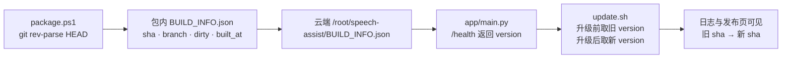
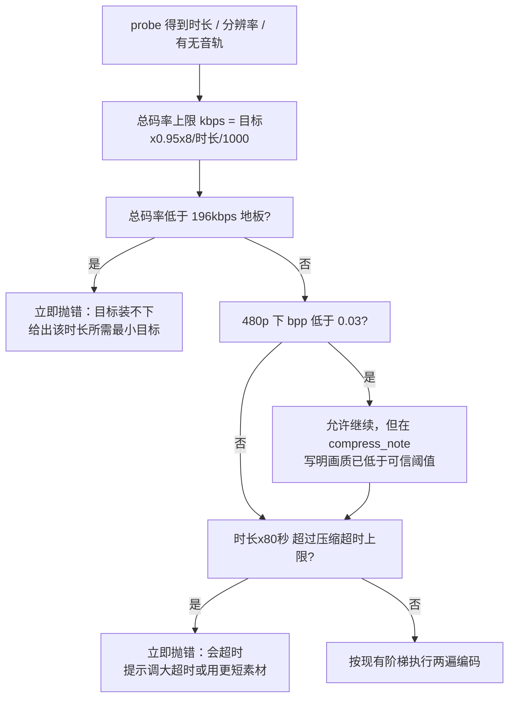

# 演讲视频评价系统 · 版本指纹与压缩闸门方案

## 目录

- 1. 结论先行
  - 1.1 调研发现的两个问题
  - 1.2 三条硬结论
  - 1.3 需要拍板的两个决策点
- 2. 调研证据
  - 2.1 版本漂移链路
  - 2.2 压缩可行性的量化分析
  - 2.3 失败路径的真实行为（一处修正）
- 3. A 线 · 版本指纹防呆
  - 3.1 设计
  - 3.2 改动清单与测试
  - 3.3 备选方案
- 4. B 线 · 压缩可行性闸门
  - 4.1 判定逻辑
  - 4.2 改动清单与测试
  - 4.3 备选方案
- 5. 实施顺序与云端发布
- 6. 明确不做的事与风险

---

## 1. 结论先行

### 1.1 调研发现的两个问题

**问题一：版本漂移。** 压缩功能已于 `ec9157e` 提交并推送到 `origin/main`，181 条自测全绿；但云端在跑的发布包 `speech-assist-20260923.tar.gz` 里根本没有 `app/compress.py`（与本次重出的新包逐文件比对，唯一差异就是它）。git、发布包、云端三者之间没有任何一处能回答"线上现在是哪个版本"。重出新包只是止血，不是防呆。

**问题二：固定 50 MB 目标与长视频存在物理矛盾。** 压缩器按"目标体积 ÷ 时长"反推码率，时长越长摊到的码率越低。调研用现有代码（`pick_plan` 纯函数）跑表，得出下面这组数字。这不是 bug——是缺一个"提前告诉用户压不下"的闸门。

### 1.2 三条硬结论

**结论一：50 MB 装不下 34 分钟以上的视频。**
视频码率有 100 kbps 的硬地板（`_MIN_VIDEO_KBPS`），加上 96 kbps 音轨，总码率最低 196 kbps。按 `HEADROOM=0.95` 反推，50 MB 目标的物理时长上限正好是 **33.9 分钟**。上传上限 200 MB 对应约 135 分钟，所以"能上传但压不进 50 MB"的区间是 **34–135 分钟**，这个区间足够宽，一定会被人踩到。

**结论二：画质在 15 分钟就开始失守。**
保真判据是每像素每比特 `bpp ≥ MIN_BPP(0.03)`，掉到 480p 为止（`LADDER` 末档）。保住 480p 所需的最小目标体积随时长线性增长：

| 时长 | 保 480p | 保 540p | 保 720p | 保原生 1080p | 每分钟系数 |
|---|---|---|---|---|---|
| 5 分钟 | 7 MB | 8 MB | 12 MB | 22 MB | 480p 1.45 |
| 10 分钟 | 15 MB | 16 MB | 24 MB | 44 MB | 540p 1.65 |
| 15 分钟 | 22 MB | 25 MB | 36 MB | 66 MB | 720p 2.38 |
| 20 分钟 | 29 MB | 33 MB | 47 MB | 88 MB | 1080p 4.40 |
| 30 分钟 | 44 MB | 49 MB | 71 MB | 133 MB | — |
| 45 分钟 | 65 MB | 74 MB | 107 MB | 199 MB | — |
| 60 分钟 | 87 MB | 99 MB | 142 MB | 265 MB | — |

对照当前 50 MB 目标（1080p 素材、25fps）：

| 时长 | 落档 | bpp | 观感判断 |
|---|---|---|---|
| 2 分钟 | 原生 1080p | .062 | 良好 |
| 5 分钟 | 720p | .054 | 良好 |
| 10 分钟 | 540p | .044 | 可接受 |
| 15 分钟 | 480p | .034 | 触底 |
| 20 分钟 | 480p | .023 | 已破地板，PPT 文字边缘开始出块 |
| 30 分钟 | 480p | .012 | 明显糊 |
| 45 分钟 | 480p 100kbps 封底 | .010 | 不可用 |

**结论三：超过约 25 分钟的 1080p 素材，会被"压缩超时"误杀。**
2 vCPU 服务器实测折算约 80 秒/分钟素材（每遍，`PRESET=veryfast`），每遍超时上限 `COMPRESS_TIMEOUT=1800` 秒：

| 素材时长 | 单遍耗时 | 状态 |
|---|---|---|
| 10 分钟 | 800 秒 | 正常 |
| 15 分钟 | 1200 秒 | 单遍正常 |
| 20 分钟 | 1600 秒 | 单遍正常 |
| 22 分钟 | 1760 秒 | 逼近上限 |
| 25 分钟 | 2000 秒 | **第一遍就被杀**，报"压缩超时" |
| 30 分钟 | 2400 秒 | 同上 |

后果：34 分钟以上的素材，用户看到的错误是"压缩超时，可调大超时后重试"，而真实原因是"50 MB 装不下"。调大超时只会让人多烧一遍 CPU，最后仍然失败。**错误信息把用户往修不好的方向引**。

### 1.3 需要拍板的两个决策点

| 决策 | 选项 | 推荐 |
|---|---|---|
| A 线版本指纹要做到哪一层 | ① 仅打包时写 `BUILD_INFO.json`（不产生提交）② 再加 `commit + push` 后的 tag | ①。仓库是 public，且 `commit→打包→上云→验收→push` 的既有闭环里，打包发生在 push 之前，不能依赖 tag |
| B 线闸门命中不可行时的动作 | ① 直接失败并给出可操作提示 ② 自动抬升目标后继续压缩并在报告留痕 | ①为主、②留开关。自动改目标会改变用户显式设置过的配额预期（`COMPRESS_TARGET_MB` 可被 `.env`/设置页覆盖），静默抬升风险大于收益 |

---

## 2. 调研证据

### 2.1 版本漂移链路

三处代码位置共同解释了"为什么没被发现"：

- `deploy/package.ps1`：白名单打包 + 泄密断言 + LF 归一 + 回环校验，流程很扎实，但**全包内没有任何版本标识**（无 git SHA、无构建时间、无来源分支）。
- `app/main.py` 的 `_health_payload`（[main.py:L993-L1017](file:///d:/heyun/speech_assist/app/main.py#L993-L1017)）：已返回 `compress_target_mb`、`compress_timeout`、`rubric` 版本、模型名、并发与 token 用量，**唯独没有代码版本字段**。也就是说 `/health` 能证明"配置是什么"，不能证明"跑的是哪份代码"。
- `deploy/update.sh`：rsync `--delete` 升级、重渲染 systemd/nginx、轮询 `/health` 成功即打印"升级完成"。**它不比对新旧版本**，所以"用旧包升级"和"用新包升级"的输出完全一样。

链路结论：git 只做备份不参与部署，部署唯一凭据是 tar.gz 文件名里的日期戳。日期戳由人手工传参（`-Stamp`），一旦忘记重打包，就出现本次这种"日期看着新、内容其实是旧的"。

### 2.2 压缩可行性的量化分析

以上三张表全部由 `app/compress.py` 的常量与 `pick_plan()` 直接算出，输入假设为 1080p/25fps 素材，非估算：

- `budget_bits = target * HEADROOM * 8 / duration` → 总码率随时长反比下降
- `video_kbps = max(_MIN_VIDEO_KBPS, total_kbps - AUDIO_KBPS)` → 100 kbps 封顶地板
- 档位选择：`bpp = video_kbps * 1000 / (w * h * fps)`，`bpp ≥ 0.03` 才保住当前档，最低掉到 480p

磁盘不是瓶颈：压缩峰值占用 = 原件 + 临时产物 ≤ 200 MB + 50 MB = 250 MB，对 40 GiB 系统盘无压力。所以闸门只需管"能否压进目标"与"能否在超时内跑完"两件事，不需要管容量。

### 2.3 失败路径的真实行为（一处修正）

先前调研推测"不可行的文件会烧满 4 遍编码（最多 2 小时）才报错"。**这个推测不成立**，逐行核对 [compress.py:L245-L265](file:///d:/heyun/speech_assist/app/compress.py#L245-L265) 后修正如下：

第二轮开始前有 `if scaled >= plan.video_kbps - _RETRY_SLACK_KBPS: break`。对已经跌到 100 kbps 地板的不可行文件，回调值只比原值低 6 kbps 左右，小于 300 kbps 的重试余量，因此**直接 break，只跑一遍两遍编码（≈2 次单遍）就退出**，随后命中 `size > target` 抛出"两遍编码后仍有 N MB，未能压到目标"。

修正后的代价评估：
- CPU 浪费：约一遍两遍编码（25 分钟素材 ≈ 2×1760 秒），仍是有意义的浪费，但不是 2 小时。
- 报错质量：这条中文提示本身是准确的，但只有在**没被超时先杀掉**时才有机会抛出。25 分钟以上的素材会先被超时截断，用户永远看不到"目标装不下"这个真因。

这恰恰强化了闸门的价值：**把"必然失败/必然糊"的判断从编码之后挪到编码之前**，既省 CPU，又让错误信息说人话。

---

## 3. A 线 · 版本指纹防呆

### 3.1 设计

打包时生成一份不进 git 的构建指纹，随包上云，运行期从 `/health` 读出，升级时前后对比。



关键点：

1. `package.ps1` 在打包目录里写入 `BUILD_INFO.json`，字段为 `git_sha`（短 7 位 + 全 40 位）、`git_branch`、`dirty`（工作区是否干净）、`built_at`（ISO8601）、`package`（包名）。取不到 git 时降级为 `"unknown"`，不阻断打包。
2. `app/main.py` 新增只读函数读取该文件（进程级缓存，仿 `face_mod.available()` 的写法），`_health_payload` 增加 `version` 对象。**文件缺失时返回 `"unknown"` 而不是报错**，这样本地 dev、老包、云上新包三种形态都能自述状态，反而一眼能看出"云端还是旧包"。
3. `update.sh` 在 rsync 之前先 `curl /health` 记下旧 `version`，重启并轮询成功后打印 `旧 <sha> → 新 <sha>`；若两者相同则显式告警"新包与云端代码指纹一致，请确认是否打包了旧提交"。这一条直接杜绝本次事故。
4. `package.ps1` 增加脏工作区提示：当 `app/` 或 `tests/` 有未提交改动时，把 `dirty=true` 写进包并在打包日志里黄字提醒"正在打包未提交的改动"。不阻断（本地验证时常需要脏打包），但要留痕。

### 3.2 改动清单与测试

| 文件 | 改动 | 量级 |
|---|---|---|
| `deploy/package.ps1` | 采集 git 信息、写 `BUILD_INFO.json`、脏区提示、加入白名单与回环校验 | ~30 行 |
| `app/buildinfo.py`（新增） | 读 `BUILD_INFO.json`，进程级缓存，异常一律降级 unknown | ~30 行 |
| `app/main.py` | `_health_payload` 增 `version` 字段 | ~3 行 |
| `deploy/update.sh` | 升级前后各取一次 version 并对比打印 | ~15 行 |
| `tests/selfcheck.py` | 断言：无 BUILD_INFO 时 `version.git_sha == "unknown"`；写入临时文件后能正确读出；`/health` 载荷含 version | ~25 行 |
| 设计报告 与 部署手册 两份文档 | 各补"如何确认线上版本"一节 | 文档 |

自测基线从 181 条增至约 184–186 条。

### 3.3 备选方案

- **把 SHA 写进代码常量**（如 `app/version.py`）：需要每次打包产生一次提交，破坏"打包在 push 之前"的闭环顺序，且会产生大量无意义提交。不采用。
- **只做 `update.sh` 比对包内文件哈希**：能防"用了旧包"，但运行期 `/health` 仍无法回答"线上是哪版"，排障时依旧要登录机器。不采用。

---

## 4. B 线 · 压缩可行性闸门

### 4.1 判定逻辑

在 `pick_plan()` 里（信息最全、且是纯函数，最易单测）加两道前置判断，**不新增配置项也能工作**，新增的 `COMPRESS_FEASIBILITY` 只用来关闭闸门。



三条提示语的具体写法（都要给出数字与出路，不说空话）：

- 不可行：`50 MB 的目标装不下 40 分钟的视频。按最低可用码率计算，这个时长至少需要 61 MB。建议：剪辑为两段分别上传，或把「压缩目标体积」调到 61 MB 以上。`
- 画质告警（仍会压，只在报告留痕）：`已压到 50.0 MB，但时长 25 分钟使 480p 画面的每像素比特数低于 0.03，回放中文字边缘会有可见色块。评分依据是 640px 关键帧，不受影响。`
- 超时预警：`这段 30 分钟的视频在两核服务器上单遍编码约需 2400 秒，超过当前 1800 秒的压缩超时上限，必然被中断。建议把「压缩超时」调到 3000 秒，或改传更短的素材。`

时长折算系数 `80 秒/分钟` 从哪来：部署手册 §7 已记录"每分钟 1080p 素材 1~2 分钟（2 vCPU）"，取中偏保守值。实现时写成 `compress.ESTIMATED_SECONDS_PER_SOURCE_MINUTE = 80`，并在注释里注明是折算系数、来源、以及 720p 素材可更低的说明，避免被当成硬编码魔法数。

`needs_compress()` 之前不需要动：闸门只在确实要压时才生效，小于目标体积的文件零影响。

### 4.2 改动清单与测试

| 文件 | 改动 | 量级 |
|---|---|---|
| `app/compress.py` | 新增 `feasibility(info, target)` 纯函数返回 `(action, message)`；`pick_plan` 开头调用；新增折算常量 | ~50 行 |
| `app/pipeline.py` | `_compress_stage` 把闸门的"画质告警"文案并入 `notes`，与现有 `res.note` 共存 | ~5 行 |
| `app/config.py` | 新增 `COMPRESS_FEASIBILITY`（默认 `on`，可 `off` 退回旧行为），沿用现有 `EnvField` 四态与 `value_source()` | ~10 行 |
| `.env.example`、`deploy/env.production` | 补配置项与注释 | 文档 |
| `tests/selfcheck.py` | 断言：20 分钟/50MB → 放行且带画质告警；40 分钟/50MB → 抛错且提示所需最小体积；`off` 时行为与今天一致；`target=0`（关闭压缩）不触发闸门 | ~40 行 |
| 设计报告 与 部署手册 两份文档 | 写入三张表与闸门行为 | 文档 |

自测基线增加约 6–8 条。

### 4.3 备选方案

- **β：自动抬升目标**。按时长自动取 `max(用户目标, 该时长保 480p 所需体积)`，压完在报告里写明"已自动调整目标"。好处是用户无感、总能出结果；坏处是静默改动了用户显式设置的配额，且 60 分钟素材会被抬到 87 MB，与"50 MB 是为了省 40GB 盘和 3Mbps 带宽"的原始约束冲突。列为后续可选增强，本次不做。
- **γ：只加文档与前端文案**，不加代码闸门。成本最低，但 34–135 分钟这个区间靠用户自己算不现实，仍然会产生"传上去等 40 分钟后失败"的差评。不采用。
- **前端上传时即时拦截**：浏览器读不到可靠的视频时长（需要 `loadedmetadata`，且对某些容器不准），且用户可能设置"先传后压"。放在闸门之后作为体验优化，本次不做。

---

## 5. 实施顺序与云端发布

推荐顺序（每步都可独立回退）：

1. **先上 0924 包**（含压缩功能，已完成打包与文档重出，等你执行）。这一步与 A/B 两线无关，是当前最紧的止血。
2. **A 线**（约半天）。改动集中在 `package.ps1`/`update.sh`/新增 `buildinfo.py`，对运行时行为零影响，风险最低，先拿到"能证明线上是哪版"的能力。
3. **B 线**（约半天）。有量化闸门，改完必须回到 `LLM_MODE=mock` 跑全量自测，再用真实长视频做一次端到端。
4. A+B 合入后重打包为 `speech-assist-<新日期>.tar.gz`，此时 `/health` 里已带 version，第 1 步的手工命令即可复用。

云端需要你手动执行（服务器仅密码认证，我无凭据）：

```bash
scp dist/speech-assist-<日期>.tar.gz root@<公网IP>:/root/
ssh root@<公网IP>
cd /root && tar xzf speech-assist-<日期>.tar.gz
sudo bash speech-assist-<日期>/deploy/update.sh speech-assist-<日期>
curl -s http://127.0.0.1:8000/health
```

A 线上线后的验收方式：`curl -s http://127.0.0.1:8000/health` 里出现 `version` 字段；升级日志末尾出现"旧 sha → 新 sha"。
B 线上线后的验收方式：上传一段 40 分钟的录屏（或临时把 `COMPRESS_TARGET_MB` 调小到 5 复现），应在排队阶段就收到中文提示，而不是等几十分钟失败。

---

## 6. 明确不做的事与风险

- **不动评价逻辑**：闸门只影响"要不要压、能不能压"，压缩本身不影响评分输入（评分只取 640px 关键帧，`Result.note` 里已有这句结论）。
- **不引入对象存储/COS**：仓库内确认无任何 COS/STS 代码，本方案不假设该方向。
- **不改上传上限**：`MAX_VIDEO_MB` 保持 200 MB，闸门是在这个前提下计算 34–135 分钟的风险区间。
- **风险一**：80 秒/分钟是折算值，真实素材（720p 手机录屏）会显著更快，闸门可能对短边较低的素材过严。缓解：把闸门 E2 只作为**预警+可调**，`COMPRESS_TIMEOUT` 设 0 即完全不限时，且提示语明确告知调大超时的出路。
- **风险二**：新增 `version` 字段可能被下游脚本按固定 JSON 结构解析。现状是 `/health` 仅由 `update.sh` 与人工使用，且只增加字段不改语义，向后兼容。
- **待你表态的遗留项**：`dist/` 下三个历史发布包是否清理。建议保留最新两个，其余删除，避免日后又拿错包。
- **文档闭环**：本方案获批实施后，需要在设计报告里新增"如何确认线上版本"与"压缩时长与体积的对应关系"两节，并在部署手册的排障表里加一行"压缩失败先查时长与目标体积是否匹配"。设计报告现有发布流程一节也要补上"打包即写指纹"这一步。
