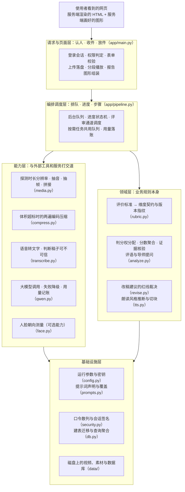
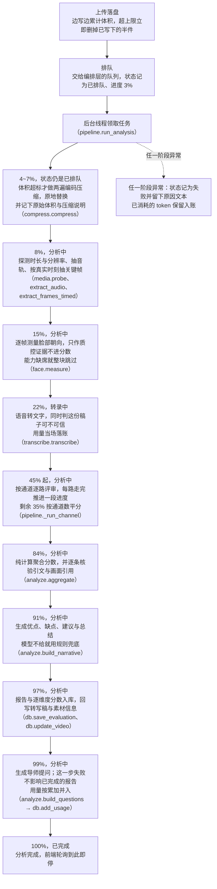
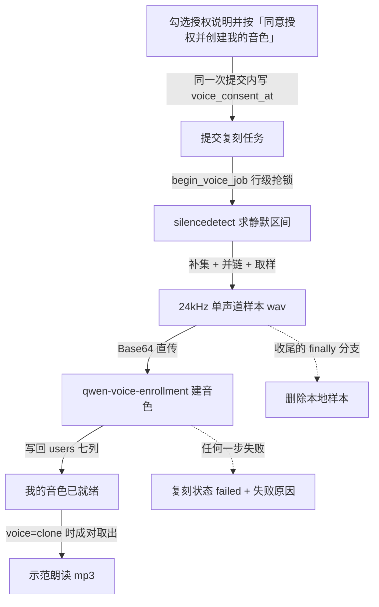

# 演讲视频评价系统 · 详细设计报告

| 项目 | 说明 |
| --- | --- |
| 代码目录 | `d:\heyun\speech_assist` |
| 运行形态 | 单机 Web 应用（FastAPI + SQLite + ffmpeg），无外部数据库、无消息队列、无 CDN |
| 评判内核 | 阿里云百炼（DashScope）OpenAI 兼容端点上的通义千问多模态模型 |
| 评分依据 | 根目录 `评价标准.txt`（制表符分隔：维度 / 分值 / 评分要点） |
| 文档版本 | 对应标准指纹 `rubric-7d-*`，7 个维度、满分 100 |

---

## 目录

- [1. 设计目标与非目标](#1-设计目标与非目标)
  - [1.1 目标](#11-目标)
  - [1.2 非目标](#12-非目标)
- [2. 技术选型与依赖](#2-技术选型与依赖)
- [3. 系统架构](#3-系统架构)
  - [3.1 分层](#31-分层)
  - [3.2 模块职责](#32-模块职责)
  - [3.3 一次分析的时序](#33-一次分析的时序)
- [4. 数据模型](#4-数据模型)
  - [4.1 表结构](#41-表结构)
  - [4.2 设计要点](#42-设计要点)
- [5. 核心流程：转录与三通道评价](#5-核心流程：转录与三通道评价)
  - [5.1 媒体预处理](#51-媒体预处理：把一段视频变成模型能吃的三样东西)
  - [5.2 语音转录：本地还是云端？](#52-语音转录：本地还是云端)
  - [5.3 通道归属：谁给哪个维度打分](#53-通道归属：谁给哪个维度打分)
  - [5.4 确定性聚合](#54-确定性聚合)
  - [5.5 叙述层与"分数不可变"](#55-叙述层与分数不可变)
  - [5.6 报告快照结构](#56-报告快照结构)
  - [5.7 评价之后：导师提问与作答点评](#57-评价之后：导师提问与作答点评)
- [6. 评分算法：从哪些维度判、分数怎么算出来](#6-评分算法：从哪些维度判、分数怎么算出来)
  - [6.1 术语约定与固定阈值](#61-术语约定与固定阈值)
  - [6.2 维度从哪来：评分标准是数据，不是代码](#62-维度从哪来：评分标准是数据，不是代码)
  - [6.3 判分权怎么分配](#63-判分权怎么分配)
  - [6.4 通道返回值的清洗与钳制](#64-通道返回值的清洗与钳制)
  - [6.5 融合公式：置信度加权平均](#65-融合公式：置信度加权平均)
  - [6.6 有资格改分（或改置信度）的六条规则](#66-有资格改分（或改置信度）的六条规则)
  - [6.7 未评维度与 100 分制折算](#67-未评维度与-100-分制折算)
  - [6.8 端到端算例](#68-端到端算例)
  - [6.9 这套算法保证的不变量](#69-这套算法保证的不变量)
  - [6.10 算法刻意不做的事](#610-算法刻意不做的事)
- [7. 多次上传的对比与复发问题](#7-多次上传的对比与复发问题)
- [8. Web 层与安全](#8-web-层与安全)
  - [8.1 路由清单](#81-路由清单)
  - [8.2 会话](#82-会话)
  - [8.3 越权与输入](#83-越权与输入)
  - [8.4 静态资源与播放](#84-静态资源与播放)
- [9. 管理员视图](#9-管理员视图)
  - [9.1 账号开通：两条路，一套校验](#91-账号开通：两条路，一套校验)
  - [9.2 上传次数配额：一个计数列，三档覆盖](#92-上传次数配额：一个计数列，三档覆盖)
- [10. 模型用量（token）统计设计](#10-模型用量（token）统计设计)
  - [10.1 采集](#101-采集)
  - [10.2 持久化](#102-持久化)
  - [10.3 聚合](#103-聚合)
  - [10.4 展示与口径](#104-展示与口径)
  - [10.5 演示模式的行为（重要）](#105-演示模式的行为（重要）)
- [11. 千问接入的工程性约束（踩坑记录 → 代码约束）](#11-千问接入的工程性约束（踩坑记录-代码约束）)
- [12. 演示模式（mock）](#12-演示模式（mock）)
- [13. 前端与可视化约定](#13-前端与可视化约定)
  - [13.1 窄屏适配：手机与电脑共用一套样式](#131-窄屏适配：手机与电脑共用一套样式)
- [14. 网页化配置与热刷新](#14-网页化配置与热刷新)
  - [14.1 一张声明表驱动全部](#141-一张声明表驱动全部)
  - [14.2 热刷新为什么可行](#142-热刷新为什么可行)
  - [14.3 取值优先级与"回填值 ≠ 生效值"](#143-取值优先级与回填值-生效值)
  - [14.4 校验与写回](#144-校验与写回)
  - [14.5 页面与权限](#145-页面与权限)
  - [14.6 管理员账号的双写](#146-管理员账号的双写)
  - [14.7 测试隔离](#147-测试隔离)
  - [14.8 大模型提示词：第二张声明表与差量落盘](#148-大模型提示词：第二张声明表与差量落盘)
- [15. 文字稿改稿与朗读合成](#15-文字稿改稿与朗读合成)
  - [15.1 修订建议：模型出清单，代码裁决，学生确认](#151-修订建议：模型出清单，代码裁决，学生确认)
  - [15.2 朗读风格的两级拼装：主题 → 情感 → 演绎指令](#152-朗读风格的两级拼装：主题-情感-演绎指令)
  - [15.3 闸门：动手之前先回答"跑不跑得动"](#153-闸门：动手之前先回答跑不跑得动)
  - [15.4 按需合成的生命周期](#154-按需合成的生命周期)
  - [15.5 页面表现：确认门与播放器](#155-页面表现：确认门与播放器)
  - [15.6 声音复刻：让示范朗读用上学生本人的音色](#156-声音复刻：让示范朗读用上学生本人的音色)
- [16. 部署与运维](#16-部署与运维)
  - [16.1 启动方式与管理员入口](#161-启动方式与管理员入口)
  - [16.2 配置矩阵（关键项）](#162-配置矩阵（关键项）)
  - [16.3 常见故障定位](#163-常见故障定位)
  - [16.4 10 个用户同时使用：瓶颈在哪、要什么配置](#164-10-个用户同时使用：瓶颈在哪、要什么配置)
  - [16.5 云上部署包（deploy/）](#165-云上部署包（deploy）)
  - [16.6 更新服务器：照抄即可的命令序列](#166-更新服务器：照抄即可的命令序列)
  - [16.7 仓库管理（git）](#167-仓库管理（git）)
  - [16.8 如何确认线上版本（版本指纹）](#168-如何确认线上版本（版本指纹）)
- [17. 测试策略](#17-测试策略)
- [18. 已知限制与演进方向](#18-已知限制与演进方向)
- [19. 附录 A：数据目录](#19-附录-a：数据目录)
- [附录 B：为什么这样设计（三句话总结）](#附录-b：为什么这样设计（三句话总结）)

---

## 1. 设计目标与非目标

### 1.1 目标

1. 账号**由管理员统一开通**（后台单个录入或 Excel 批量导入），用户登录后上传演讲视频，一键触发分析，全过程可视化进度；站点**不开放自助注册**。
2. 系统完成 **语音转录 → 多模态判分 → 证据核验 → 反馈生成** 的完整链路，且严格按《评价标准》逐维度打分。
3. 输出**可复现、可审计**的分数：分数由确定性规则聚合，不依赖模型情绪；评语必须由大模型生成，但**不得反向修改分数**。
4. 同一用户多次上传可按维度对比，并识别**反复出现的同类问题**。
5. 管理员可见全站视频、评价、用量与统计，普通用户之间的数据严格隔离。
6. 没有任何可用密钥时也必须能跑通全流程（演示模式），便于验收与教学演示。
7. 对"眼神回避 / 不正视评委 / 表情不自然"这类主观判断，提供一层**可复现的客观测量做交叉核对**（正脸率、头部偏向、疑似低头），只作质控证据与人工复核指路，不进入加权求和（§5.1.2）。
8. 服务器上的运行参数（走真实模式还是演示模式、三条评审通道的开关、抽帧密度、上传体积上限、各类安全项）都能在**管理员网页**上看懂、改对、改完立刻生效，不必登录服务器去编辑配置文件（§14）。
9. 面向**至少 10 个用户同时操作**：把"同时能接多少网页请求 / 同时能跑几路视频分析 / 同时在途多少个大模型请求"三层额度拆开、各自可调，设置页上能改、健康检查页上能查，避免一处堵死处处转圈（§16.4）。
10. 发给大模型的**提示词也是管理员可维护的配置**：23 块提示词（9 组）在同一个设置页上可读、可改、可一键恢复内置默认，改动受占位符与输出结构校验保护，保存即对下一次分析生效（§14.8）。
11. 转写稿**可纠错、可采纳、可朗读**：模型只逐处提修改建议，采纳与否先过系统的硬性规则、再由学生本人点头，**原始转写永不被覆盖**；定稿后按需合成"示范朗读"，语速与情感从演讲现场与主题反推，而不是给一个固定腔调（§15）。

### 1.2 非目标

- 不做多租户横向扩展、不做分布式任务调度、不做对象存储。
- 不做实时（流式）视频评测，只处理上传完成的文件。
- 不承诺分数与人类评委完全一致；本系统追求的是**同一输入产生稳定且可解释**的结果。
- 不做视线方向估计、表情单元（AU）识别或眨眼频率测量——关键帧是稀疏静态画面，且 Haar 级联测不出注视角；报告里出现这类结论时，它来自大模型的看图判断，而非测量值。

---

## 2. 技术选型与依赖

| 层 | 选择 | 理由 |
| --- | --- | --- |
| Web 框架 | FastAPI + Uvicorn | 表单解析、文件上传、参数校验都是自带的，不必再拼一套。绝大多数页面按普通同步写法处理即可，框架会自己放到后台线程执行；只有健康检查这一个接口必须写成异步——因为并发额度只能在请求调度器内部才读得到（§16.4） |
| 视图 | Jinja2 服务端渲染 + 一份样式表 | 不用前端框架、没有构建步骤，页面能离线打开、能直接 Ctrl+P 打印 |
| 图形 | 服务端直接生成矢量图（雷达图、趋势图、分数差值条） | 不引入图表库、不依赖外部资源；图上的文字能被选中复制，打印也不失真 |
| 存储 | SQLite（Python 自带，开启 WAL 日志与外键约束） | 单机零运维；"删号即清数据"由外键级联自动满足 |
| 模型 | 阿里云百炼的 OpenAI 兼容接口，只用最朴素的 HTTP 客户端 | 不引入官方 SDK，方便精确控制是否流式返回、请求体里放哪些字段 |
| 音视频 | 调用本机安装的 ffmpeg / ffprobe | 抽音轨、抽帧、切块、取时长都交给成熟工具，Python 侧不背任何编解码依赖 |
| 可选：本地语音识别 | faster-whisper，用到时才加载 | 不装也不影响启动；只有在设置页把转录引擎选成"本地 whisper"时才需要（§5.2） |
| 可选：客观测量 | opencv（headless 版，限定 4.x，用到时才加载） | 只做正脸率、头部偏向这类**可复现测量**，用于交叉核对与质控。三种情况下整块降级、评分链路照常跑完：没装、装成了 5.x（正脸检测器被移出了主安装包）、或在设置页关掉了"启用人脸质控"（§5.1.2） |
| 账号表格 | openpyxl，读表写表都用它 | 模板下载与批量导入共用同一套解析逻辑。刻意不引 pandas——体积大，且本机 pandas 与 NumPy 2.x 存在二进制接口冲突，装了也用不了 |

依赖清单只声明 7 个核心包（FastAPI、Uvicorn、表单上传支持、模板渲染、配置读取、HTTP 客户端、表格读写）加 1 个可选的图像测量库，面刻意收得最小。表格读写只依赖 openpyxl（§9.1），不引 pandas——本机 pandas 与 NumPy 2.x 存在二进制接口冲突，装了也导入不了。

---

## 3. 系统架构

### 3.1 分层

系统从上到下只有六段，彼此是"上面使唤下面、下面不知道上面"的关系。先说清每一段在替谁干活，图里的文件名只是"去哪儿找它"的路标，读架构不需要先记住它们。

1. **使用者看到的页面**：所有网页由服务端渲染成 HTML，雷达图、趋势图、胶片带这些图形也是服务端算好坐标再发过去的。好处是页面能离线打开、能直接 Ctrl+P 打印，不需要任何前端构建步骤。
2. **管请求与页面的那一段**只做三件事：**认人**（这个访客是谁、有没有权限看这条视频）、**收件**（上传的文件边收边写磁盘，超出上限立刻丢弃半成品）、**放件**（视频按字节区间回吐，播放器才能拖动进度条）。
3. **管编排调度的那一段**是全局唯一的调度者：谁在排队、谁正在跑、跑到哪一步给了百分之几、下一步该叫谁上场，都由它定；每一步花掉的模型用量也由它落账。
4. **管能力的那一段**负责与外部世界打交道——本机装的视频工具、云端语音识别、云端大模型、可选的图像测量库。这一段的共同点是**可以整块缺席、也可以整块换掉**：换识别引擎、换模型、不装图像库，都只影响这一段自己。
5. **管业务规则的那一段**装着这个系统的"主张"：一份评价标准文本怎么变成"有哪些维度、各占多少分、判分要点是什么"；三份评审意见怎么定成一个分数；什么样的证据才算成立；改稿建议能不能采纳；朗读该用什么情感与语速。
6. **底座**放运行参数与密钥、提示词配置、口令散列与会话签名、数据库和磁盘上的素材目录。



**三条依赖规矩**：

- **只许上层使唤下层**。判分与聚合环节不知道有 HTTP 这回事，数据存取层不知道模型叫什么名字，页面层也不直接指挥视频工具——要抽素材一律找编排层。
- **层与层之间交的是数据，不是调用**。往下要的是时长、帧表、文字稿、三份评审意见；往上拿的是分数、证据、质控记录。所以"换模型、换语音识别引擎、换存储"都局限在一个文件里改，不会顺着调用链改出一片（见 §5.2、§12）。
- **可选能力必须能整块缺席**。图像测量库没装、版本不对、或者在设置页里关掉，评价照样跑完，只是报告里少一段质控证据并写明"为什么没有"（§5.1.2）；压缩也同理——体积不超标就根本不进那一步（§3.3）。

### 3.2 模块职责

下表按"先地基、再入口、后能力"的顺序列出十七个部分。**"关键职责"一栏写的是它替谁干活、读哪些参数、在什么情况下会拦下来**；括号里的文件名与函数名只是给人查代码用的索引，不是职责本身。

| 模块 | 关键职责 | 对上层提供（括号内为代码入口） |
| --- | --- | --- |
| **配置模块**<br>（`config.py`） | 把运行参数的四十三项一次读齐并逐项校正：用哪个模型、网关地址、超时与重试次数、并发与分析额度、上传体积与压缩目标、各类开关与阈值。判断的事有三类——**密钥能不能用**（去掉引号后不少于 12 位、且不是"sk-"这类占位写法）、**该走真实还是演示模式**（显式指定就照办，自动则看有没有可用密钥）、**数值合不合法**（整数必须落在声明的上下限内，开关认 1/true/yes/on）。取值顺序是先看进程环境变量，再按固定名单依次到八个候选密钥文件里找。设置页保存时只改写有变化的键，保留原有注释与行序，用"先写临时文件再替换"的方式落盘，写完立刻让内存里的参数换新，不要求重启服务。 | 全程序共用的一份参数快照（`settings`）；"现在该用哪把密钥、哪个模型"的问答（`resolve_api_key()`、`resolve_model()`）；参数声明表本身，供设置页照着渲染（`ENV_GROUPS`、`settings_overview()`） |
| **提示词模块**<br>（`prompts.py`） | 集中声明 23 块提示词、分 9 组，每块写明用在哪个环节、允许填哪些占位符、有没有必须保留的关键句子。使用者从设置页改文案时过四道闸门：单块不超过 6000 字；声明过的占位符一个不许少；开了严格花括号检查的块不许出现没声明过的大括号内容；指定的关键片段不能丢。落盘时只存与默认不同的块，改回原样就把条目删掉，所以"哪些被自定义过"一眼可见。读文件按修改时间与大小判断是否变过，变过才重读，不每次请求都开盘。 | 按编号取文案、填好占位符再交给模型（`get()`、`render()`）；保存与一键还原全部自定义（`save()`、`reset_all()`）；改动校验与总览（`validate()`、`placeholder_report()`、`overview()`、`custom_count()`） |
| **评价标准模块**<br>（`rubric.py`） | 把标准文件读成一组维度。行首的注释记号跳过，整行读不出"数字加分"就丢弃，一个维度都没解析出来直接报错——绝不带着空标准往下跑。维度标识限 32 字符，重名自动加序号。用文件原文算版本指纹（形如 `rubric-6d-xxxxxxxxxx`），标准改一个字指纹就变，报告上写的标准版本与实际用的永远对得上，跨次对比不会因为中途换了标准而被误读。 | 默认标准实例与按需加载（`rubric`、`load_rubric()`）；维度列表、总分与按名取维度（`Rubric`、`Dimension`） |
| **口令与会话模块**<br>（`security.py`） | 口令只存带盐散列：每次随机 16 字节盐，用 pbkdf2-sha256 迭代 18 万次，原文不入库、任何页面不再显示。会话令牌的内容是"用户号 + 角色 + 有效期 + 签名"，签名用服务端密钥做 HMAC-SHA256 后取前 32 位写进浏览器 cookie，服务端每次重算比对，改动一个字符即失效。用户名与口令的规矩也在这里：用户名 3 到 32 位、只允许字母数字和点、划、下划线，口令至少 6 位。 | 口令的存与验（`hash_password()`、`verify_password()`）；令牌的签发与读取（`make_session_token()`、`read_session_token()`） |
| **账号批量导入模块**<br>（`accounts.py`） | 把管理员给的表格变成账号。只认 `.xlsx`，文件不超过 4MB、表格不超过 5000 行，超出立刻拒绝而不是硬撑内存。表头认"用户名 / 登录口令 / 显示名"三列；以 `#` 开头的行按示例或注释处理并跳过——模板里本来就带着示例行。重名、缺项、口令不合规矩的行不静默丢弃，带着行号退回。导入只新增，绝不删改已有账号。口令一进这道门就散列，明文不落库、不外流。 | 表格读取与文件层面校验（`read_table()`）；逐行解析与冲突处理（`plan_users()`）；结果汇总（`summarize()`）；可下载的填写模板（`build_template()`） |
| **版本指纹模块**<br>（`buildinfo.py`） | 回答"线上跑的到底是哪一版"。读打包脚本写进发布包根部的构建信息——提交号、分支、是否含未提交改动、打包时间——拼成一行摘要给健康检查和管理页显示，升级验收因此能闭环到"运行版本等于新包指纹"。文件缺失或读坏了一律降级为 unknown 并且绝不抛错：指纹是辅助信息，不能因为它把健康检查整个打挂。读一次缓存在内存，不每请求开盘。 | 构建信息字典与一行版本摘要（`data()`、`version()`） |
| **数据存取模块**<br>（`db.py`） | 六张表的建表、加列迁移、日常读写和统计聚合集中在此。开 WAL 日志与外键约束，统一 30 秒锁等待，避免多线程下偶发"库忙"。保存一次评价先按视频清掉旧行再写，重跑不会留双份；入库前截断长文本（标签 160 字、引文 200 字）防止撑爆表格。上传名额的增减与视频行的增删放在同一个事务里，删一条退一个名额且不会退成负数；名额先看账号自己的设置，没设置才用全局值，管理员不受限。token 用量按阶段与模型累加而非覆盖。"反复出现的问题"只统计出现过两次及以上的，最多取 12 条。服务重启时把上次残留在"分析中"的任务判为失败，不留僵尸进度。 | 初始化（`init_db()`）；用户与视频读写、名额查询与设置（`upload_quota()`、`set_upload_quota()`）；评价入库（`save_evaluation()`）；用量统计与累加（`token_usage()`、`add_usage()`）；历史聚合（`recurring_issues()`、`user_best_worst()`）；残留任务清理（`reset_stale_jobs()`） |
| **页面与请求模块**<br>（`app/main.py`） | 三十二条路径的进出都从这里过，做三件事。**认人**：先读 cookie 判身份与角色，看别人的视频又不是管理员一律拒绝，没登录的送回登录页，能直接取文件的地方走资源名白名单，其余一律不给。**收件**：上传只认九种视频后缀，文件名先清洗再截 60 字，每读 1MB 就累计一次体积、超过上限立即删掉已经写下的半件；播放支持分段请求，区间不合法就拒绝，合法就按 512KB 分块送，让长视频能秒开、能拖。**放件**：校验通过后交给编排层排队，此后页面只轮询进度，绝不在请求线程里等分析。报告页与对比页的雷达图、趋势图、时间轴由服务端直接画成图形下发，前端不装任何框架。 | 应用入口与页面渲染（`app`、`render()`）；会话读取与归属校验（`session_user()`、`owned_video()`）；报告页图形（`build_radar()`、`build_trend()`、`build_film()`） |
| **编排调度模块**<br>（`app/pipeline.py`） | 一条视频从入库到出报告的全过程在这里排队、推进、记账。维护六个状态和一条只前进不后退的进度线：排队 3%，压缩 4 到 7%，抽素材 8%，测脸 15%，转录 22%，三路判分从 45% 起把剩下的 35% 按通道数平分，聚合 84%，评语 91%，写库 97%，出题 99%，完成 100%。工作线程数跟着"同时能跑几路分析"这项参数走（默认 10，可设 1 到 64），但只有额度真的变了且当前没有任务在跑时才重建线程池，避免半路换池丢任务。改稿与朗读这类按需任务共用同一个池，只报进度不改状态，进度值夹在 5 到 99 之间。音频超过 15 分钟判为不支持。文本通道一路都没出分时直接终止——没有分数的报告不如报错。演示模式不发请求也能跑出完整报告，方便在没密钥的机器上验整条流程。每一步的 token 消耗当场落账。 | 提交分析任务与按需任务（`enqueue()`、`submit()`）；跑完整条流程（`run_analysis()`）；改稿与朗读入口（`propose_script()`、`run_tts()`）；并发与排队状况查询（`pool_size()`、`queue_depth()`、`is_running()`）；用量落账（`_flush_usage()`） |
| **媒体素材模块**<br>（`media.py`） | 借外部音视频工具探出时长与分辨率、抽音轨、抽关键帧、拼接音频。抽帧张数按时长自适应：大约每 5 秒一张，只做封顶不做抬底，硬顶 100 张；取样时刻取每段等距区间的中点，保证整段都被覆盖；画面缩到最长边 640 像素，只缩不放；单帧小于 512 字节视为失败。全部抽不到时退回"取正中间一帧"，不因抽帧失败让整单报错。音轨短于 10KB 判定为没有声音。每帧都带真实时刻回传，报告里点某句评语能直接跳到对应秒。外部工具找不到时先问出来，而不是抛一个"找不到命令"。 | 探测（`probe()`）；抽音与拼接（`extract_audio()`、`concat_audio()`）；按时刻抽帧与张数计算（`extract_frames_timed()`、`frame_budget()`、`FrameSet`）；封面（`video_thumbnail()`）；工具可用性（`ffmpeg_exe()`） |
| **视频压缩模块**<br>（`compress.py`） | 只在文件太大时出场，出场前先答三个问题。**要不要压**：体积是否超过设置里的压缩目标。**压了会不会更亏**：按每分钟素材约需 80 秒编码估算耗时，超过压缩超时上限就直接放弃并说明原因。**能压到多小**：分辨率按 1080、720、540、480 逐级降，每级用目标体积反推码率、留 5% 余量、音轨固定 96kbps；最低一档的每像素比特数仍低于 0.03 时不再硬压，放行并在报告里留一句"画质可能不足以评"。真压时用两遍编码把体积算准，压完比原件还大就保留原件。压前记下原始体积，压后写明用了哪一档、什么码率、花了多久。 | 是否需要压缩与目标体积（`needs_compress()`、`target_bytes()`、`target_hint()`）；方案与可行性（`pick_plan()`、`feasibility()`）；执行与留痕（`compress()`、`Plan`、`Result`） |
| **语音转录模块**<br>（`transcribe.py`） | 选引擎、切音频、分段转写，最后判断这份稿子能不能信。音频按 175 秒一块，最多 24 块，超出部分不硬转。可信度用三条规则把幻觉拦在门外：整段词数太少；平均每词字母数少于 1.8（成串乱码的典型形状）；时长 20 秒以上但词密度低于每秒 0.4 个（本地引擎跑脱时的特征）。任一命中就把文本通道标为不可信，后面只降权、不采纳它的具体指控。本地引擎返回空结果时自动改用云端，不静默交白卷。 | 转写与分段结果（`transcribe()`、`TranscriptResult`）；可信度判定与理由（`credibility()`） |
| **大模型调用模块**<br>（`qwen.py`） | 所有对外请求集中一处，管文本、图像、音频、转写、朗读五类调用。发出去之前先过额度闸门：一轮分析的总请求数超过设置上限（默认 20）就拦下，排队等待超过三倍单次超时仍拿不到额度就报错，而不是无限等。失败重试三次，间隔按 1.5 倍递增、每次再多等约 2 秒。只有一种情形才换同族模型顶上——报 400/403/404/422 且错误信息里提到模型或权限问题，同时不是额度用尽、也不是密钥无效；对话按 plus、turbo、max 顺序降级，朗读按带指令版、通用版顺序降级。每次调用都记账，账单拿不到时按估算兜底：中文一字一 token、其余四字符一 token、图片每张折 1000、音频按 Base64 长度除 900。返回内容允许前后裹着说明文字，只取其中的结构化部分，取不出来就明确报错而不是猜。 | 客户端与结果（`QwenClient`、`Completion`、`TtsAudio`）；额度闸门（`RequestGate`）；用量估算（`estimate_tokens()`、`prompt_tokens_estimate()`）；结构化结果解析（`parse_json_block()`）；多模态素材打包（`image_url_item()`、`input_audio_item()`） |
| **人脸朝向测量模块**<br>（`face.py`，可选能力） | 在抽出的关键帧上量脸的朝向，产出正脸率、非正脸率、左右偏向与角度散布。三道门控防止把"没测到"当成"表现差"：整段检出率低于 0.5 时一个指标都不出；有效帧少于 3 帧不判；判低头要求眼睛检测可靠度至少 0.5。给使用者看的总结语只在左右偏超过 0.04 时才提。最多测 120 帧，多了等距抽样。测量库缺失、版本不符或运行中报错，整块能力自动停用并记下原因，评价照常完成，报告里写明这一段为什么缺。指标只作质控证据，不直接进分数；与模型给的分明显冲突时，只在报告里提示复核。 | 是否可用与不可用原因（`available()`、`unavailable_reason()`）；测量与指标（`measure()`、`FaceMetrics`） |
| **判分与聚合模块**<br>（`analyze.py`） | 决定哪一路通道给哪些维度打分、三份意见怎么合成一个分、模型说的证据算不算数。**通道归属**是写死的分配表：稿子归文本通道，画面与姿态归画面通道，声音归语音通道，不随提示词漂；时长只由一路判，避免三个各说一套。**核验是纯计算，不再叫模型**：引文与稿子的实词重叠率至少 0.55 才算命中，帧引用的时刻误差在 2 秒内才算数；两路通道分差超过 25% 就把该维度置信度减 0.15；证据脱靶按每条 0.1 扣分、最多扣 0.3；时长偏离目标 15% 以上且维度名与时间相关，分数压到 60%；没有任何已核验证据却给到 88% 以上，整体收缩到 85%；稿子被判不可信时文本通道置信度乘 0.5、下限 0.25。分数四舍五入到 0.5，等级按 90/80/70/60 划线。评语、总结、导师提问与答题点评也在这里生成；模型不给或给坏时有规则兜底，报告不会开天窗。出题失败只跳过提问，不影响已完成的报告。 | 通道归属与维度分配（`channel_weights()`、`dims_for_channel()`）；聚合（`aggregate()`、`Aggregated`）；规范化与可信度降权（`normalize_channel()`、`apply_transcript_credibility()`）；时长核验（`check_timing()`）；证据核验（`verify_quote()`）；评语、提问与答题点评（`build_narrative()`、`build_questions()`、`review_answers()`）；完整报告（`build_report()`） |
| **改稿建议模块**<br>（`revise.py`） | 让学生对文字稿的修改可控、可回退。模型一次只出"改哪儿、改成什么、属于哪类、为什么"的清单，绝不直接重写全篇。逐条过五条红线，碰一条就整条丢掉并回执原因：单条改动超过 20 字（改稿不是重写）；全篇累计改动量超过原稿的 8%；改动让数字、日期、人名序列发生变化（数字转错极可能是听错，不能顺手改）；改动让句末标点变多（擅自断句会改变朗读节奏）；风格类建议超过 5 条。此外要求定位文本在稿中唯一命中、各建议覆盖区间互不重叠、类型属于声明过的五类。应用时只采纳学生点了"接受"的，并从稿子末尾往前改，前面的位置不会错位。用原稿指纹判断这份建议是否已过期，过期就拒绝应用而不是套到错稿上。喂给模型的稿子截到 12000 字。 | 生成与逐条裁决（`run_revision()`、`validate_items()`）；幂等应用（`apply_revisions()`）；确认门表单解析（`decisions_from_form()`）；指纹与过期判断（`source_hash()`、`is_stale()`）；建议与时间轴对齐（`stamp_items()`）；提示词里用的类型与格式说明（`kinds_block()`、`schema_block()`） |
| **示范朗读模块**<br>（`tts.py`） | 把确认后的稿子合成一段给学生听的示范，语速与情感要贴现场。先做一次廉价的情感推断（温度 0.3）：从主题、要求与稿件判断这是什么场合该有什么情绪；失败就退回按场景写死的四套基线，绝不为"情绪"卡住合成。语速不写死数值而给区间——中文每分钟 180 到 260 字、英文每分钟 120 到 170 词，再按情感与实际演讲速度做相对调整。切块只在句末标点处落刀，累积到 1600 字切一块，绝不在句中切开；总长不超过 12800 字，块数超过 8 块直接报错。合成前先估时：每块至少 30 秒、按 1600 字 50 秒折算，预计总耗时超过朗读超时上限（默认 300 秒）就不开跑，并把原因告诉用户。下载最多重试两次，小于 1024 字节算失败；拼接失败时退化为只保留第一块——给半段也比整单报错有用。 | 情感推断与规则兜底（`infer_style()`、`style_fallback()`）；语速区间与评语侧重点（`speech_band()`、`build_focus()`）；演绎指令拼装（`build_instructions()`）；切块与估时（`plan_chunks()`、`tts_feasibility()`）；合成与产物（`synthesize()`、`download_audio()`、`TtsResult`） |

### 3.3 一次分析的时序



> 压缩那一步只在文件体积超过设置里的压缩目标时才出现（算法见 §5.1.3）。它刻意不改状态，仍写"已排队"：
> 对用户来说"正在压缩"和"正在排队"都是"还没开始分析"，新增一个压缩态要多一处前端分支，
> 收益只是文案不同，却会把状态机的迁移路径变成要测两遍的东西。

---

## 4. 数据模型

### 4.1 表结构

一共六张表：用户、视频、评价结果、逐维度得分、问题记录、导师问答，外加六个索引。下面的建表语句节选自数据存取模块（`db.py`）中的表结构定义，列名与行尾注释保持代码原样以便对照，读的时候只需关心"这一列为什么要单独存"。

```sql
CREATE TABLE IF NOT EXISTS users (
    id INTEGER PRIMARY KEY AUTOINCREMENT,
    username TEXT UNIQUE NOT NULL,
    password_hash TEXT NOT NULL,
    display_name TEXT NOT NULL DEFAULT '',
    role TEXT NOT NULL DEFAULT 'user',          -- 'user' | 'admin'
    created_at TEXT NOT NULL,
    upload_used INTEGER NOT NULL DEFAULT 0,     -- 已用掉的上传名额（删一条视频即 -1）
    upload_limit INTEGER                        -- NULL = 跟随全局 USER_UPLOAD_LIMIT；管理员可单独放行/封禁
);

CREATE TABLE IF NOT EXISTS videos (
    id INTEGER PRIMARY KEY AUTOINCREMENT,
    user_id INTEGER NOT NULL REFERENCES users(id) ON DELETE CASCADE,
    title TEXT NOT NULL, topic TEXT NOT NULL DEFAULT '',
    requirements TEXT NOT NULL DEFAULT '',       -- 用户自填的时长/主题要求
    filename TEXT NOT NULL DEFAULT '', path TEXT NOT NULL DEFAULT '',
    size INTEGER NOT NULL DEFAULT 0, duration REAL NOT NULL DEFAULT 0,
    width INTEGER NOT NULL DEFAULT 0, height INTEGER NOT NULL DEFAULT 0,
    thumb TEXT NOT NULL DEFAULT '',
    status TEXT NOT NULL DEFAULT 'uploaded',     -- 见 4.2 状态机
    stage TEXT NOT NULL DEFAULT '', progress INTEGER NOT NULL DEFAULT 0,
    error TEXT NOT NULL DEFAULT '',
    transcript TEXT NOT NULL DEFAULT '',         -- 全文
    segments TEXT NOT NULL DEFAULT '[]',         -- JSON：[{start,end,text,speaker?}]
    engine TEXT NOT NULL DEFAULT '',             -- 实际使用的 ASR 标识
    model TEXT NOT NULL DEFAULT '',
    channels TEXT NOT NULL DEFAULT '{}',         -- JSON：三通道原始返回
    qc TEXT NOT NULL DEFAULT '[]',               -- JSON：质控/降级/下调记录
    prompt_tokens INTEGER NOT NULL DEFAULT 0,
    completion_tokens INTEGER NOT NULL DEFAULT 0,
    total_tokens INTEGER NOT NULL DEFAULT 0,
    api_calls INTEGER NOT NULL DEFAULT 0,
    token_detail TEXT NOT NULL DEFAULT '{}',     -- JSON：usage_summary（分阶段/分模型）
    frontal_ratio REAL,                          -- 正脸率；NULL = 未测或门控未通过（≠ 0%，见 §5.1.2）
    orig_size INTEGER,                           -- 压缩前的原始体积；NULL = 没压过（≠ 0，见 §5.1.3）
    compress_note TEXT NOT NULL DEFAULT '',      -- 给人看的压缩说明，见 §5.1.3（含目标、码率、耗时）
    script_status TEXT NOT NULL DEFAULT '',      -- 改稿状态机：'' → proposed → decided（见 §15.1）
    script_items  TEXT NOT NULL DEFAULT '[]',    -- JSON：逐条修订建议 + 逐条判定 + 红线丢弃回执
    script_text   TEXT NOT NULL DEFAULT '',      -- 学生确认后的成稿；空串 = 成稿等同原始转写
    script_meta   TEXT NOT NULL DEFAULT '{}',    -- JSON：source_hash/模型/术语表/告警等回溯信息
    created_at TEXT NOT NULL, updated_at TEXT NOT NULL, analyzed_at TEXT
);
-- tts_status / tts_path / tts_error / tts_meta 四列不在这份 SCHEMA 摘录里：
-- 它们只走列级迁移（_EXTRA_VIDEO_COLUMNS），为的是老库不删库直接升级，见 §4.2。

CREATE TABLE IF NOT EXISTS evaluations (
    id INTEGER PRIMARY KEY AUTOINCREMENT,
    video_id INTEGER NOT NULL REFERENCES videos(id) ON DELETE CASCADE,
    user_id INTEGER NOT NULL, rubric_version TEXT NOT NULL DEFAULT '',
    total REAL NOT NULL DEFAULT 0, max_total REAL NOT NULL DEFAULT 100,
    band TEXT NOT NULL DEFAULT '', confidence REAL NOT NULL DEFAULT 0,
    advantages TEXT NOT NULL DEFAULT '[]', disadvantages TEXT NOT NULL DEFAULT '[]',
    suggestions TEXT NOT NULL DEFAULT '[]', summary TEXT NOT NULL DEFAULT '',
    next_focus TEXT NOT NULL DEFAULT '',
    payload TEXT NOT NULL DEFAULT '{}',          -- 完整报告快照（报告页数据源）
    model TEXT NOT NULL DEFAULT '', created_at TEXT NOT NULL
);

CREATE TABLE IF NOT EXISTS dimension_scores (     -- 便于按维度做聚合/均值，无需解析 JSON
    id INTEGER PRIMARY KEY AUTOINCREMENT,
    evaluation_id INTEGER NOT NULL REFERENCES evaluations(id) ON DELETE CASCADE,
    video_id INTEGER NOT NULL, user_id INTEGER NOT NULL,
    dim_key TEXT NOT NULL, name TEXT NOT NULL DEFAULT '', idx INTEGER NOT NULL DEFAULT 0,
    score REAL NOT NULL DEFAULT 0, max_score REAL NOT NULL DEFAULT 0,
    ratio REAL NOT NULL DEFAULT 0, confidence REAL NOT NULL DEFAULT 0,
    evidence TEXT NOT NULL DEFAULT '[]', detail TEXT NOT NULL DEFAULT '{}'
);

CREATE TABLE IF NOT EXISTS issues (               -- 复发问题检测的原子事实
    id INTEGER PRIMARY KEY AUTOINCREMENT,
    user_id INTEGER NOT NULL, video_id INTEGER NOT NULL, evaluation_id INTEGER NOT NULL,
    dim_key TEXT NOT NULL DEFAULT '', signature TEXT NOT NULL DEFAULT '',
    label TEXT NOT NULL DEFAULT '', quote TEXT NOT NULL DEFAULT '', created_at TEXT NOT NULL
);

CREATE TABLE IF NOT EXISTS qa_turns (             -- 导师提问：一行一道题，作答与点评同行
    id INTEGER PRIMARY KEY AUTOINCREMENT,
    video_id INTEGER NOT NULL REFERENCES videos(id) ON DELETE CASCADE,
    user_id INTEGER REFERENCES users(id) ON DELETE CASCADE,
    idx INTEGER NOT NULL,
    question TEXT NOT NULL,
    answer TEXT NOT NULL DEFAULT '', ai_comment TEXT NOT NULL DEFAULT '',
    status TEXT NOT NULL DEFAULT 'open',          -- open → answered
    created_at TEXT NOT NULL DEFAULT '', answered_at TEXT NOT NULL DEFAULT ''
);

CREATE INDEX IF NOT EXISTS idx_videos_user  ON videos(user_id, id DESC);
CREATE INDEX IF NOT EXISTS idx_eval_video   ON evaluations(video_id);
CREATE INDEX IF NOT EXISTS idx_dim_eval     ON dimension_scores(evaluation_id);
CREATE INDEX IF NOT EXISTS idx_dim_user     ON dimension_scores(user_id, dim_key);
CREATE INDEX IF NOT EXISTS idx_issue_user   ON issues(user_id, signature);
CREATE INDEX IF NOT EXISTS idx_qa_video     ON qa_turns(video_id, idx);
```

### 4.2 设计要点

- **"完整留档 + 可查询投影"双写**：评价结果整份存档，网页渲染只读这一份存档，因此历史报告永远能复现；同时把其中的分项分数与问题条目另抄一份成可查询的两张表，用于跨次对比、均值统计和复发检测。重新分析时先把这条视频名下的旧投影清空再写入，避免叠加。（存档落在评价记录的"完整内容"一栏，两份投影即"分项分数表"与"问题条目表"）
- **任务状态是一条固定流水线**：已上传 → 排队中 → 转录中 → 分析中 → 完成 / 失败。
  进度百分比与"当前在干什么"的文案由数据存取模块一处统一写入，前端每 2 秒查一次该视频的状态接口。
  "排队中"这一段里包含自动压缩（进度 4~7%，见 §5.1.3），即状态不新增、只靠文案与进度刻度区分，
  以免前端、重启自愈、测试三处都要多认一个态。
- **重启自愈**：进程被杀会使任务永远卡在"分析中"。服务启动时先把所有进行态改为"失败"并给出"请重新点击分析"的中文原因，用户可一键重试；正在合成的朗读任务同样被改为失败并写明"朗读合成中断"，不会留下一个永远转圈的播放器。
- **加字段不需要迁移框架**：新增列靠"读一遍现有表结构、缺哪列补哪列"的自动补齐完成（比对视频表与用户表两份扩展列清单），老库直接升级，无需删库重来。
  > 代价：评价与问题这两张投影表若将来加列，需要在同一个补齐入口里登记。
- **改稿与朗读各占一组可空状态列，靠内容指纹判新鲜**：改稿四列（建议、判定、成稿、元信息）与朗读四列（状态、产物路径、错误、元信息）互相独立，也都不碰视频的任务状态——评价做没做完，和稿子改没改、朗读合没合，是三件事。两组元信息里各存一个内容哈希：重新分析会改写文字稿，旧建议与旧音频的哈希就对不上，页面据此提示"已过期"，而不是继续拿旧产物当真（§15.1、§15.5）。
- **上传配额是"计数列"而不是"临时统计"**：用户表上单独一列记已用次数，新增一条视频加一、删一条视频减一（减到零为止），因此**删掉一条视频就返还一次名额**——用户的直觉是"名额 = 我还能传几个"，不是"我历史上点过几次上传"。若改成每次现算该用户名下的视频条数，一次失败分析、一次误传再删都会永久吃掉名额，且和"管理员重置已用次数"这个动作对不上。上传限额与人脸达标线同理用**留空表示"未单独设置、跟随全局"**，与显式填 0（禁止该账号上传）含义相反。
- **删除即清盘**：管理员删视频/删用户时，除了数据库级联删除，还显式删掉这条视频的产物目录，避免抽出来的帧成为占盘的孤儿文件。
- **导师提问是"整组重建"的从属数据**：提问表一行一道题，作答与点评同行，挂在视频与用户之下并随父记录一并删除。删视频时只有问题条目是显式删的，其余子表都靠级联——所以新表漏写外键就会留下孤儿行，而数据库复用行号时旧作答还会串到新视频上。出题走"先清空再写入"，重出不累积、旧作答随之作废；重新分析同样会清空提问，因为题目是从属于某一份评价结果的。

---

## 5. 核心流程：转录与三通道评价

### 5.1 媒体预处理：把一段视频变成模型能吃的三样东西

这一步由媒体素材模块（`media.py`）完成，产出三样素材：一张封面、一条音轨、一批带时间标签的关键帧。

| 步骤 | 做什么 | 口径与兜底（括号内为代码入口） |
| --- | --- | --- |
| 探测 | 先读出时长和分辨率，后面所有换算都以它为准 | 读不出来就直接判失败，视频进入"失败"态（`probe`，底层调 `ffprobe`） |
| 封面 | 不取第一帧，而是取开场约三分之一处、最迟 1.5 秒的那一帧 | 避开片头黑屏（`video_thumbnail`） |
| 音轨 | 统一转成 16k 单声道 wav，交给语音识别 | **最长取 15 分钟**，超出部分截断并在质控里提示（`extract_audio`） |
| 关键帧 | 按"每 5 秒一张"随时长推导张数，逐点均匀采样 | **只封上限不抬下限**（上限 100 张），每张带回自己的真实采样时刻，落盘到 `artifacts/<id>/frames/`（`frame_budget`、`extract_frames_timed`） |

产物目录结构固定为 `data/artifacts/<video_id>/{cover.jpg, audio.wav, chunks/, frames/, tts/}`（`tts/speech.mp3` 为按需合成的示范朗读，见 §15.4），Web 层只允许按白名单正则读取（见 §8.4）。

#### 5.1.1 关键帧张数：按时长自适应（每 5 秒一张，只封上限）

帧数不再是常量，而是按时长推导：**大约每 5 秒一张，只封上限、不抬下限**。探测不出时长时退回一个保守值（12 张）；正常情况下按"时长 ÷ 5 秒"四舍五入，最少 1 张、最多 100 张（100 是千问视觉单次请求的图片数上限）。参数入口在媒体素材模块的张数推导与抽帧两处（`frame_budget`、`extract_frames_timed`）。

实测下来的曲线：**0 秒→12 张、1 秒→1 张、8 秒→2 张、42 秒→8 张、145 秒→29 张、3600 秒→100 张、86400 秒→100 张**。这条曲线由自检脚本逐项钉住，改动必先过断言。

**下限夹进取掉了，这是本轮最重要的口径变更。** 上一版把张数限制在"最少 6 张、最多 36 张"之间，结果是 8 秒的视频被硬摊成 6 帧（每 1.3 秒一张）、15 分钟的又被压在 36 帧（每 25 秒一张）——两头都不等距。等距是这条链路的硬需求（画面通道一次请求要看完整帧序列才能判"随时间的变化"，采样忽密忽疏会让"每帧代表多久"这个隐含口径失效），所以改成**短视频就少采、长视频多采**，"最少张数"这个参数已从配置项、设置页与校验逻辑里整体删除。同理，上限从 36 提到 **100**，长视频的覆盖密度不再被人为截断。

抽帧本身是**纯均匀采样**，且**每帧带回自己的真实采样时刻**（帧表同时保存文件清单与时刻清单）：

1. **等距铺满是唯一策略**：间隔 = 时长 ÷ 张数，采样点落在每段的中点，逐点定位、单帧导出。定位时所请求的时刻就是想要的时刻，天然精确，不需要事后推测。
2. **"发现镜头切换就补插一帧"已整体删除**：补插逻辑与它的触发阈值参数一并移除。它们会把采样点从等距格子上拽偏——而"每张代表若干秒"正是上面整套推理的前提。旧版为补插帧做的四处视频工具兼容处理（指定像素格式、可变帧率降级阶梯、放行首帧的无时间戳特判、从滤镜日志里解析时刻）也随之消失，抽帧命令只剩"定位 + 单帧 + 缩放"这一种形态。
3. **缺点不回填**：个别采样点抽取失败就直接少一张，剩余帧按真实时刻排序后**重新连续编号命名**。宁可少一张证据，也不能让"第几张对应第几秒"错位。
4. **全失败兜底**：一张都没抽到时退化为在视频正中间抽单帧，报告仍能出。

自检脚本用一段合成的硬切探针视频（白/黑/红三段 + 测试图）把"均匀"这个性质钉死，而不是只数张数：

- **相邻帧间隔恒定**：最大间隔与最小间隔之差不超过 0.05 秒——旧版有补插时这条必然失败，它守的就是"不许再把格子拽偏"；
- **采样点落在格子中点**：首帧时刻必须约等于半个间隔，防止实现漂回"从 0 秒开始抽"（抽到片头黑屏）；
- **硬切夹具不被误删**：抽满预算张数，帧文件按序号连续编号；
- **时刻与帧一一对应且单调递增**。

（夹具仍刻意选白/黑/红三段：历史上这套颜色是为"场景分数按亮度直方图计算"选的，现在保留是为了万一将来重新引入内容感知采样时，夹具不会因为等亮切换而误报故障。）

画面缩放是**最长边不超过 640 像素、只缩不放**——竖屏素材原始宽度常小于 640，放大只会白涨视觉 token 换不来细节。单帧导出固定用较高的一档质量，体积门槛 **512 字节**：纯色背景或白底 PPT 压完可能不足 1KB，门槛定到 1KB 会把合法帧当失败丢掉。

取值理由按重要性排序：

| 理由 | 说明 |
| --- | --- |
| 维度要判"随时间的变化" | 「态势语与舞台表现」「结构与时间控制」需要覆盖开场/中段/收尾才能判断"是否走动""是否全程低头念稿""结尾是否仓促"。1–2 帧只能判**状态**，不能判**变化**。 |
| 覆盖密度要随时长走 | 2 分钟与 15 分钟的演讲用同一张数，长视频会退化成"每 75 秒一张"的抽样噪声。**等间隔 + 每 5 秒一张**同时满足两件事：密度随时长走，且任意两帧之间的时间跨度恒定。短视频不再被抬底凑数（10 秒就老实抽 2 帧），长视频不再被上限截断（可到 100 帧）。 |
| token 与时延线性可控 | 每张画面按约 1000 token 计价，帧数就是输入 token 的斜率（8 帧 ≈ 0.8 万、29 帧 ≈ 2.9 万、100 帧 ≈ 10 万）；且画面通道把全部帧放在**同一次请求**里（须让模型看到前后对比才能判变化），"最多帧数"这项设置就是这个请求体积的保险丝。 |
| 证据锚点数 == 帧数 | 画面通道要求模型给每条证据标注"第几分几秒的画面"，聚合时逐条核对这个时刻确实抽到过帧（提示词里写明了格式与通用规则，核验在确定性聚合层做）。张数与时长挂钩后，锚点密度稳定，不会出现"15 分钟只有 12 个锚点、模型只能靠编"的窘境。 |

两条必须知道的边界：

- **硬上限 100 张**：千问视觉单次请求的图片数上限就是 100，代码里的常量与"最多帧数"的默认值同值，推导张数与实际抽帧两处都再夹一道，防止设置页填入超界值后请求被服务商整批拒收。可访问素材的白名单相应放宽为"封面、音轨、序号一到三位的帧图"（旧版只认两位序号，100 张起会被报告页静默过滤、被文件路由拒绝）；帧文件名仍是两位起算、到三位自然变宽，不必改命名规则。
- **时刻是真实值**：列给模型的帧时刻序列直接取自抽帧时的真实记录；证据核验在有帧表时要求所标时刻落在某张确实抽出的画面附近 ±2 秒。只卡"不超过总时长"的话，模型编一个"视频里有、但没被抽到"的时刻照样通过，证据核验形同虚设——这一条补上了画面证据比文字证据（要求实词重叠 ≥ 0.55）弱一档的缺口。

#### 5.1.2 微表情的客观测量层：只当质控证据，不当分数

需求侧要判"眼睛乱瞟、不正视评委、表情不自然"。落地方案是与需求方确认过的**路线 B：轻量先行**——在本机对已经抽出的关键帧做人脸朝向测量（人脸测量模块 `face.py`，属可选能力，缺席时整块跳过），不额外花模型额度。四条硬约束：

| 约束 | 怎么做到 |
| --- | --- |
| 不新增大模型请求 | 复用同一批关键帧，在本机跑传统人脸检测；画面通道仍是**一次**请求，只是提示词里多了逐帧判读指令与一段客观核查块。 |
| 不参与加权求和 | 指标只作**质控证据**，分数仍由模型判分 + 确定性聚合产出，与历史报告口径可比。 |
| 能力边界诚实 | 这套检测只能可靠区分「正脸 / 侧脸 / 无脸」和「脸在画面里的位置」。真实视线方向做不出来（眼部检测在同一批真实帧上极少同时命中），所以只报"头部朝向偏离""疑似低头"，**不假装能测注视角**；写进报告的核查块里明写"该测量不含视线方向"。 |
| 缺依赖整块降级 | 图像库是可选包，用到时才加载。三种情况下整块降级：设置页关掉"启用人脸质控"、根本没安装、或装成了 5.x（正脸检测器已移出主安装包）。降级时系统会给出"为什么没有这段测量"的说明，评分链路零影响。依赖清单里因此锁定在 5.0 以下。 |

这一层真正的重点是"什么时候该闭嘴"——测量结果先过四道门控依次把关（人脸测量模块的测量入口），原则是**宁可不说，不可说错**：

1. 实际扫到的帧不足 3 张 → 不做任何判断，只留一句"有效采样帧过少，不足以判断朝向习惯"；
2. 正脸检出率低于设置里的下限（默认 0.5）→ **一个朝向指标都不输出**。低质或远景素材的正脸检出率可以低到两成，把"拍不清"当成"不看镜头"是直接扣分级别的误判；
3. 眼睛部位的检测可靠度不足五成 → 不给"低头率"这个数字，只在备注里写明"眼部检测可靠度仅 X%，未输出低头率"（合成样例实测 0%，真实素材约 43%，两种情况都不硬凑指标）；
4. 正脸率低于 0.35 → 追加一条核实提示："正脸率偏低：请核实是否长期侧对镜头/评委，而非镜头本身拍不清"。

降级时的文案同样受约束：标题位置只写理由不给数字，喂给模型的核查块里明写"眼神与表情的判断只能依据画面本身，**不要引用任何未经测量的数字**"。库里的正脸率一栏在门控未通过时**留空而不是记 0**——留空是"没测准"，0 是"全程没正脸"，两者含义相反。

与模型判分的交叉核对由判分与聚合模块在汇总时顺带做，**双向**且都以"分数保持不调整"结尾：

- 模型按眼神/表情扣分至 <70%，而本地正脸率 ≥80% → 提示人工回看那些时间点；
- 该项给到 ≥90%，而本地正脸率 <35% → 提示疑似漏判回避对视。

配套还有提示词侧的"微表情判读要求"块（原本是代码里写死的文案，现已挪进 §14.8 的可编辑清单，共 5 条编号要求）：眼神与表情分别判、每条结论都要指到具体某一帧及其时间点作为证据、不许合并成一句"台风欠佳"、**稀疏静态帧看不出眨眼频率就别扣分**（把不确定写进该项备注并调低置信度）、与客观测量冲突时保留判断但必须写明理由而不许改分。


#### 5.1.3 体积超目标怎么办：先算能不能压，再两遍编码，码率不够才降分辨率

这件事由视频压缩模块（`compress.py`）承担，位置在流水线里、抽帧之前，也就是 §3.3 时序中"已排队 4~7%"那一段。

**先分清两个上限——它们管两件不同的事**，混为一谈是这套设计最容易被误读的地方：

| 设置项（网页上的名称） | 管什么 | 在哪一步生效 | 默认值（本地 / 生产） |
| --- | --- | --- | --- |
| 单个视频上限（`MAX_VIDEO_MB`） | **收不收**：上传时逐 MB 校验，超过立即拒收并删掉已落盘部分 | HTTP 请求内，流式写盘时 | 500 / 200 |
| 自动压缩目标（`COMPRESS_TARGET_MB`） | **存多大**：收进来以后落库保留多少 | 流水线里、抽帧之前（进度 4~7%） | 50 / 50；填 `0` = 关闭压缩 |

所以"上限还是 200 MB，怎么冒出个 50 MB"不是配置冲突：用户可以传 180 MB 的原片，系统收下并压到 50 MB 以内再存。填 0 只有关闭含义，**没有"不限制"含义**——判断规则就一句话：目标填了正数、且文件比目标大，才动手压。

**为什么压缩放在流水线而不是上传请求里**：一段几十分钟的 1080p 在 2 核服务器上转码要十几分钟，放进 HTTP 请求必然超时——应用侧 `REQUEST_TIMEOUT=180s`，nginx 侧 `proxy_read_timeout=300s`，两个数都远小于最坏情况的转码时间，而且会把 worker 线程占死。流水线已有排队、进度回写、失败兜底与重启自愈，直接复用即可。代价是用户在进度页会看到"压缩视频（180 MB → 目标 50 MB）"停在 4~7% 一段时间，所以这一段的文案要写清楚在干什么、还剩多少（见下）。

**为什么非压不可**（运维口径，细节在部署手册 §7.1）：生产机只有 40 GB 系统盘，且 3 Mbps 出网。200 MB 的原片回看一次约 9 分钟，等于"报告页能打开、视频拖不动"；压到 50 MB 以内约 2 分半，学生等得起。

**第零步：可行性闸门——编码之前先算三道题**（对应设置里的「压缩可行性闸门」，关掉即退回"闷头跑完再失败"的旧行为）

反推码率有个前提："目标 ÷ 时长"摊出来的码率还得编得出东西。50 MB 对 3 分钟素材很宽裕，对 80 分钟素材就是物理不可能：码率跌到地板（视频 100kbps + 音轨 96kbps，约每分钟 1.4 MB）仍装不进目标，两遍编码跑满全程最后还是失败——用户等到的是进度条终点的一句"压不下"。闸门把这个判断挪到编码之前，纯算术、零 CPU 成本：

| 题目 | 判据 | 命中后的行为 |
| --- | --- | --- |
| 1. 装不下？ | 目标小于"全程按地板码率编出来的最小体积"（`时长 × (100 + 音轨kbps) × 1000 / 8`） | **拦**：在启动编码器之前就报错"该时长至少需要 N MB"，原文件保留，ffmpeg 根本没启动 |
| 2. 必超时？ | 按 80 秒/分钟折算的编码耗时超过设置里的「压缩超时」（上限 21600 秒） | **拦**：报"必然被中断"，出路给两条——调大超时或剪辑分段上传 |
| 3. 画质破线？ | 阶梯掉到 480p 档，每像素比特数仍低于经验线 0.03 | **放行**，但告警随压缩说明进报告的"注："，并写明评分关键帧不受影响 |

三个口径必须讲清楚：

- **第 1 题不含那 5% 余量**。0.95 的余量是给容器开销与两遍编码误差留的，不是"能不能压"的分界——视频码率最低也会被夹到 100kbps，所以目标只要还大于"地板码率 × 时长"就压得动；卡在地板附近是"压得动但很糊"，那种情形归第 3 题留痕而不是拦。这条口径是被冒烟测试纠正出来的：42 秒 / 3 MB 样本压 1 MB 目标，闸门第一版多除了一个余量（算出最小 1.086 MB > 1 MB）把它误拦了，而真实 ffmpeg 3 秒就压出了 0.8 MB。
- **装不下就早失败，不自动抬目标**。「自动压缩目标」是管理员显式设定的存储配额预期，静默抬升等于改配置于无形；报错文案里带上最小需要的 MB 数，"调目标"还是"剪辑分段"的决策交还给用户。
- **闸门算术与选档逻辑同源**：用的就是同一组最低视频码率与音轨码率（`_MIN_VIDEO_KBPS`、`AUDIO_KBPS`），自检里有一条断言按独立公式给闸门对账，防止将来改了一处忘了另一处。

具体数字：50 MB 目标下，有声素材的时长上限约 **35.6 分钟**、无声约 69.9 分钟——这就是方案调研里"能上传（≤200 MB 约 142 分钟）但压不进 50 MB"风险区的由来，现在由闸门在几毫秒内判掉。第 2 题在生产默认的「压缩超时」1800 秒下反而更严：超过约 **22.5 分钟**就先拦。这是接受的保守——低分辨率素材实际远快于 80 秒/分钟的折算，但"放它跑跑看"只会白烧 2 vCPU 机器的时间和整条队列的排队位；若确实误伤，调大超时或关掉这道闸门都是现成出路。

**第一步：由目标体积反推码率预算**

先算"每秒能用多少比特"：**目标体积 × 95% 换算成比特，再除以时长**；画面码率等于每秒总比特扣掉音轨固定占用之后剩下的部分，最低不小于 100kbps。

只做到目标的 95% 是有意留的余量：容器与流的开销是实打实的，而两遍编码本身有 ±3% 误差，不留余量就会以"最后 2 MB 装不下"失败。音轨固定 96kbps（AAC）——这是**语音评测**场景，96k 已接近听感透明，再高就是拿画面质量换没人听的信息；无音轨时这项为 0，全预算归画面。

**第二步：分辨率降不降，看"每个像素摊到多少比特"而不是体积**

把画面码率摊到像素上：**每个像素的比特数 = 画面码率 ÷（宽 × 高 × 帧率）**。从原始分辨率起逐档试，每个像素摊到的比特数不低于经验线 0.03 就保住这一档，低于才掉下一档；降档阶梯按**画面短边**排：1080 → 720 → 540 → 480（实现见视频压缩模块（`compress.py`）的缩放与选档函数）。

0.03 是 x264 编码器开始出块的实测经验线：低于此值，PPT 文字边缘会出现可见的块效应。**此时留着高分辨率只是浪费像素**——同样一段码率摊到更少的像素上，每个细节反而分到更多比特，画面更清楚。这条判据让"画质优先"变成可计算的东西：先尽力保住原始分辨率，只有码率实在撑不动才降。

**按短边排档**是为了竖屏：手机竖拍的画面是 1080 宽 × 1920 高，短边才是画面宽度。若按长边排档，这类视频第一档就"已经达标"，永远降不下来。缩放只缩不放，且宽高**向下取偶数**——网页能播的编码格式要求偶数尺寸，奇数会被编码器直接拒绝。

目标 50 MB / 25fps / 有音轨时，真实的分档结果（由代码直接枚举，非手算）：

| 素材 | ≤ 245 秒 | ≤ 510 秒 | ≤ 825 秒 | 更久 |
| --- | --- | --- | --- | --- |
| 横屏 1920x1080 | **1920x1080** 保住 | 1280x720 | 960x540 | 852x480（阶梯到底） |
| 竖屏 1080x1920 | **1080x1920** 保住 | 720x1280 | 540x960 | 480x852 |
| 横屏 1280x720 | —（本来 720p） | **1280x720** 保住 | 960x540 | 852x480 |

即：**3 分钟 1080p 原样保留**（约 2117kbps，每个像素 0.041 比特），5 分钟降到 720（1232kbps），10 分钟降到 540，15 分钟到 480 为止。480 是硬底线，再小网页上就没法看了，此时宁可压得狠一点也不继续降。超长片（两小时）会撞到画面码率的地板 100kbps——这是刻意保留的兜底，不给"算出零码率"的机会。

**第三步：两遍编码，最多回调一次**

第一遍只统计不产出（把全片的复杂度信息先采下来），第二遍按统计结果真正输出压缩文件。两遍而不是一遍：单遍按目标码率实时分配，无法预知全片复杂度，长片常见"开头运动大就糊、后面静止段浪费码率"；两遍把全片统计先拿到手再分配，同样体积下画质更稳，且体积可预测。**代价是编码时间翻倍**，所以「压缩超时」是**按每一遍**算的（默认 1800 秒，两遍各一次）。

如果一遍跑完仍然超标（缓冲与容器开销，偶尔超 3%），按实际体积比例回调码率再跑一次；回调幅度小于 300kbps 就直接收手，不为省 1% 再花两分钟。重试只在局部换一份新方案，**不改上一次已经记进质控说明的参数**——否则报告里会写下被悄悄改过的码率。

进度回调通过定时读取编码器输出的已播时长换算百分比，映射到 4~7 这四个刻度上，避免长片期间页面数字完全不动。

**第四步：兜底原则——宁可报错，绝不静默拿超限文件继续跑**

| 情况 | 行为 | 原文件 |
| --- | --- | --- |
| 闸门判定"装不下 / 必超时" | 在启动 ffmpeg **之前**就报错，秒级失败 | **保留**，按提示剪辑分段或调大超时/目标后重传 |
| ffmpeg 不在 PATH / 时长探测失败 | 直接报错 → 任务转"失败"并留中文原因 | **保留**，装好 ffmpeg 可原地重跑 |
| 单遍跑过「压缩超时」 | 终止编码进程，提示"已保留原始文件，可在设置页调大压缩超时后重试" | **保留** |
| 两遍（含一次回调）后仍 > 目标 | 报"两遍编码后仍有 X MB，未能压到目标 Y MB" | **保留** |
| 压完反而比原片大 | 放弃压缩产物，用原片继续分析 | **保留**（原片码率本来就低于目标时会倒挂） |
| 目标 ≤ 原始体积 / 压缩目标填 0 | 不启动 ffmpeg | 不动 |

静默跳过是最坏选择：磁盘会悄悄涨爆，而用户以为已经压过了。**任何失败路径都不动原文件**，实现上靠一个顺序保证——压缩产物先写到同名的临时文件里，只有确认成功才替换原件。临时文件必须保留视频扩展名，否则编码器认不出该按什么格式封装会直接拒绝开工。任务结束时无论成败都会清掉临时文件与编码日志，只有强制杀掉进程才可能残留。

**压完即替换，但必须留痕**：原件被替换掉，因此库里另存的两项——原始体积（未压缩时留空）与压缩说明——是唯一能回溯"原来多大"的地方。说明的完整措辞连同决策依据一起写：

```
原始文件 128.4 MB 超过目标 50 MB，已两遍编码压到 47.3 MB（视频 1232kbps / 音频 96kbps，
分辨率 1920x1080 → 1280x720），耗时 1 分 12 秒。评分用的关键帧只有 640px 宽，压缩不影响评分依据。
```

最后一句是**给用户的定心丸，也是事实**：评分用的画面只有 640 像素宽，压缩影响的是网页回放观感，不影响评分输入。展示面共五处：上传表单说明（"超过 50 MB 自动压缩"）、进度页页头与步骤条、报告页体积行（"压缩前 128.4 MB"）、用户列表大小列、后台列表大小列。

**其他两个刻意的取舍**：
- 编码速度档选"快"而不是"标准"：后台队列跑，慢一档画质提升有限却让用户排队时间明显变长，在两核服务器上尤其不值。
- 强制每 2 秒插入一个关键帧：默认的关键帧间隔长达 250 帧，网页拖动播放头会先黑屏再跳；3 Mbps 出网下"拖得不卡"比省那 3% 体积更有用。

**耗时实测**：32 逻辑核开发机上，一段 60 秒 / 1920x1080 的测试样片（43.2 MB）压到 20 MB 目标，**两遍合计 5 秒**、未降分辨率（1080p 原生 / 2656kbps）。折算到 2 核服务器约 **80 秒 / 每分钟素材（按单遍计）**，即 3 分钟片子约 3~5 分钟。该折算偏保守（编码器多线程加速不到线性、合成噪点比真人固定机位难压），端到端测试里 3 MB 样本压到 1 MB 目标只用 3 秒。这个 80 秒系数不是只写在文档里——闸门的第二道题（必超时）直接用它做估算：默认「压缩超时」1800 秒下，超过约 22.5 分钟的素材会被拦下而不是跑到一半被强杀，两遍编码真正需要的是 2×80 秒/分钟。

**测试覆盖**：自检脚本（`tests/selfcheck.py`）第 13 节 38 条断言钉住压缩模块的纯计算层（体积换算、档位选择、竖屏、进度解析、结果提示措辞）与真实 ffmpeg 夹具，其中 6 条专测可行性闸门（"装不下"拦截、方案选定阶段前置报错、开关关闭退回旧行为、最小可达体积与方案公式同源对账、"必然超时"判定、画质告警留痕）；第 14 节 2 条钉住版本指纹（有发布包时逐项对账 / 缺发布包时降级为 unknown 且不报错）。端到端冒烟脚本（`tests/smoke_web.py`）用"把目标临时降到 1 MB"的方式让 3 MB 样本必然触发压缩，走完上传 → 压缩 → 分析 → 报告 → 分段播放全链路 12 条，并断言无临时文件残留。

### 5.2 语音转录：本地还是云端？

**答案由配置决定，两条路都实现了**（下面这一节的逻辑集中在语音转录模块（`transcribe.py`）里）：

| 转录引擎（网页上可选） | 实际执行 | 模型标识 | 特点 |
| --- | --- | --- | --- |
| 云端千问（默认，当前 `.env` 即此值） | **云端**千问语音识别 | `qwen3-asr-flash`（不可用时降级 `qwen-omni-turbo-latest`） | 无需下载模型、CPU 机器即可；音频需上传，切成约 3 分钟一段逐段提交（`_split_wav`） |
| 本地 whisper | **本地** faster-whisper | 按所选规格加载（默认 `small`，跑在 CPU 上、用 int8 量化） | 完全离线、零 token 成本；首次运行需模型权重，CPU 上速度较慢；异常或空结果时**自动回落云端**并在质控记录里说明 |

选哪条路只看"转录引擎"这一项配置，代码里就是一处分支判断。切引擎**只改设置，不需要改代码，也不需要重建数据库**。

一个必须写明的差别：**本地路径按英语演讲调优**——转录时显式指定语种为英文，并开启静音过滤、加宽候选搜索（`_whisper_asr()`）。中文演讲请保持云端引擎，千问对中英文混合口语的识别明显更稳。这也解释了为什么默认值是云端而不是"本地优先"。

当前状态可在三处自查，无需读源码：

- 健康检查接口（`GET /health`）会同时返回引擎标识、中文标签（"云端 qwen3-asr-flash" / "本地 faster-whisper"）、所选模型规格与实际生效的模型名
- 使用指引页「转录与评审」区块（面向用户的中文说明）
- 首页概览卡片的「转录方式」格（只显示"本地引擎 / 云端引擎"，不显示模型名；库里另有一列记每段视频实际用的是什么（`videos.engine`））

**可信度闸门**：语音识别在纯音乐或静音上会产出幻觉（例如把一段背景音乐转成几个孤立数字）。转录结果先过三道检查（`credibility()`），任一命中即判为不可信：

1. 有效词数 < 8；
2. 平均词长 < 1.8（几乎不含实义词，疑似纯音乐）；
3. 时长 ≥ 20 秒且词密度 < 0.4 词/秒（明显低于正常语速）。

命中后**不会把报告清零**，而是把依赖文字稿的通道置信度整体减半（下限 0.25），并在质控里写明"结论仅供参考"。这是对"模型失误不应静默毁掉整份评价"的显式防御。

### 5.3 通道归属：谁给哪个维度打分

不是"三个模型平均分"，而是**按维度语义分配权重**。分配规则写在判分与聚合模块（`analyze.py`）里，判分依据是维度名称中出现的关键词：

| 维度名称命中哪类线索 | 由谁打分 | 例子 |
| --- | --- | --- |
| 画面类（态势、舞台、肢体、眼神、手势、着装…） | 只由画面通道打分 | 态势语与舞台表现 |
| 声音类（发音、语调、连读、重音、节奏、停顿…） | 语音通道为主（权重 0.6）、文本通道为辅（0.4） | 发音与语调 |
| 其余维度以及明确只该看文字的维度 | 只由文本通道打分 | 语言准确性、内容与思想、主题契合度 |

- 参与哪些通道是**动态算出来的**：如果评分标准里没有任何维度需要看画面，就不会抽帧、也不会调用视觉模型（省 token，见 §10）。
- 越界判分会被丢弃并记账：某个通道给不属于它的维度打了分，质控里追加一条"通道越界判分，已忽略"。
- 这张映射表同时驱动使用指引页的「谁给哪个维度打分」，做到**代码与说明书同源**，不会出现两边说法不一致。

### 5.4 确定性聚合

三个通道的原始分数拿到后，对每个维度执行一条固定流水线（`analyze.aggregate`），**全程没有随机、也没有模型参与**——分数怎么合、什么时候该降信、什么时候该改分，全部是可复现的规则：

1. **置信加权融合**：得分 = Σ(通道权重 × 通道置信度 × 通道分) ÷ Σ(通道权重 × 通道置信度)，单个通道的置信度先钳制在 0.25~1.0 之间；维度置信度取参与通道里的最大值。
2. **分歧降信**：多通道分差超过满分的 25% → 置信度减 0.15，并在质控里写明分歧。
3. **时长硬核查**：从评分要求的原文里解析出时长区间（"2-3 minutes""约90秒""01:30-02:30"等写法都认）；明显不达标时，与"时间/timing"相关的维度得分收缩到满分的 60%。这是**唯一由代码强制改分**的客观规则（微表情指标刻意排除在外，见第 5 条）。
4. **证据核验**：
   - 文字稿类引语 → 必须是转录稿里真实存在的话：直接子串命中，或去掉停用词后**实词重叠率 ≥ 0.55**；
   - 画面类证据 → 必须写成"某分某秒的画面"，且**有帧清单时**该时刻要落在某张真实抽到的画面附近 ±2 秒内；
   - 未命中 → 该维度标记"证据未核验"，置信度按每条减 0.1（最多减 0.3）。
5. **微表情交叉核对（只留痕、不改分）**：双向比对——模型按眼神/表情扣分至满分的 70% 以下、而本地正脸率 ≥ 80%；或该项给到满分的 90% 以上、而正脸率 < 35%。两种情况各写一条质控，并显式以"分数保持不调整"收尾（§5.1.2）。
6. **无证据不下高分**：没有任何已核验证据、得分却超过满分的 88% → 强制收缩到 85%（四舍五入到 0.5 分）。
7. **未评维度重标定**：某维度所有通道都不可信 → 标为"未评"，其满分权重按比例分摊给其余维度（已评得分 ÷ 已评满分 × 标准总分），保证总分仍是 100 分制，同时质控写明折算过程。
8. **等级**：按得分率划线 —— A ≥ 90、B ≥ 80、C ≥ 70、D ≥ 60，其余为 E。
9. **总分置信度**：按各维度满分加权的平均置信度。

聚合的产物是"逐维度得分 + 总分 + 等级 + 置信度 + 质控记录"这一份结构（`Aggregated`），落库与报告展示都以它为准。

### 5.5 叙述层与"分数不可变"

分数全部确定之后，才让模型写评语（`build_narrative()`）：提示词**只允许引用已确定的分项得分与已核验证据**，产出优点、缺点、可执行改进建议、总结与"下一步只练一件事"。

- 模型不可用或输出不合法 → 改用兜底模板，按维度数据拼出结构化中文（`fallback_narrative()`），报告照常生成。
- 建议条目再清洗一遍，保证每条都挂到真实存在的维度上（`_clean_suggestions()`）。
- 设计立场：**大模型负责解释，代码负责裁决**。任何"评语里说扣 5 分但分数没变"的不一致在结构上不可能发生。

### 5.6 报告快照结构

评价结果最终落成一份自包含的快照：由报告组装函数（`build_report()`）生成，整份写入评价结果表（`evaluations.payload`），流水线事后再附加上用量信息。字段清单供排查与二次开发对照：

```
rubric_version, total, max_total, band, pct, confidence,
dimensions:[{key,name,name_en,index,max_score,score,ratio,band,confidence,
             strengths[],issues[{desc,quote,channel,evidence_ok,signature}],
             notes[],checkpoints[],not_applicable}],
advantages[], disadvantages[], suggestions[{text,dim_key,dim_name}], summary, next_focus,
timing{ok,note,duration,expected}, channels[{channel,model,confidence}],
evidence[], frames[], stamps[], face{available,scanned,face_rate,frontal_ratio,
nonfrontal_ratio,down_ratio,yaw_bias,head_spread,eye_reliability,headline,notes,frames[]},
qc[], provenance{asr_engine,judge_models,model}, usage{...}
```

其中两处对应关系值得注意：**画面时间戳清单与抽帧文件清单是一一对应的**，前面的证据核验和报告页的胶片带都依赖这个对应关系；**微表情部分**在门控未通过时各项比率留空、只带一条理由（§5.1.2）。

### 5.7 评价之后：导师提问与作答点评

- **触发点**：评价结果落库之后、任务标记完成之前，自动多走一步生成思考题（进度 99，文案"生成导师提问"）。整步包在异常保护里——出题失败最多是"这份稿子没有思考题"，绝不能把已经算完的评价报告判成失败。
- **喂什么**：沿用写评语那套组装方式（`build_questions()`），把「演讲主题 + 老师要求 + 已定评价结果 + 讲稿节选」送进一次请求。评价结果**先剔除画面帧清单、时间戳、微表情指标，以及其中重复携带的一份讲稿节选**——这些对"该问什么"没有信息量，却会白白吃掉上千 token。
- **模型只给建议，条数由代码保证**：空题会被丢掉，凑不满 3 条、模型输出解析失败或请求异常 → **整批**改用兜底题目（从"改进建议 + 得分率最低的两个维度"生成，永远恰好 3 条）。不让真题与兜底题混排，否则一份卷子上会出现"两题贴稿、一题通用"的割裂感。
- **点评一次送评**：把三题的「问题 / 学生作答」拼成一段文本，一次请求换回三条点评（省两次网络往返）；条数对不上或异常 → 三条整体换成兜底点评，而**学生作答照常落库**——点评可以重出，答案不能丢。
- **演示模式**：真实模式关闭时，出题与点评都走本地兜底，绝不联网（见 §12）。
- **页面交互**：报告页最后一张「导师提问」卡片，题目下方就是作答框；尚未出题时显示"生成导师提问"按钮（手动补生成与自动出题目的是同一套代码）。提交后逐题在原位显示点评，跳转用一次性提示参数加页面锚点，保证刷新后仍停在提问区；三题任一为空即退回，不做半保存。
- **可调提示词**：出题与点评的 5 块提示词挂在 §14.8 的第二张声明表里，其中系统角色设定（`qa_system`）为两次请求共用——它同时管住"题只出自这篇稿子"和"点评只两三句话"。
- **额度同样入账**：流水线内自动出题、以及页面上的两次操作（补生成、提交作答）都走同一个用量累加接口记账（§10.2）。这里**只能累加、不能整段覆盖**，否则会把分析阶段已记的 token 抹掉；记账放在收尾保护里执行，请求失败也要入账——钱已经花出去了，账面装作没花是最坏的结局。

---

## 6. 评分算法：从哪些维度判、分数怎么算出来

第 5 章讲的是**链路**（谁在什么时候被调用），本章单独讲**裁决**：维度从哪来、每个维度交给谁判、通道给出的原始分如何融合、代码在哪些情况下有资格改分、最后如何折算成 100 分制。全部规则对应 `app/rubric.py` 与 `app/analyze.py` 的实际代码，不是理想化描述。

一句话立场：**模型只交"单项判断 + 证据"，分数由确定性代码算出来**。同一段视频换一次模型可能给出不同的单项分，但"单项分 → 总分"这段路永远可复算、可审计。

### 6.1 术语约定与固定阈值

| 名称 | 含义 | 从哪里来 |
| --- | --- | --- |
| 评分维度 | 评分标准里的一项（本系统当前 7 项） | 由评价标准模块解析得到（`rubric.py`） |
| 维度满分 | 这一项最多能得的分 | 写在《评价标准.txt》的分值列 |
| 通道权重 | 某条通道对某个维度的判分占比 | 由维度语义查通道权重表 |
| 通道原始分 | 这条通道给这个维度打的分 | 通道返回值里的分数 |
| 通道置信度 | 这条通道自报的把握（0–1） | 通道返回值里的置信度 |
| 置信度下限 | 记作 **τ = 0.25**，全文用它当"降无可降"的地板 | 写死在判分与聚合模块（`analyze.py`） |

判分算法里写死的阈值只有下表这些，全部集中在判分与聚合模块（`analyze.py`）里，没有一项做成配置、也不出现在设置页上。改任何一个，§6.6 的规则表和本章算例都要跟着复核——目前的自动化测试不会替你拦住这类改动（原因见 §6.9 第 7 条）：

| 阈值 | 值 | 用途 |
| --- | --- | --- |
| 置信度下限 τ | 0.25 | 再不信自己也不许把置信度写成 0（否则加权分母会塌） |
| 分数量表 | **0.5 分** | 分数收敛的最后一步四舍五入，杜绝 13.7 这种假精确 |
| 分歧门限 | 该项满分 × 25% | 多通道分差超过它就降置信度 |
| 时长上限 | 该项满分 × 60% | 时长明显不达标时，含"时间/timing"的维度封顶 |
| 引语重叠率 | **0.55** | 判定"这句话真的出自讲稿"（引语核验） |
| 帧时刻容差 | **±2 秒** | 证据标注的画面时刻，必须落在某张真实抽到的画面附近 |
| 无证据高分 | 触发 88% / 收缩到 85% | 一条已核验证据都没有却近乎满分 → 强制收缩 |
| 置信度惩罚 | 分歧 −0.15、每条失效证据 −0.1（最多 −0.3） | 只降"可信度"，不直接降分 |

### 6.2 维度从哪来：评分标准是数据，不是代码

七个维度全部解析自根目录的评分标准文本文件（`评价标准.txt`，当前版本指纹 `rubric-7d-bfdd0600f5`，满分合计 100）：

| # | 维度 | 满分 | 由谁判分 | 为什么 |
| --- | --- | --- | --- | --- |
| 1 | 语言准确性 | 15 | 文本通道 1.0 | 语法/用词只能从转写文本判 |
| 2 | 发音与语调 | 15 | 语音通道 1.0 | 音素、重音、连读必须听原声 |
| 3 | 流利度与连贯性 | 15 | 语音 0.6 + 文本 0.4 | 填充词与卡顿要听，逻辑衔接要看文本 |
| 4 | 内容与思想 | 20 | 文本通道 1.0 | 观点与论证是纯文本判断 |
| 5 | 主题契合度 | 10 | 文本通道 1.0 | 是否回应题目，需要题目 + 讲稿 |
| 6 | 态势语与舞台表现 | 15 | 画面通道 1.0 | 眼神、表情、手势、姿态只能看画面 |
| 7 | 结构与时间控制 | 10 | 文本通道 1.0 | 结构靠文本，"时间控制"另有一层客观核查（§6.6 第 2 条） |

解析规则值得写清，因为它决定了"改标准"这件事有多安全（标准解析由评价标准模块完成，写在 `rubric.py`）：

- **列分隔**是制表符或连续 3 个以上空格；以 `#` 或 `//` 开头的行是注释，整行跳过；一行里**找不到"N分"就不是维度行**（所以表头行、说明行自动被忽略）。
- **评分要点**按分号、句号、斜杠、顿号、逗号切分，但切分前会先把方括号里的内容临时换成私有区字符、切完再还原——否则"完整回应题目所有问项（是否现实＋对行业的看法）"会被括号里的顿号劈成两截，模型收到的评分要点就断了。
- **维度键**由英文名转成小写连字符形式得到（`Pronunciation & Intonation` → `pronunciation_and_intonation`），没英文名就用中文名，重复的追加 `_2`。历次对比、复发问题指纹、建议归属全部按维度键对齐（§7），**改中文显示名不影响历史可比，改英文名等于换维度**。
- **版本号**由"维度个数 + 全文哈希的前 10 位"拼成，会写进每一份报告。所以"换了评分标准"在数据层是可查的事实，不是靠人记。
- **权重百分比就等于满分**——本文里"权重"和"分值"是同一个数，没有第二套隐藏权重。

给模型的提示词里逐条列出每个维度的键、序号、中英文名称、满分与评分要点，并硬性声明"每个维度必须独立给分，得分不得超过该维度分值上限"。**上限是提示词里说一遍、代码里再钳一遍**：模型的自觉不在信任范围内。

### 6.3 判分权怎么分配

分配规则写在判分与聚合模块（`analyze.py`）的通道权重表里。它匹配的文本是**维度中文名 + 英文名 + 全部评分要点**拼成的一串小写文字，四条分支按顺序判定：

| 命中情况 | 由谁负责 |
| --- | --- |
| 只命中画面类关键词（态势、舞台、肢体、眼神、表情、姿态、台风、手势、着装…） | 画面通道独担 |
| 只命中声音类关键词（发音、语调、语音、连读、重音、节奏、停顿、流畅、流利…） | 若同时含"流利/连贯" → 语音 0.6 + 文本 0.4；否则语音通道独担 |
| 两类都命中 | 语音 0.5 + 画面 0.5 |
| 都不命中 | 文本通道独担 |

三条由此推出的行为，比规则本身更容易被误认为 bug：

1. **参与哪些通道是动态算出来的**。当前标准里没有任何维度落到"语音 + 画面"组合，所以画面通道只负责 1 个维度；若把标准改成"完全不需要画面"，系统就不会抽帧、也不会调用画面模型（省 token，§10）。
2. **每个通道只被问自己负责的维度**（负责清单由权重表反查得出）。它要是还给了别的维度的分，聚合时**直接丢弃**并写一条"通道越界判分，已忽略"进质控——这是防"模型顺手全打一遍"造成同名维度被稀释。
3. **0.6/0.4 的混合分工只出现在"流利度与连贯性"这一行**，不是所有声音类维度都要跟文稿分摊。按当前 7 个维度算，文本通道承担 61 分（其中 6 分与语音通道共担），语音通道承担 24 分，画面通道承担 15 分。

### 6.4 通道返回值的清洗与钳制

清洗步骤就在同一个判分与聚合模块里，它的前提是：**模型输出先当作"可能畸形"处理**，然后才进入算法：

- 接受三种写法：带 json 代码围栏的、前后夹着解释文字的（从杂文本里抠出第一个可解析对象）、分数直接给成裸数字的（视为只含一个分数的结果）。**解析不出来才叫失败，格式不规范不算失败。**
- 分数：非数字记 0，越界钳到"0 到该维度满分"之间，最后**四舍五入到 0.5 分粒度**。
- 置信度：钳到 0.25~1.0 之间；缺失或不是数字按 0.5 处理（不给默认满分信任）。
- 条数与长度限制：优点去空白去重后最多 6 条；问题点清洗后最多 8 条，每条保留"描述 / 证据引语 / 时间点 / 改法 / 示例"；批注最多 800 字，观察记录最多 1200 字。
- 某个本该负责的维度在返回里根本没出现 → 不补默认分，交给 §6.7 的"未评"逻辑处理。

### 6.5 融合公式：置信度加权平均

```
维度得分 = Σ（通道权重 × 通道置信度 × 通道原始分） ÷ Σ（通道权重 × 通道置信度）
维度置信度 = 参与通道里的最高置信度
```

三个设计选择各自的理由：

- **为什么不是算术平均**：一个通道说"这段我听不清"（置信度只有 0.3）时不该和另一个满把握的通道同权。**通道权重**表达"这个维度该信哪个通道"（由评分标准的语义决定），**通道置信度**表达"这个通道这次有多信自己"（模型自报），两者相乘一次解决两个问题。
- **为什么维度置信度取最高值而不是均值**：只要有**一个**负责通道看得清楚，这个维度就立得住；把均值当置信度会让"两通道都含糊"和"一通道清楚一通道漏判"混为一谈。多通道的真实分歧由 §6.6 第 1 条专门处理。
- **单通道维度**（7 个维度里有 6 个，只有"流利度与连贯性"是双通道）公式退化为"通道给多少就是多少"，但后面的核验与封顶一步不少——退化的只是融合，不是裁决。

### 6.6 有资格改分（或改置信度）的六条规则

按代码执行顺序，每条都写清"动分还是动信度"，因为这是最容易讲混的地方：

| # | 规则 | 触发条件 | 影响 | 质控是否留痕 |
| --- | --- | --- | --- | --- |
| 1 | **分歧降信** | 多通道原始分差 > 该项满分 × 25% | 置信度减 0.15（下限 τ） | 是 |
| 2 | **时长硬核查** | 客观时长核查判定不达标，且维度名含"时间/timing" | **封顶**在该项满分 × 0.6 | 是 |
| 3 | **引语核验** | 证据引语在转写里既非子串命中、实词重叠率也 < 0.55 | 该条证据记为失效，每条使置信度减 0.1（最多 −0.3） | 是 |
| 4 | **画面证据核验** | 证据标注的画面时刻距任何真实抽帧时刻 > ±2 秒（无帧表时退化为"落在视频时长内"） | 同上 | 是 |
| 5 | **转写可信度** | 语音识别结果被判不可信（有效词 < 8、平均词长 < 1.8、词密度 < 0.4 任一命中） | **文本通道**置信度减半（下限 τ） | 是 |
| 6 | **无证据不下高分** | 该维度**一条已核验证据都没有**，却得到 > 该项满分 × 88% | **收缩到**该项满分 × 85%（0.5 分粒度） | 是 |

只有第 2 与第 6 条直接改分数，其余四条只改置信度——**置信度影响的是下一次融合的可信程度和报告上的"把握度"提示，不会凭空把学生的分扣掉**。

第 2 条值得展开，因为它是全系统唯一由代码强制改分的客观规则：时长核查（在判分与聚合模块（`analyze.py`）里）从"题目 + 老师要求"中解析时长要求，支持 `01:30-02:30`、`3-4 分钟 / 3~4min / 2至3分钟`、`90-120 秒` 这类区间，以及"约 3 分钟"这样的单值（单值按 ±15% 变成区间）。**解析不出明确时长要求时判为"未知"，不扣分**，并在质控写明"未从题目/要求中解析到明确时长要求，时长项不做硬性扣分"——把"没配置"当成"学生超时"是最坏的错误方向。

还有一条**刻意不改分**的交叉核对：汇总时把本地逐帧测量的正脸率与画面通道给的分做双向比对（按眼神/表情扣分到 < 70% 而实测正脸率 ≥ 80%，或给到 ≥ 90% 而实测 < 35%），只写一条质控并显式收尾"分数保持不调整"。理由是本地层只能测**头部朝向**，测不了视线与瞬时表情，用它去改分等于拿更弱的数据去覆盖更好的判断（§5.1.2、§18）。

### 6.7 未评维度与 100 分制折算

某维度所有通道都没给出可采信判定时，这一项标记为"未评"：得分记 0、档位写"未评"、得分率记 0，**但它的满分不进分母**：

```
已评满分 = 各已评维度满分之和
原始合计 = 各已评维度得分之和
折算总分 = 原始合计 ÷ 已评满分 × 100     （只有已评满分不足 100 时才折算）
得分率   = 折算总分（本就是百分制）
等级     = A ≥ 90 ／ B ≥ 80 ／ C ≥ 70 ／ D ≥ 60 ／ 其余 E
总分置信度 = 各已评维度置信度按满分加权后的平均
```

**为什么必须折算**：不折算的话，"画面通道这次挂了"会让一个正常水平的学生白丢 15 分（从 C 掉到 D），把**系统故障写成了学生缺点**。折算后总分含义明确为"已评维度的得分率按 100 分制表达"。

这种情况下质控里是**连续两条**，一条说谁没评、一条给出折算口径。照抄这段文案时要留意两处细节：两条都用"最简数字"格式输出，所以小数位不固定（`60` 而不是 `60.0`，`70.5882` 而不是 `70.6`）；口径行也没有列出未评维度的名字，名字在上一条里：

```
态势语与舞台表现：无通道给出可采信判定，标记为「未评」，其 15 分权重按比例分摊到其余维度
总分口径：已评维度 60/85 折算为满分 100 制 → 70.5882
```

再往下走一步：`70.5882` 在返回前还要过一遍分数收敛（在判分与聚合模块（`analyze.py`）里：先夹回 0–100 区间，再取到 0.5 分的粒度），**落库的总分是 70.5**；而定级不看 70.5，看的是保留完整精度的得分率 70.5882（对外显示时四舍五入成 70.6），70.59 ≥ 70 → **C**。也就是说"页面显示的分数"和"决定等级的数字"来自同一个换算结果，只是一个取了 0.5 分粒度、一个保留完整精度后再显示到 0.1 个百分点。

也因此**各分项之和未必等于总分**（折算后必然不等），报告页在总分旁显示折算说明，避免用户自己加起来发现对不上。

### 6.8 端到端算例

设一段 **2:35（155 秒）** 的演讲，题目要求"3-4 分钟"，画面通道给出的其中一条画面证据标注的时刻是 02:10，而真实抽帧时刻是 …02:07.5、02:12.5…（每 5 秒一张，首点在格子中点）。

**第一步：各通道原始分**

| # | 维度 | 满分 | 文本 分/信 | 语音 分/信 | 画面 分/信 |
| --- | --- | --- | --- | --- | --- |
| 1 | 语言准确性 | 15 | 11 / 0.80 | — | — |
| 2 | 发音与语调 | 15 | — | 10.5 / 0.70 | — |
| 3 | 流利度与连贯性 | 15 | 8 / 0.90 | 12 / 0.85 | — |
| 4 | 内容与思想 | 20 | 16 / 0.90 | — | — |
| 5 | 主题契合度 | 10 | 6 / 0.60 | — | — |
| 6 | 态势语与舞台表现 | 15 | — | — | 12.5 / 0.75 |
| 7 | 结构与时间控制 | 10 | 8.5 / 0.80 | — | — |

**第二步：融合 + 核查**

| # | 维度 | 融合计算 | 命中的核查 | 最终分 | 置信度 |
| --- | --- | --- | --- | --- | --- |
| 1 | 语言准确性 | 单通道 → 11.0 | 引语全部核验通过 | **11.0** | 0.80 |
| 2 | 发音与语调 | 单通道 → 10.5 | — | **10.5** | 0.70 |
| 3 | 流利度与连贯性 | 语音通道权重 0.6、文本通道权重 0.4 加权：(0.4×0.90×8 + 0.6×0.85×12) ÷ (0.36+0.51) = 9.00÷0.87 = 10.345 → 取 0.5 分粒度 → 10.5 | 两通道分差 4 > 满分 15×25%=3.75 → 降信 | **10.5** | 0.90−0.15 = **0.75** |
| 4 | 内容与思想 | 单通道 → 16.0 | 引语未命中 1 条 → −0.1 | **16.0** | 0.80 |
| 5 | 主题契合度 | 单通道 → 6.0 | 无已核验证据，但 6/10 = 60% < 88% → 不触发收缩 | **6.0** | 0.60 |
| 6 | 态势语与舞台表现 | 单通道 → 12.5 | 证据时刻 02:10 距最近抽帧点 02:07.5 有 2.5 秒 > 2 秒 → 证据无效 → −0.1（同批另一条 00:23 距 22.5 秒点仅 0.5 秒 → 有效）；12.5/15 = 83.3% < 88% → 不收缩 | **12.5** | 0.75−0.10 = **0.65** |
| 7 | 结构与时间控制 | 单通道 → 8.5 | 解析出要求 180–240 秒，实测 155 秒 → 判为不达标 → **封顶 10×0.6 = 6.0** | **6.0** | 0.80 |

**第三步：总分**

七个维度得分相加 = 11.0 + 10.5 + 10.5 + 16.0 + 6.0 + 12.5 + 6.0 = **72.5**，已评满分合计正好 100 → 无需折算，得分率 72.5 → **等级 C**，总分置信度 **0.73**。质控记录里应当正好是这四条（下面是把本节输入喂给判分与聚合模块后程序的真实输出，不是手写示例）：

```
流利度与连贯性：通道间分歧 8 / 12，可信度下调至 0.75
内容与思想：1 条证据未在转写中命中，标记待核并下调可信度
态势语与舞台表现：1 条证据未在转写中命中，标记待核并下调可信度
结构与时间控制：时长不达标（实测 02:35（155s），要求 03:00–04:00，偏差 00:25），分数由 8.5 收缩至上限 6
```

**第四步：换个故障场景看折算**

同一次演讲，若画面通道超时挂了（三通道结果里根本没有画面这一路，也就没人能给第 6 维打分）：第 6 维标记为"未评"，已评满分 = 100 − 15 = **85**、原始合计 = 72.5 − 12.5 = **60.0** → 60 ÷ 85 × 100 = 70.5882 → 收敛到 0.5 分粒度后总分 **70.5**，得分率显示为 70.6 → 仍是 **C**。如果不折算就是 60.0 → D，一次基础设施故障被写成学生的能力问题。

### 6.9 这套算法保证的不变量

1. **可复算**：判分与聚合这一步（写在 `analyze.py`）里没有随机数、没有网络、没有模型调用。同一份标准 + 同一组通道输出，分数逐位相同。
2. **分数边界**：任一维度得分一定落在 0 到该项满分之间，且必为 0.5 的整数倍；总分一定在 0–100 之间。
3. **每次改分都留痕**：封顶、收缩、降信、折算全部写进质控记录，报告页原样展示。质控记录为空即"通道给多少就是多少，代码一分没动"。
4. **评语不可能与分数打架**：叙述层在聚合**之后**运行（§5.5），提示词里只有已确定的分项，且没有任何写回分数的路径。
5. **客观指标要么明着改分、要么只留痕**：时长是硬规则且质控可查；正脸率只写冲突提示。不存在"偷偷扣分"这第三种状态。
6. **口径可追溯**：每份报告都记下用的哪一版评分标准（标准版本号）、三个通道分别是哪个模型答的题、转录用的是哪个引擎，事后能回答"这个分是哪套标准、哪些模型、什么转录方式判的"。
7. **有回归兜底（但不逐条钉规则）**：自检脚本（`tests/selfcheck.py`）用模拟的三通道输出跑完整流水线，断言"7 维度分项得分齐全""满分口径 = 100""总分不超过满分""时间控制有客观核查""质控记录可见"；网页冒烟脚本（`tests/smoke_web.py`）断言报告页把分项得分等主区块渲染出来。**要说清的边界**：分歧降信、越界判分丢弃、未评折算这三条分支目前没有独立的单元断言（模拟数据不会触发它们），它们靠本节的可复算输入兜底——把 §6.8 的通道数据喂进判分与聚合模块就能逐位复现每个中间量。改这几条规则时请连第 6.9 节一起复核，并考虑顺手补一条断言。

### 6.10 算法刻意不做的事

| 不做 | 原因 |
| --- | --- |
| 多模型投票取多数 | 三个通道是**分工**不是重判，同一维度让两个互不相干的模型各判一次只会制造分歧 |
| 历史分位 / 相对排名 | 不同人不同题目，跨用户比分会误导，只提供同人历次对比（§7） |
| 让评语层再调一次分 | 立场就是"模型解释、代码裁决"（§5.5） |
| 自适应/学习出来的权重 | 通道权重由评分标准文本里的维度归属推导；要改权重就改标准文本本身（随附的《评价标准.txt》），走升版本号的正规流程 |
| 把本地测量指标直接乘进分数 | 缺标定集，"多少正脸率值多少分"没有依据；先留痕，见 §18 |
| 采信模型自己算的总分 | 模型给出的总分从不采信，总分永远是分项聚合算出来的 |

---

## 7. 多次上传的对比与复发问题

- 取数与出图分两步：先从数据存取模块（`db.py`）取该用户最近若干次的评价记录与各次维度分，再由页面渲染层（`main.py`）把它们叠成三张图——雷达图叠加多次轮廓、总分折线、逐项增减表。
- **眼神接触率第二折线**：总分折线之外再叠一条虚线，数据源是每条视频本地测得的正脸率（存在视频表的正脸率一列）。它与总分**共用归一化纵轴**（各按自己的满分取比例），图例明写"本地逐帧测量，仅供质控参考，不计入分数"。没测到或门控未通过时画成**断点而不是补 0**——否则趋势线上会出现一段假的"眼神突然变差"；也因此当中间有断点时，虚线会跨过空档直连，读数时要结合表格。
- 维度对齐按**维度键**（不是显示名称），标准改名后仍能对上；维度不同时只比较交集并提示。
- **复发问题**：每条问题都会算一个指纹——"维度键 + 问题描述去掉标点和大小写后的前 60 字符摘要"，随每次分析写入问题表。统计时按指纹分组，出现两次及以上即为"反复出现的同一问题"，并附上最近一次出现的视频，用于报告页"上次也提到过"和后台趋势提醒。
- 分析时会把上次报告的最弱维度注入提示，使建议具有延续性。

---

## 8. Web 层与安全

### 8.1 路由清单

| 方法 | 路径 | 权限 | 说明 |
| --- | --- | --- | --- |
| GET | `/` | 公开 | 落地页：主视觉 + 三个入口 + 4 格 ledger（**刻意不放长说明**） |
| GET | `/guide` | 公开 | 说明页：怎么用、评分标准全表、通道归属、关于分数、转录与评审、用量口径 |
| GET/POST | `/login` | 公开 | 用户名 + 口令，成功后跳回原来要去的页面；表单校验（用户名 3–32 位，只允许字母、数字和 . _ - 三种符号；口令不少于 6 位） |
| GET/POST | `/register` | — | **已下线**：两种方法都会带回登录页并附一句提示，页面写清"账号由管理员统一开通"。老书签与外链不报错，也绝不建号 |
| POST | `/logout` | 登录 | 清 cookie 并跳首页 |
| GET | `/dashboard` | 用户 | 我的演讲列表 + 上传表单 + 累计用量 + **上传名额（已用/上限/剩余）**；管理员访问会被带回后台页 |
| POST | `/videos` | 用户 | 边收边落盘的上传，勾选"上传后自动分析"则直接入队；**落盘前先查上传额度**（见 §9.2） |
| POST | `/videos/{id}/analyze` | 所有者/管理员 | 幂等：进行态时直接回详情页 |
| POST | `/videos/{id}/delete` | 所有者/管理员 | 删库 + 删文件 + 删产物 |
| GET | `/videos/{id}/status` | 所有者/管理员 | 前端轮询用的进度接口，回状态、阶段、百分比与错误；另带"分析是否在跑""朗读是否在跑"两项，供朗读播放器轮询（见 §15.5） |
| GET | `/videos/{id}` | 所有者/管理员 | 报告页 |
| GET | `/videos/{id}/play` | 所有者/管理员 | 支持 `Range` 的流式播放 |
| GET | `/videos/{id}/asset/{name:path}` | 所有者/管理员 | 封面/音频/关键帧/朗读音频（只放行四类白名单产物，见 §8.4） |
| POST | `/videos/{id}/qa/generate` | 所有者/管理员 | 补生成导师提问：仅在该视频已分析完成、且尚未出过题时可点，否则回详情页并说明原因 |
| POST | `/videos/{id}/qa/answer` | 所有者/管理员 | 提交三题作答：缺任一空即退回，一次请求出三段点评并逐题回写 |
| POST | `/videos/{id}/script/propose` | 所有者/管理员 | 生成修订建议（唯一动模型的一条，**提交后台任务 + 页面轮询**，实测 1600 字稿子约 350 秒）：四道闸门——开关关闭、非在线模式、未分析完、无转写各回一句原因（§15.1） |
| POST | `/videos/{id}/script/decide` | 所有者/管理员 | 应用勾选成稿：**纯本地替换不调模型**，未勾选一律视为不采纳，成稿等同原稿时写空串（§15.1） |
| POST | `/videos/{id}/script/reset` | 所有者/管理员 | 撤销改稿：全部建议标记为不采纳、成稿清空，原始转写从未被改动过，因此天然可重复点击 |
| POST | `/videos/{id}/tts/synthesize` | 所有者/管理员 | 按需合成示范朗读：先过可行性闸门（§15.3），再交给编排调度模块排队执行；与分析共用互斥集，抢不到回"合成任务已在队列中"（§15.4） |
| POST | `/videos/{id}/voice/consent` | 仅所有者本人 | 登记或撤回「处理本人录音」的授权：撤回时先删远端音色再撤授权，删不掉就保持已授权并回执原因，不留"已撤回但声音还在服务方"的假合规（§15.6） |
| POST | `/videos/{id}/voice/create` | 仅所有者本人 | 提交账号级复刻任务：授权是硬前置，进度借用这条视频的轮询通道，防重复靠账号级抢锁而不是页面判断（§15.6） |
| POST | `/videos/{id}/voice/delete` | 仅所有者本人 | 删除音色但保留授权；**唯一不受站点开关 `VOICE_CLONE_ENABLED` 限制的复刻入口**——关掉功能不能顺便让学生删不掉自己的声音（§15.6） |
| GET | `/compare` | 用户 | 历次对比（默认最近 3 次，可用地址栏参数指定要比的几条）；管理员访问会被带回后台页 |
| GET | `/admin` | 管理员 | 全站统计、全部视频、用量明细、**账号开通**、用户表；地址栏带主题参数时只筛选「维度均分」区块 |
| POST | `/admin/users/create` | 管理员 | 单个开通账号（用户名/口令/显示名/角色），出错回表单并回填已填内容 |
| GET | `/admin/users/template` | 管理员 | 下载《账号导入模板.xlsx》（「账号」表 + 「填写说明」表 + 两行以 # 开头的示例） |
| POST | `/admin/users/import` | 管理员 | 上传 .xlsx 批量开通，逐行判定并给出**带行号的退回回执** |
| POST | `/admin/users/{id}/password` | 管理员 | 重置口令（只替换哈希，任何页面都不回显新口令） |
| POST | `/admin/users/{id}/quota` | 管理员 | **重置/调整上传名额**：改「已用次数」，或单独设上限（留空=跟随全局，填 0=停用该账号上传） |
| POST | `/admin/users/{id}/delete` | 管理员 | 删号（禁止删当前登录的管理员自己） |
| GET/POST | `/settings` | 管理员 | **网页化配置**：读写 `.env`，保存即热刷新（见 §14） |
| POST | `/settings/prompts` | 管理员 | **保存大模型提示词**：与 `.env` 分开落盘，任一块校验不过则整份不写并原样回显草稿（见 §14.8） |
| POST | `/settings/prompts/reset` | 管理员 | 清空落盘的覆盖，全部回到代码里的内置默认 |
| POST | `/settings/reload` | 管理员 | 手工编辑过 `.env` 后，按磁盘内容重新灌进运行时 |
| GET | `/health` | 公开 | 体检接口：当前运行模式、密钥来源、评分标准版本、四组模型名、**转录引擎与标注**、ffmpeg 可用性、**人脸朝向测量是否可用（含降级原因）**、**三层并发额度与在途数（§16.4）**、**全站 token 聚合** |

### 8.2 会话

- 登录态是一张**无状态签名令牌**（存在浏览器的 `sid` Cookie 里）：内容打包了用户、角色与过期时间，再用服务器密钥做 HMAC-SHA256 签名，校验签名时用防时序攻击的等长比较。有效期由设置里的"登录保持（天）"决定（默认 7 天），服务器侧不建会话表。
- **角色只认数据库**：即使伪造出签名仍然有效的"管理员"载荷，路由判断仍以用户表里的角色列为准（冒烟用例"签名有效但角色伪装无效"断言 403）。
- 口令用 PBKDF2-SHA256 存，180,000 次迭代、16 字节随机盐，落库格式为"算法 + 迭代次数 + 盐 + 摘要"四段拼接。

### 8.3 越权与输入

- 视频归属判断走统一入口（管理员视同所有者），跨用户访问一律 403（未登录 303 跳登录），避免"资源存在性"泄露成 200/404 差异。
- 上传只收常见视频扩展名（mp4/mov/m4v/webm/mkv/avi/mpg/mpeg/wmv/3gp），边收边按 MB 累计校验单件上限（默认 500MB，超限即删半成品）；文件名会把非法字符换成下划线并截到 60 字符，落盘名再带上"用户号-时间戳"防覆盖。
  **超限拒收发生在 HTTP 请求内，体积压缩发生在流水线内**，两件事两把尺子（压缩目标默认 50MB，见 §5.1.3）。
  顺带一个副作用值得知道：**只有触发压缩的件**会被重新封装成网页能播的 MP4 并顺势改掉扩展名，
  未超限的 `.mkv/.avi/.wmv` 保持原容器，浏览器可能放不出来——白名单收得宽是为了"别在上传这一步把人卡住"，不是保证可播。
- 所有页面文本默认转义输出，用户输入不允许走"原样嵌入 HTML"的通道。

### 8.4 静态资源与播放

- 产物访问是**完全白名单**：只允许封面图、转录用音频、按序号命名的关键帧、示范朗读音频这四类，其余一律拒绝（朗读音频入白名单也是"加一项匹配"而不是"加一条路由"）。路径穿越（诸如 `..%2f..%2fapp%2fmain.py`）必然被拒。关键帧序号放 1–3 位是为"最多 100 帧"的硬上限预留余量（§5.1.1）。
- 播放接口手工支持断点续传式的分段请求（HTTP Range）：命中的区间回 206 并附实际范围，越界回 416，不带区间就整段回 200，因此浏览器可以拖动进度条。
- 产物一律以"在线预览" disposition 下发，且路径只从"设置里的产物目录 + 视频号"拼出来，不信任请求参数中的目录。

---

## 9. 管理员视图

后台概览由数据存取模块的统计查询给出用户数、视频数、全站平均分与**按维度平均分**（直接读评价记录的维度分投影列聚合，不去解析存档文本）。后台页含：

1. 概览卡片（含"用量统计"面板：全站 token、均次消耗）；
2. 全部视频表（用户、标题、总分、等级、状态、用量、时间）；
3. **维度均分**（全站最弱维度一目了然）：一次查询同时返回"按维度摊开"与"按人摊开"两张表，顶部下拉框按**主题**筛选（选项从实际数据里长出来，未填主题的归入「未填主题」桶，每个选项带条数）。加这个筛选是因为维度均分原本是全站平均——一个班同时交"自我介绍"和"命题演讲"时，两种主题混在一起的平均分没有任何可执行结论；筛完之后的"某人 × 某主题"才是能拿去反馈的口径；
4. **用量明细**：分阶段、分用户两视角 + 最近消耗（分模型的原始数据仍存库，只是不在界面上出现模型名）；
5. **账号开通**面板：逐个录入 + Excel 批量导入两条路（§9.1）；
6. 已开通账号表（视频数、平均分、token、开通日期、**重置口令**、**上传次数**（§9.2）、删号入口；账号数只统计普通用户角色，不含管理员自己）。

管理员查看他人报告时，页面顶部标注"用户 ×× 的视频"，删除/重试入口对管理员同样开放。管理员**不再看到**「我的演讲」与「历次对比」两个入口（导航栏按角色分支），并且直接访问这两个地址会被带回后台页：管理员自己通常没有视频，那两个页面对他是一片空白，反而把真正该看的后台藏在了第二跳。

### 9.1 账号开通：两条路，一套校验

自助注册关闭后，账号只能从后台产生。校验逻辑集中在账号批量导入模块（`accounts.py`），它不碰库也不碰文件，两条路共用同一套判定，因此**单个录入与批量导入的口径必然一致**：

| 环节 | 单个录入 | Excel 批量导入 |
| --- | --- | --- |
| 入口 | 后台"开通账号"表单 | 先下载模板 → Excel 填写 → 上传导入 |
| 校验 | 用户名合法性 + 口令强度 | 逐行判定，额外管表头、示例行、文件内重名 |
| 建号 | 校验通过即写库 | 先整表判定完，再对"可导入"行逐个写库 |
| 回执 | 绿条"已开通账号 X"；出错回表单并回填已填内容 | "新建 N 个账号 / 退回 M 行（带行号原因）/ 跳过示例与表头 K 行" |

逐行判定的顺序（已写进测试，逐条断言）：**首行像表头就丢弃** → **`#` 开头的用户名按示例跳过** → **中途再现的表头也跳过** → **三列全空直接忽略、不进任何统计** → **缺项 / 非法 / 重名退回** → 其余判为可导入。重名分两种：库里已有（回执写"该账号已存在，未做任何改动"）与文件内更早的行（回执写"与模板第 N 行重名"），都带行号退回。

三条防呆细节：

- **数字单元格去 `.0`**：学号常被 Excel 存成数值，读单元格时会把 `20250101.0` 还原成 `20250101`，否则管理员会开通一个用户登不上去的账号。
- **模板原样上传是安全的**：模板里两行示例用户名以 `#` 开头，导入时计入"跳过"，不会误建示例账号；下载后直接传回去，账号数不变。
- **导入只新增，不改不删**：重名行退回而不是覆盖口令，避免一份旧名册刷掉已有账号；退回行**不留半截账号**（整表判定通过后才写库）。

口令策略与自助注册时代一致：PBKDF2-SHA256 + 180,000 次迭代 + 16 字节随机盐。导入与重置之后**任何页面都不再回显明文**，模板「填写说明」里同步提醒"Excel 用完请删除，不要转发明文口令"。重置口令只替换哈希，用户名、视频、评价与抽帧产物都不动。

### 9.2 上传次数配额：一个计数列，三档覆盖

自助注册关闭后，账号是管理员批量开出来的，"每人能交几个视频"就成了必须能圈住的口子——不限次的话，一个账号可以被拿去刷几十条真实模型调用，费用全部记在站点头上。默认每人 **5 次**，由配置模块的"每人上传次数"这一项给出（键名 `USER_UPLOAD_LIMIT`，见 §16.2）。

口径设计上有三个决定：

| 决定 | 怎么实现 | 为什么 |
| --- | --- | --- |
| 记**已用次数**，而不是数现存视频条数 | 账号表上单开一列"已用次数"（`upload_used`）：新建一条评价记录加一，删掉一个视频减一，且永远不会减成负数 | 配额要管的是"上传动作的次数"，不是"当前留存的视频数"。用户删掉一条想重传，必须能拿回名额；数条数表达不了这个语义，而且每次上传都要把视频表整表扫一遍 |
| 额度检查**在视频落盘之前** | 上传接口第一步先查这个人还剩几次，剩余为 0 就直接退回表单并给出提示，一个字节都不写盘 | 500 MB 的失败上传既浪费磁盘也浪费用户时间；同时避免"文件已存下但库里没记录"的孤儿产物 |
| 账号级覆盖 + 全局默认两层 | 账号表上再开一列"个人上限"：这一列空着 = 跟随全局默认，填数字 = 只管这一个账号，填 0 = 停止该账号上传 | 管理员要么逐个改默认（改不动），要么只有"全局 / 无限"两档（太粗）。保留"空着"这个第三态，才能在全局默认从 5 调到 8 时让**没有特殊安排**的账号自动跟上 |

管理员本身不受额度约束，后台界面上显示"不限次数"。

后台每个账号一行「上传次数」折叠面板，三个按钮共用一张表单，按提交的动作名区分意图：**保存**（按输入框里的数字写）、**清零**（已用次数归零、上限不动）、**恢复默认**（取消个人上限，回到跟随全局）。

- **"清零已用"是日常主路径**——用户说"我再交一版"，管理员点一下就放行，不必去理解上限那一栏；
- 上限输入框**留空表示这一列不动**（和 §14.3"回填值 ≠ 生效值"同一条哲学：不要把没改的东西写回去），填 0 才是明确的封禁；
- 上限框是数字输入框，人不可能在里面打出"恢复默认"这几个字，所以这个意图只能由按钮来表达，而不是靠一个混在数据里的特殊字符串。

提示文案区分两种耗尽情形，避免用户去猜：上限为 0 时说"该账号已被管理员停止上传"，用满时说"上传次数已用完（3/5）"。普通用户在「我的演讲」页顶部就能看到"已用 X / 共 Y、剩余 Z"，不用等到上传失败才知道。

---

## 10. 模型用量（token）统计设计

### 10.1 采集

用量在大模型调用模块就地采集（`qwen.py`），谁调用谁记账，业务层不需要单独上报：

- 每次真实调用结束后记一条流水：环节、实际使用的模型、输入 token、输出 token、合计、是否为估算值。
- **环节**由调用前打的业务标签决定（"转录 ASR""文本通道""评语生成"等），因此统计天然带"钱花在哪个环节"这一维度。
- **优先信任接口返回的用量**：不同接口对"输入 / 输出 / 合计"的字段写法不一致，这里做了兼容。
- 流式返回或部分模型（omni 系列）不回用量 → 走估算并打上"估算"标记：
  - 中日韩字符与全角标点：1 字 = 1 token；其余文本：4 字符 = 1 token；
  - 图像/关键帧：每张固定 1000 token；
  - base64 音频：每 900 字符 ≈ 1 token（16k 单声道 wav 约 47 token/秒）。

汇总出来的是"总次数 + 输入/输出/合计 token + 估算次数 + 分环节明细 + 分模型明细"，按合计倒序。

### 10.2 持久化

**分阶段刷库**，而不是等全部结束再一次性写：转录完写一次、每条评审通道完成再写一次（写在编排调度模块 `pipeline.py` 里）。因此分析中途失败（网络断、额度尽、模型不可用）时，**已消耗的 token 仍然留在库里**，不会出现"花了钱但账面上是 0"。写库异常被吞掉、只打印堆栈——统计失败绝不能拖垮评价主流程。

落到视频表上是 5 个字段：4 个计数列，外加一份 JSON 明细。

**分析阶段的刷库是覆盖写**，因为它汇总的是贯穿整条流水线的那一个客户端的全部记录，每次刷库写入的都是"到目前为止的总量"。这也意味着它只能用于分析阶段：一旦分析结束后另起客户端调模型（学生点「生成导师提问」、提交作答），拿它刷库会把分析统计整段抹掉。

因此第二条写库路径是**增量累加**（数据存取模块 `db.py`）：读出行上已有的 4 个计数与明细，把新用量按环节、按模型逐桶相加，估算次数也累加，再整体写回；本次调用数为 0 时直接返回，连写库语句都不发（演示模式因此完全不受影响）。

配套细节：分析最后一次刷库之后立刻清空客户端的用量缓冲，出题阶段前补打"导师提问"标签——这样流水线内自动出题的 token 走累加路径，且不会误挂到"评语生成"环节的桶里。页面上的两条路由（补生成、提交作答）同样在收尾保护里累加——**模型调用失败也要记账**，钱已经花出去了。

由于报告页取的是评价快照里的那份用量副本，它始终是"本次分析"口径；数据看板与后台取视频行，是含提问与点评的累计口径。两者不一致是刻意区分，不是数据错乱。

### 10.3 聚合

聚合放在数据存取模块（`db.py`），**不依赖 SQLite 的 JSON 扩展**，而是把明细读出来后在 Python 侧做二次汇总。输出包含：已分析视频数、调用次数、输入/输出/合计 token、估算次数，以及分环节、分模型、分用户、最近消耗明细与单视频平均。

- 分用户的名字形如"昵称（账号）"，后台直接展示；
- "最近消耗"是逐视频明细并带估算标记，条数由调用方限长；
- 合计 token 与调用次数都为 0 的行直接跳过 → 演示模式与历史数据不会污染统计。

### 10.4 展示与口径

| 位置 | 内容 |
| --- | --- |
| 报告页 | 元信息区一格"用量"；正文一节分阶段明细表（界面上不出现模型名） |
| 「我的演讲」页 | 每条视频一列 token + 调用次数（**累计口径**，含导师提问与点评）；标题栏累计 |
| 管理后台 | 全站卡片 + 分阶段/分用户明细 + 最近消耗 + 用户表 token 列 |
| 体检接口 | 全站聚合结果，供运维和监控系统抓取 |
| 评分标准说明页 | 公开说明估算规则 |

三处页面模板都以"这条视频确实有过模型调用"为前提才渲染用量块，没数据就显示"—"或整块不显示，绝不伪造 0。

> **口径声明（界面已注明）**：本统计用于观察用量结构与异常消耗，**结算以 DashScope 控制台账单为准**；估算行会显示"估算"标记。

### 10.5 演示模式的行为（重要）

演示模式（`LLM_MODE=mock`）下三个评审通道直接本地造数，**根本不会发出真实请求**，因此调用次数恒为 0、报告里的用量区块不出现。这是刻意设计：演示不得假装消耗额度。测试也因此必须用"直接驱动采集 → 落库 → 聚合"的单元式断言，而不是靠页面文本去猜。

---

## 11. 千问接入的工程性约束（踩坑记录 → 代码约束）

| 现象 | 根因 | 对策 |
| --- | --- | --- |
| 模型名报 400 不存在 | 百炼的模型名**大小写敏感**（`Qwen3.8-flash` 和 `qwen3.8-flash` 是两个名字） | 候选模型名依次试的时候，会自动补试一个全小写写法；一旦小写成功，就把"模型名大小写不被接受，已改用某某"写进这条报告的质量提示 |
| 带 `-latest` 的名字报 403 拒绝访问 | 部分账号没有预览版模型的权限 | 降级链优先落到稳定版（写在降级表里） |
| omni 系列返回一片空白 | 这一系列**必须用流式方式调用**，而且不认"最大输出长度""强制 JSON 输出"这两个参数 | 调用前按模型名认家族：属于 omni 就把这两个参数摘掉并改走流式聚合 |
| 反复试错拖慢分析 | 每次都从头试一遍哪个模型能用 | 进程内记一张"配置里写的名字 → 实际能用的名字"的对照，配置一换即失效 |
| 视觉请求可能被整批拒收 | 千问视觉**单次请求图片数上限 100**，而画面通道必须把全部关键帧塞进一次请求（判"随时间的变化"要看前后对比，拆开就废了） | 抽帧上限与硬上限取同一个值（默认都是 100），并且在"抽取多少帧"和"实际抽取"两处都夹一次，设置页填进超界值也不会让一次分析直接失败（§5.1.1） |
| 额度、鉴权类错误被误判为"换个模型就好" | 4xx 一类状态码语义混杂 | 认错的白/黑名单要分开写：报"密钥无效 / 额度不足 / 余额不足"的直接抛出，让用户看到真原因；只有"模型不存在 / 拒绝访问 / 欠费"这类才继续降级换模型 |
| 网络抖动 | — | 对 408/409/429 和 5xx 做指数退避重试（单次超时 180 秒，默认重试 3 次） |
| 密钥没地方放 | — | 密钥文件是**唯一权威来源**（密钥、地址、模型名都能写在里面），`.env` 只作覆盖；体检接口与自检会把"这一把 key 从哪来"如实报出来 |
| 朗读音频"当时能播、隔天 404" | 语音合成接口回的是**约 24 小时过期的签名链接**，存进库迟早漏 404 | 拿到链接后**立刻下载落盘**（失败重试一次），库里只存本地相对路径——代码注释原话是"落库只会漏 404"（§15.4） |
| 朗读计费口径与对话不同 | 合成按**输入字符数**计费，不看输出 token | 每次合成把各段的字符数累进用量流水，收尾时统一并入这条视频的记录，管理端用量明细照常可见（§15.4） |
| 合成不走对话那套协议 | 多模态生成是百炼的**原生接口**，不能复用对话请求体 | 合成单独走原生生成端点，模型名候选链与降级链和其他通道保持同一套形状 |

降级链：

```
chat   : qwen-plus → qwen-turbo → qwen-max
vision : qwen-vl-max → qwen3-vl-plus → qwen-vl-plus → qwen-vl-ocr
audio  : qwen-omni-turbo-latest → qwen-omni-turbo
asr    : qwen3-asr-flash → qwen-omni-turbo-latest
tts    : qwen3-tts-instruct-flash → qwen3-tts-flash
```

---

## 12. 演示模式（mock）

- 触发：运行模式选为演示（mock），或者选"自动"但没有检测到有效密钥。
- 行为：转录文稿用一份内置的固定文稿；三条评审通道的分数由"以视频号 + 文件名为种子的确定性伪随机"生成，落在 0.62–0.86 的基线区间，之后走**完全相同**的聚合、核验、落库与渲染路径——演示模式跑的是全流程，不是特例分支。
- 价值：换种子看分数波动、同种子可完整复现；没有 key 也能验收整条链路；自动化测试因此不烧额度。
- 明示：报告质控区固定追加一句"演示模式：未检测到有效密钥……评分不代表真实评价"，首页账目条上也标着演示字样。

---

## 13. 前端与可视化约定

- 全站只有一个样式文件，不引外部字体、图标库和 JS 库（`static/style.css`）。动效也只有一种：区块进场时按层级做延迟显现，一共定义了 7 个层级。
- 雷达图、趋势图、逐项增减表都是**服务端直接拼出的矢量图**（在页面与请求模块 `main.py` 里生成），以"原样嵌入"的方式注入模板。图里只有程序算出来的数字和固定标签，不含任何用户输入，因此这条路是安全的。
- 报告页按"可打印文档"取向排版：元信息、总体评价、优点与缺点、分项得分、证据材料、用量统计、质控记录、与上次对照、改进建议自上而下**单列整行排布**，不用多竖栏；分项得分的正文与证据块不做左缩进，保证长句用满整行宽度、展开后不会叠在一起。
- 关键帧胶片带把抽出来的画面、它们的时间戳、以及本地逐帧测量的结果按 **±2 秒**对齐成一条带子，每格标注"正脸 / 非正脸 / 未检出"，非正脸的格子单独描边。下方的"本地逐帧测量"区块嵌在同一节里：测量可用时给一句结论加明细，门控没通过时把标题改成"本地逐帧测量未采信"并只说明理由——**不给数字只给理由**，与 §5.1.2 的降级口径一致。
- 改模板时要记住的几条样式约定：小字号只作用于按钮（`.small` 只能加在 `.btn` 上）；标签没有小字号变体；需要整行堆叠时统一用堆叠容器 `.rows`，两栏三栏网格只留给确实需要同排对照的表单和对比页；新增区块要同步补上它的进场延迟层级。

### 13.1 窄屏适配：手机与电脑共用一套样式

需求："把 web 页面改一版手机可以适配的，手机、电脑都要能用"。约束决定了做法：无构建、无框架、全站只有一个 `style.css`（§13），所以**只能用纯 CSS 媒体查询 + 模板结构微调**；批注纸的视觉语言（纸底 / 墨字 / 朱砂 / 宋体标题 / 等宽数据）保持不变，窄屏是**重新排布**而不是换皮肤。

断点体系（四档，全部按"屏幕宽度不超过某个值"来写）：

| 断点（像素） | 触发什么 |
| --- | --- |
| 1080 | 卡片栅格与账目条先折成自适应列，宽屏还不需要滚动 |
| 860 | 分数头改单列、总分区纵排、胶片带缩格；**宽表从这里开始横向滚动**，不等挤到手机上才崩 |
| 680 | 手机主形态：顶栏品牌独占一行 + 导航等分铺满、页脚竖排、触控区放大到 44 像素级、单列栅格、表格字号与内边距收紧 |
| 420 | 小手机：再收版心与字号、印章徽章缩小、维度头三列再压缩 |

宽于 1080 的部分不进入任何一条规则，**电脑端观感与改造前一致**（这是"手机能用但不得回退"的实现前提）。

**宽表统一交给一个可横向滚动的容器**（类名 `.table-wrap`）：最宽的是用户表 9 列、全部视频表 8 列，表头又设成"不许折行"，撑破版心是手机端首要障碍。做法是外层容器负责横向滚动，模板里给每张表标一个最小宽度（多数是 900 像素），首列（演讲名 / 用户名 / 编号）吸附在左侧不动，滚动时不迷路；列数少、不需要最小宽度的表另用一种精简标记。全站 **15 张表**全部收进这个容器，能滚动这件事用容器内侧的阴影提示。**新增表格时必须一起补这层包裹**，否则窄屏又会崩。

三个踩过一次就会反复踩的坑：

1. **样式优先级**：包进容器之后，容器下那条规则比基础的表格规则更"具体"，所以"宽度取 100% 与最小宽度里较大的那个"这条**只能写在断点里**——写进基础层会连带把电脑端的表也撑宽，基础层只保留"宽度 100%"。
2. **打印**：A4 打印视口只有约 794 像素宽，会命中窄屏的两条规则并盖掉打印排版。因此窄屏规则一律限定"仅屏幕"，并在打印样式里把滚动容器恢复成不滚动（打印要整表铺开，不要滚动条阴影）。
3. **行内样式压制断点**：宽度只要写在元素自带的样式上，媒体查询永远争不过它。这一轮把配额输入框、勾选框、页头布局的宽度全部从行内挪进类里，窄屏才能统一收回整行。判断标准：**固定宽度和最小宽度必须进类**；最大宽度可以留在行内（比如进度条的 420 像素、登录卡的 520 像素）——它的语义本来就是"窄屏自然收缩"。

**触摸与手机系统的细节**：输入框字号不小于 16 像素，否则 iOS 一聚焦就会自动放大页面；适配刘海屏的安全区，让页脚不被系统手势条压住；关掉双击缩放延迟，点击响应更快；点按高亮换成淡淡的朱砂色；触屏设备上没有真正的悬停，因此对"无法悬停"的设备关掉行高亮与卡片放大（否则 hover 效果会"粘住"不走）；键盘与遥控器操作时，可聚焦元素统一给 2 像素朱砂描边，焦点位置始终看得见。

**图表在窄屏的两种处理**：趋势图的画布很宽（720 个内部单位），等比缩到手机宽度时坐标轴文字只剩四五像素，没法读，所以外面套一层可横向滚动容器，窄屏把图固定成 600 像素宽**横向滚动**——和宽表是同一套心智。雷达图反过来，它不该滚动，但缩放会把字号一起缩没，于是窄屏单独把标签字号提到 15 像素、副标签与刻度提到 13 像素补足。同时，服务端拼这张图时会按"一个中文字约占一个字号宽"估算标签的实际宽度，把标签的位置夹回画布之内：原先 7~8 个字的长维度名（"流利度与连贯性""态势语与舞台表现"）贴着边界会被直接切掉，**这是电脑端就存在的问题**，现在宁可让标签向内压进网格区也不缺字。估算用的字号正好等于窄屏字号，两级不会再撑破。

**改模板时的红线**：页面上有 4 处内联脚本是靠 CSS 选择器找到自己要操作的东西的，重构样式时不能动这些类名和属性——进度页与「我的演讲」页的轮询依赖进度条、百分比文字、阶段行、阶段列表项和视频行这几处标记；后台页依赖"随机取 N 条"的按钮目标；报告页依赖时间戳芯片和播放器。每轮改完用自检脚本（`tests/selfcheck.py`，274 项）和网页冒烟（`tests/smoke_web.py`，297 项，演示模式）确认全绿，再加一次标签开闭配平检查。

---

## 14. 网页化配置与热刷新

目标：配置文件里的每一项都能在浏览器里看懂、改对、改完立刻生效，同时**不破坏"模型与 key 只认 `api_key.txt`"这条硬约束**；发给大模型的提示词也在这一页上可维护（§14.8）。整章由配置模块（`config.py`）与设置页路由共同实现。

### 14.1 一张声明表驱动全部

配置模块里有一张**字段声明表**（`EnvField`），它是唯一事实来源。每一行同时说明：环境变量名、中文标签、用哪种控件（密钥框 / 文本框 / 下拉 / 开关 / 整数 / 小数）、对应到运行期配置的哪个属性、框下说明、生效范围提示（例如"影响新任务"）、默认值、可选值、是否关联 `api_key.txt` 的某个槽位，以及上下限、步进和"按 MB 编辑但按字节存储"这类换算（`scale`）。

这张表把 **46 项**分成 5 组：服务接入 3、评审通道 8、关键帧与微表情 7、站点与安全 13、文字稿与朗读 15（用户上传配额与三项压缩设置归在第四组，见 §9.2 与 §5.1.3；最后一组是 §15 的三项新能力，修订五项加朗读八项加声音复刻两项）。**校验、写回、页面渲染、测试断言全部读这张表**——新增一项配置只需加一行声明，不必再动路由和模板。

同一个设置页上其实有**两张声明表、两条落盘链路**：本节讲的运行参数表（写回 `.env`），和 §14.8 的提示词表（写回 `提示词.json`）。两者刻意不合并，原因写在 §14.8。

### 14.2 热刷新为什么可行

- 配置对象里每一个由环境变量派生的字段，都声明成"由工厂函数现取现算"；刷新时遍历字段，**只重算这些有工厂的字段**并原地改写单例对象，`base_dir` 这类静态字段不动（`settings.reload()`）。
- 全项目 100 多处引用都是**运行时去单例上取属性**（既没有结果缓存，也没把模型名烤进常驻客户端），所以刷新之后其后的请求与分析任务立刻用新值——**不重启、不重导入、进行中的任务不受影响**。
- 一次完整的刷新动作（`refresh_runtime()`）做三件事：重新把配置文件灌进进程环境、重新读取 `api_key.txt`（它可能被外部编辑过）、再刷新配置单例。页面上的"重新加载"按钮就是它的入口，用于"手工改过文件但页面还显示旧值"这种场景。

### 14.3 取值优先级与"回填值 ≠ 生效值"

优先级：**网页上填写并保存的值（写回 `.env`）> `api_key.txt` > 内置默认**。此外还能识别出一种来源——进程环境变量注入（例如测试里的 `LLM_MODE=mock`）。

每一项同时给页面两个值，这是本节最重要的设计：

| 给页面的值 | 含义 | 用在哪儿 |
| --- | --- | --- |
| 生效值 | 当前真正生效的那个数（按声明换算成人类可读单位） | 只渲染在右侧"当前生效"栏 |
| 预填值 | 输入框里该预先填什么：**只有来源是网页自己写回的才非空** | 渲染进输入控件 |

若把生效值直接回填进输入框，管理员随便点一次保存就会把 `api_key.txt` 里的模型名钉死写进 `.env`，从此页面覆盖文件——违背硬约束。留空即"不覆盖"，页面用「来自 `api_key.txt` / 内置默认」徽章解释为什么框里是空的；下拉框也额外给一个"不覆盖 · 沿用上游"空选项，避免默认选中第一项而静默钉死。

### 14.4 校验与写回

- **写文件保留原貌**：逐行匹配键名，**只替换命中的那一行**，保留原有注释、空行、键顺序与**换行风格**，新键追加末尾；先写临时文件再原子替换。换行风格这条是踩过坑的：按行读入会丢掉行尾标记，若拼好文本后用默认换行模式写盘，Windows 会把整个 LF 文件翻成 CRLF——一次保存等于重写每一行，"保留格式"就成了空话。因此先读原始字节判定主导行尾（CRLF 数与纯 LF 数比较），再按原样落盘（`write_env_file()`）。
- **只写真正变化的键**：与当前文件内容逐项比对，返回变化清单用于"已保存 N 项（…）"提示；无变化时明确回"没有需要保存的改动"（`save_settings()`）。
- **提交即整表校验**：页面必然提交全部 45 项，逐条判定后把错误汇总成一句中文（`标签：原因`）。规则是：开关类未提交即为关闭；密钥类留空表示不改，只有明确勾了"清除"才写空（等于撤销覆盖、回到 `api_key.txt`）；下拉留空表示写空值"不覆盖"；数值项按声明的上下限逐项卡区间；接口地址去掉尾部斜杠；选本地转录引擎时自动补上默认模型规格（`validate_env_updates()`）。**跨字段规则已经清空了**——旧版这里有一条"帧数下限 ≤ 上限"，下限夹取消后（§5.1.1）它没有作用对象了，与其留一段永远不会命中的代码，不如连字段一起删干净。
- **校验失败完全不写盘**：回显时把提交值标成琥珀色"待保存"徽章，与绿色的"当前生效"并列，避免"报错却以为改成了"。

### 14.5 页面与权限

- 设置相关的几个入口共用同一道登录与角色检查：未登录跳转登录页，非管理员直接 403；导航栏"系统设置"只对管理员出现。
- 密钥类三项（大模型 key、会话签名密钥、管理员口令）用密码框呈现且输入框始终为空，右侧只给首尾掩码（`sk-1****…1234`），提示"留空表示不修改"。**整页 HTML 不出现明文 key**（冒烟用例直接断言真实 key 不在响应里）。
- 布局沿用 §13 的约定：单列整行、每组一张卡片、每行三栏（标识 + 键名 / 控件 + 框下说明 / 生效值 + 来源徽章 + 生效范围提示）；窄屏降为单列；打印时每一行不跨页、动作按钮隐藏。

### 14.6 管理员账号的双写

管理员账号与口令**同时活在配置文件和用户表里**，因此顺序很关键：先在写盘之前挡住格式错、重名、口令过短（这道前置检查独立成一段逻辑，写在 `main.py` 里）；写盘成功后再同步用户表——改名（含查重）或回写口令散列。改会话签名密钥会让所有旧登录态失效，所以保存响应里顺手给当前管理员重发一次登录态，避免"改个设置把自己锁在门外"。

### 14.7 测试隔离

配置文件路径支持用环境变量指到别处，默认才落在项目根。自动化测试因此各有隔离手段：端到端冒烟脚本在**导入应用之前**把配置指向 `data/_websmoke/` 下的专用文件；自检脚本把配置模块的该路径临时替换到临时文件，收尾时还原文件、快照/恢复进程环境并重新刷新一次。两处都保证自动化测试绝不写坏用户真实的配置文件。

提示词那份是**同一个坑的第二个实例**：提示词文件路径同样是模块级求值（§14.8），所以必须在导入应用**之前**设好环境变量，事后改无效——写晚了测试会覆盖仓库根的 `提示词.json`。两个脚本都已把它指到自己的临时目录。

### 14.8 大模型提示词：第二张声明表与差量落盘

需求："把大模型相关的提示词也放到管理员的页面，管理员可以修改"。做法是在配置文件之外另开一条链路：由提示词模块（`prompts.py`）声明 **23 块**提示词，分 **9 组**（共用规则 3 / 文本通道 2 / 画面通道 3 / 语音通道 2 / 语音转写 1 / 反馈叙述 3 / 导师提问 5 / 文字稿修订 2 / 朗读合成 2），在同一张设置页上以大文本框呈现。后两组随 §15 的能力落地：修订那块是"只出 diff、不许改整篇"的硬规则镜像，朗读两块是两级拼装的模板。

**为什么不塞进 `.env`**：配置写回链路会把值里的换行压成空格（`.env` 的语义是"一行一个标量"），多段长文本进去就毁了；而且提示词是**内容资产**、环境参数是**运行开关**，两者变更频率、回滚方式、评审人都不一样。分文件后 `git diff 提示词.json` 只出现提示词改动，改配置也不会顺手覆盖提示词。

提示词这张声明表的每一行说明（表本身在提示词模块 `prompts.py` 里）：块名、中文标签、内置默认、框下说明、改动风险提示（例如"删掉它模型会开始凭印象打分"）、本块允许的系统占位符清单、是否禁止出现其它花括号、以及必须保留的字面串（用来守住写回报告的 JSON 键名）。

四条关键语义：

1. **差量存储**：与内置默认一模一样的块**不写盘**。文件里只有管理员真正改过的块，另附一条版本与时间戳；改回原样再保存，这块自动从文件里消失、回到内置默认；删掉整个文件 = 全部回默认。保存时写的是**完整快照**，所以一次提交就能同时完成"改 A、清空 B、原样保留 C"。
2. **留空 ≠ 删除要求**：整块清空只表示"用内置默认"。想让系统不再评价某项，得把该块改写成一条明确的"不评价"指令——页面上把这句话写了三遍，因为这是最容易误解的地方。
3. **占位符是接口不是文案**：花括号占位由运行期注入（转写文本、维度键名、JSON 结构、帧数、时长预算…）。渲染时用**单次**替换、替换结果不再二次扫描，所以转写里出现字面的花括号内容不会被展开。校验双向卡：声明过的占位符必须都在（否则模型收不到材料）、严格模式下不许有额外花括号（防把占位符当排版符号）、"必须保留"守住写回报告的 JSON 键名、单块上限 6000 字。**任一块不过 → 整份不写盘**，并把草稿原样退回页面、在对应格子标出缺了哪几个。
4. **保存即生效，无需重启**：评审通道每次拼请求时才去取当前提示词，转录指令同理，所以新的分析任务立刻用新提示词（正在进行的那次不变）。页面、引擎、测试看到的都是同一份带文件时间戳缓存的读取结果，不存在"页面显示的生效值和实际用的值不一致"。

**一处必须写进文档的事实**：系统角色提示词历史上**只作用于文本通道**——画面与语音通道虽然也留有对应参数，但评审流程从不传，它们的规则全部写在请求正文的块里。页面文案按这个事实写，自检脚本也用一个假客户端把三条通道实际送出去的正文钉住（含"画面/语音不重复挂系统角色"这条反向断言），避免将来有人以为改了系统角色会同时影响三路。

代价记在 §18：提示词一改，新旧报告的**判分口径**可能就不同了，而分数聚合规则与标准版本号都没变，系统不会提示这件事。已经存库的历史报告不受影响，但"历次对比"的可比性由管理员自己负责。

---

## 15. 文字稿改稿与朗读合成

需求是四层：**修正转写错误 → 结合主题小范围改稿 → 学生确认后才生效 → 在线合成一段"比学生本人读得更好"的示范朗读**。整条链路都是**评价完成之后学生主动发起的动作**（视频始终停在"分析完成"这个状态，不为它新增状态），并且沿用评审层同一套安全模型。三条不变式贯穿全链：

1. **模型永不碰成稿**——修订模型只交回"哪一句、改成什么"的清单，成稿由改稿建议模块用代码逐条替换产出（`revise.py`）；
2. **校验靠代码不靠恳求**——提示词里写的硬性规则，代码里都有对应的红线做镜像检查，改提示词不会放松校验；
3. **绝不覆盖原始转写**——转写原文是一次性的事实，改完的稿子另存一栏"改稿后文字稿"，随时可回退。

交付时又追加了第五层需求：**示范朗读能不能用学生自己的声音**。这一层不改上面三条不变式，只是给朗读链路的"音色"这一个维度多开一个来源——从"系统音色 + 演绎指令"扩成"系统音色 + 演绎指令"或"本人复刻音色（不送指令）"，并在这个维度上叠了授权、样本来源、保留期三条新约束。实现与口径见 §15.6。


### 15.1 修订建议：模型出清单，代码裁决，学生确认

改稿建议模块（`revise.py`）管住"建议 → 确认"的两头。一次改稿只向文本模型发一次请求（模型可在设置里单列，留空则跟随文字评审通道；温度取很低的 0.1、要求返回标准 JSON；超过 12000 字的转写采取**截断注入**而不是拒服务——只送前段，并回一条「只对前段提出建议」的留痕）。要求逐条返回"原文片段、改成什么、属于哪一类、有多大把握、一句话理由"——**返回结构里根本没有"整篇改后稿"这一项**。提示词里也写明了为什么（这段说明可在设置页改，块名 `revise_head`）：越是叮嘱"不要返回整篇改后稿"，越是在提醒模型它有能力这么做。

建议分五类，类别决定页面上是否默认勾选：**同音字/听错**、**术语纠正**、**语法修正**属于"几乎该改"，默认勾选；**去掉口头语**与**结合主题的润色**属于口味，默认不勾，全留给学生自己决定。

每条建议都要过一遍机器校验（`validate_items()`），任何一条被丢弃都会带一句中文理由回显给学生（理由超过 120 字截断）：

| 序 | 校验内容 | 丢弃消息（界面上的原话） |
| --- | --- | --- |
| 1 | 条目结构完整可用 | 条目无效 |
| 2 | 全篇改幅预算是否已经用尽（用尽即一次性停止） | 全篇改幅已用尽，未采纳 |
| 3 | 待替换的原文片段确实存在于稿件中 | 原文中没有这段话 |
| 4 | 该片段在稿件中只出现一次，位置唯一 | 原文出现多次，不敢定位 |
| 5 | 与已经采纳的改动在位置上不重叠 | 与前一条改动区间重叠 |
| 6 | **红线 R1 · 单条幅度**：一条最多改动 20 字 | 单条幅度超过 20 字（R1） |
| 7 | **红线 R3 · 数字一致**：改前改后出现的数字必须一模一样 | 数字前后不一致（R3） |
| 8 | **红线 R4 · 禁止扩写**：句末标点个数不许变多 | 新增句子，涉嫌扩写（R4） |
| 9 | 类别必须是上面五类之一 | 未知类型 …（类别为空时显式写「未知类型 （空）」） |
| 10 | **红线 R5 · 润色限量**：润色类最多 5 条（数值可配） | style 条数超过上限（R5） |
| 11 | **红线 R2 · 全篇改幅**：累计净增删不超过原文的 8%（数值可配） | 累计改幅将超过原文 8%（R2），本条与后续均未采纳 |

改幅红线（R2）撞线是一次**全局事件**：撞线之后本条与其后所有条目直接放弃，不再逐条判断——学生看到的提示语也因此前后一致。第 4 条"出现多次不敢定位"值得单独说：模型给不出唯一位置时，系统宁可丢弃这条建议，也不"猜一个位置改掉"，这是"校验靠代码不靠恳求"最具体的样子。

成稿由代码替换产出（`apply_revisions()`）：按位置**从后往前**替换，这样前面的坐标不会被后面的替换带偏；并且**可重复执行不出错**——它带着一份坐标快照，同一批建议对已经改过的稿子再跑一遍时，坐标对不上就跳过，绝不会改两遍。学生在页面上的勾选会被翻译成逐条判定（`decisions_from_form()`）：**没勾上一律按"不采纳"记录**，"学生确认"只认真实勾选，不接受任何默认值。成稿写进视频记录上的"改稿后文字稿"这一栏（字段 `script_text`），如果改完和原文完全一样，则**这一栏留空**——代码里定的口径是"空 = 成稿完全等同原稿，下游的字幕、朗读、导出一律回去读转写原文"，下游因此永远不必自己判断两份稿子是否一致。

防"拿旧建议配新稿"靠指纹：生成建议时把原文指纹（一段 sha256 短哈希）连同建议一起存档；一旦重新分析、转写原文被改写，旧建议立刻被判定过期，页面拦住提交并提示重新生成。**一键撤销**把所有建议记为不采纳、成稿清空——原稿从未被改过，所以撤销天然可以重复点击。入口这一侧，"生成建议"有四道前置闸门（功能开关、必须是在线模式、视频须已分析完成、转写须非空），每道各自回一句原因；"确认采纳"是纯本地动作，不再调用模型。

### 15.2 朗读风格的两级拼装：主题 → 情感 → 演绎指令

朗读不是"把文字念出来"，是**目标状态的示范**。要求：语速与情感要贴**演讲现场**和**主题**，还要比学生本人的演绎更好。演绎指令分两级拼装，各自容错（实现在示范朗读模块 `tts.py`）：

```
第一级  情感推断（一次廉价对话请求，温度 0.3）
        主题 + 演讲要求 + 现场场合 + 稿件开头 200 字
              ──▶ 情感基调 / 语速档位 / 结构处理 / 要避免的毛病
第二级  演绎指令（纯文字拼接，不调模型）
        现场场合 + 情感基调 + 逐句演绎 + 节奏 + 重点
              ──▶ 最终指令 ──▶ 朗读合成请求
```

**第一级**从主题反推演绎方式，四个字段合计限 80 字（这是提示词里的软约束），代码再对每个字段各截 60 字（硬约束）。其中"结构处理"一项必须逐句点出节奏（例如"设问句之后停顿留白；排比要层层递进"），不许堆抽象形容词。这一级**随时允许失败**：模型调用异常、超时、或者情感基调和结构处理没出来，一律落回内置的四套现场基线（课堂展示 / 演讲比赛 / 毕业答辩 / 工作汇报），并留一条"改用默认演绎基线"的痕迹。来源会记档（模型推断还是规则基线），报告页据此写明"这次的情感是从主题推断的还是用了默认基线"。降级绝不阻塞合成。

**第二级**把四路素材拼进模板：现场与基线保底（情感基调为空时用"清晰沉稳的新闻腔"）、第一级的推断结果、相对语速、短板导向。两个刻意的口径：

- **只用相对档位，绝不用绝对数值**。判断语速档位时拿学生原速做参照（中文按每分钟 180/260 字、英文按每分钟 120/170 词切三档，产出"示范比原速放慢一档、句间留呼吸"这类句子；音频不足 10 秒不评），第一级提示词里的硬规则也禁止模型输出"每分钟多少字"。依据是实测（见方案文档 §3.4）：朗读模型对绝对语速数值听不进去，对相对档位词响应好。
- **短板决定求稳还是求活**。取向选择时看流畅度、台风一类维度的得分：低于 0.7 时指令转向"把容易含混的地方念清楚，语速平稳，句与句之间留出呼吸"；够好时才敢要求"比学生原演绎更松弛自然，示范「讲人话」而不是「背稿子」"。

两个必须写进文档的成本/兼容事实：这段指令**随每个分块重复发送并按字符数计费**（提示词说明里明写"改长了会抬高成本"）；指令只在**模型名里含 instruct 字样**时才携带，换成 cosyvoice 系列或在设置里关掉，自动退回普通朗读。模型名的选取方式和评审通道一致：配置名 → 全小写变体 → 内置降级表，走的是同一家的多模态生成端点。

### 15.3 闸门：动手之前先回答"跑不跑得动"

与压缩可行性闸门（§5.1.3）同一个思路，合成前先把三道判断题算完（`tts_feasibility()`），每道都给出路：

1. **模式题**：功能开关关闭 / 演示模式 / 没有可用密钥 / 稿件为空——直接拒（"演示模式（mock）无法合成朗读，请切换到在线模式"）；
2. **容量题**：稿件总字数超过"单块字数上限（最低 200 字，设置项 `TTS_CHUNK_CHARS`）× 分块数上限（设置项 `TTS_MAX_CHUNKS`）"就拒并提示"超过上限"，让管理员去调这两个上限，或者学生先删稿——**不偷偷放宽**；
3. **超时题**：给单个分块估一份时间预算，起步 30 秒，字数越多预算越大（`max(30, 50 × 分块字数 ÷ 1600)` 秒）。如果这一块连自己的预算都跑不进"朗读超时"（设置项 `TTS_TIMEOUT`），直接拒，并给出建议值：两倍单块预算再加 60 秒。**这里是逐块比对而不是整次累加**——每个分块是一次独立的网络请求，超时本来就按块计。

切块（`plan_chunks()`）只在**句子边界**下刀：逐句累积，到上限时在最后一个完整句号处切开；只有一句话本身就超长时才硬切。自检因此能钉住"每一块都以句末标点收尾，而且一句不丢"。闸门是第一道防线，切块时如果块数超出上限会直接抛错终止，作为第二道兜底——半句话送进合成，回来就是半口气，这跟画面通道"不许撕材料"是同一个立场。

### 15.4 按需合成的生命周期

学生在报告页点"生成示范朗读"后，请求先过闸门，再交给编排调度模块排队（`pipeline.submit()`）。这里**与视频分析共用同一个"在跑清单"：一个视频同一时刻只跑一件事**，抢不到就回执"合成任务已在队列中"。

合成过程（`run_tts()`）有一个刻意的语义：**全程不碰视频状态**（保持"分析完成"），进度只写"当前阶段"和"完成百分比"两栏——合成是评价完成后的按需动作，不能把学生从报告页打回进度视图。进度刻度：5（排队等待合成）→ 5 到 90 之间按已合成块数线性推进（"合成第 i/n 块"）→ 92（拼接音频）→ 100。结果落在四栏上：朗读状态、音频位置、依据信息、失败原因。这四栏只走"老库加列"的迁移方式，不删库升级（§4.2）。

一块一块地调用大模型调用模块的朗读接口（音色在设置里选，默认男声新闻腔），拿回来的是**约 24 小时后就过期的临时下载地址**——铁律是"即下即存、绝不落库"（存档信息里只留本地路径，留外链只会变成 404），下载失败重试一次。失败处理分两层，界线清楚：**任何一块合成失败 → 整次失败**（失败原因记"异常类型: 消息"，超过 1500 字截断），不产出残缺音频骗人；**唯独分块都拿到了、拼接失败**（典型原因：机器上没装 ffmpeg）而且是多块时，保留第 1 块，并在质量提示里明说"本次仅保留第 1 块，只含前 N 字"——给个能听的开头，但把不完整写在脸上。拼接由媒体素材模块完成：统一重编码为 24kHz 单声道 mp3、码率 48kbps、块之间垫 250 毫秒静音、**每一路先归一采样率**（不同批次的返回可能不一致，这是防"输入采样率不匹配"这类隐蔽失败）。临时分块无论成败最后都会清理，成品固定放在这条视频的产物目录里（`artifacts/<id>/tts/speech.mp3`）。

收尾三件事：各块计费字符数累进这条视频的用量账目，并在结束时统一记账——朗读成本进管理端用量明细，演示模式恒为 0 的老口径不变；启动扫描会把重启前卡在"合成中"的记录改判为失败（"朗读合成中断"）；音频对外供给走的是资源白名单里已有的那一条通道，**不新增对外地址，访问面仍然完全白名单**。

### 15.5 页面表现：确认门与播放器

两块界面都在报告页的"文字稿与朗读"这一节里，状态各管各的：

- **确认门**：每条建议并列展示"原文片段 / 改后片段"，配一个复选框。尚未处理过、且属于推荐三类（同音字、术语、语法）的**自动预勾选**，其余一律留给学生自己勾。被红线拦下的条目不进列表，但会**披露条数**（"另有 N 条被红线拦下"），不静默吞掉。每条建议上的时间标记是一个可点击的小标签，点一下联动页首的视频播放器跳到对应秒。"撤销改稿"带二次确认。建议过期时（原文指纹对不上）提交按钮变成一句提示，只许重新生成。
- **播放器**：音频地址后面挂一个合成时刻当缓存戳——**重新合成之后浏览器不会还在重播旧音频**。播放器下方的依据行交代这次朗读的完整来历：用的模型 / 音色 / 情感从哪来（主题推断还是默认基线）/ 分成几块 / 计费字符数 / 依据哪份稿（改稿后文字稿还是原始转写）/ 什么时候合成的。如果稿件在合成之后又改了（存档里的稿件指纹与当前有效稿件对不上），页面上挂一条醒目提示："当前音频与稿不一致"，引导重新合成。
- **轮询**：合成开始，页面每 **3 秒**问一次进度接口。该接口在原有几项之外多回两项：本进程此刻有没有这个视频的任务在跑、以及当前朗读状态。一旦状态不再是"进行中"，页面立刻刷新，直接看到结果或失败原因。进度页原有的 2 秒轮询不动——那守的是分析，这守的是合成，两套节奏互不干扰。

### 15.6 声音复刻：让示范朗读用上学生本人的音色

追加这一层的动机很朴素：示范朗读用的是系统播音员的嗓子，学生听完的第一反应往往是"读得挺好，但那不是我"。而"朗读表现"这一维恰恰最需要学生拿**自己的声音**去试——同一副嗓子读快了会吞字、气口会乱，这比听一段别人的播音更能暴露问题。于是在朗读的音色维度上开了第二个来源：`voice=clone` 时按账号本人的复刻音色合成（模块 `voice.py`，实现口径见方案文档 §9）。

这一层没有动摇 §15 的三条不变式：模型照样不碰成稿，校验照样靠代码，原始转写照样不被覆盖，视频状态也仍然停在"分析完成"。新增的约束全部集中在"人声"这份此前系统从不碰的资料上，为它单立四个动作：

| 动作 | 系统怎么做 | 为什么这样才成立 |
| --- | --- | --- |
| 授权留痕 | 学生勾选授权说明才允许读他视频里的声音，勾选时间写进 `users.voice_consent_at` | 站点开关只是放出入口，处理录音的合法凭证必须是**本人那一次点击**，管理员不能代勾 |
| 样本只来自本视频 | 从这条视频的原片里挑一段连续朗读，以 Base64 Data URL 直传 | 不要求学生另录、不经过任何第三方存储，人声不会在学校之外的地方留下副本 |
| 用完即删 | 复刻任务无论成败，收尾都清空 `voices/<user_id>/` 下的样本 wav | 样本是学生原声，只在送出请求那一刻存在于本地 |
| 随时可撤、可删 | 撤回授权先删云端音色再落本地；删除音色不受站点开关限制 | 顺序反了会丢掉音色标识，人声永远挂在服务方而库里写着"已撤回"——那是假合规 |

#### 15.6.1 样本怎么挑：在原视频里找一段最干净的连续朗读

官方对样本的硬约束是单声道、采样率 ≥24kHz、推荐 10~20 秒、含 ≥3 秒连续清晰朗读、停顿不超过 2 秒、避免背景音乐与他人声。转录用的 `audio.wav` 是 16kHz，往上重采样只会得到 16kHz 的假高频，所以样本**一律直接从原视频抽**，单独走一路 24kHz。

挑法不依赖转写时间戳（千问通道的块级标签粗到没法用），而是用 ffmpeg 的 `silencedetect` 求出静默区间、取补集当说话区间，再把常量串成一条流水线：

| 常量 | 取值 | 作用 |
| --- | --- | --- |
| `VC_NOISE_DB` | −30dB | 静默判定阈值：口语录音里比这条线更响的都不当静默 |
| `VC_MIN_SILENCE` | 0.30 秒 | 更短的空隙当语气停顿处理，别把一句话切开 |
| `VC_MIN_SPEECH` | 3.0 秒 | 官方"≥3 秒连续清晰朗读"的下限，短于它的碎片直接丢 |
| `VC_MAX_PAUSE` | 2.0 秒 | 间隔不超过它的说话区间并成一条链，链之间才算真断 |
| `VC_SAMPLE_MIN / TARGET / MAX` | 10 / 16 / 20 秒 | 在最长的一条链里取一段，优先取 16 秒 |
| `VC_MIN_BYTES / MAX_BYTES` | 20KB / 7MB | 防呆：太小是抽风（不足约 0.4 秒），太大是不该出现的体积 |
| `VC_QUIET_MEAN_DB` | −45dB | 平均音量低于此值，复刻出来的音色多半是噪声 |

收尾端点尽量落在**真实停顿**上：先找某个说话区间的右端点作终点，找不到落在 10~20 秒内的停顿才退化成定长截取——把句子腰斩送进去，复刻出来的嗓子会带上"戛然而止"的毛病。挑不出、抽不出都抛 `VoiceSampleError`，消息必须写清原因加下一步（典型如"最长连续朗读不足 10 秒，达不到官方 ≥3 秒清晰朗读、10~20 秒样本的要求；请上传一段更连贯的讲话视频后重做音色"），原样进页面回执。

样本 Base64 编码后还要过官方 10MB 上限（`_VC_MAX_DATA_URL_CHARS`），超了就提示缩短片段而不是硬送。建音色走注册模型 `qwen-voice-enrollment`，`target_model` 取设置项 `TTS_VC_MODEL`；`preferred_name` 只是服务侧的内部标识，官方不接受中文（会 400），因此按"仅字母数字下划线、最长 16 字符"清洗（用 `u<账号id>_<用户名>` 生成），页面展示的仍是本库里的记录。

#### 15.6.2 账号级一副嗓子，进度借视频轮询

音色属于**账号**不属于视频，一个账号长期只留一副嗓子——`users` 表上七列：音色标识、绑定模型、创建时间、失败原因、授权时间、样本来源、复刻状态。但提交必须挂在某条视频上，因为进度借用这条视频的 `stage/progress` 两列，页面就能沿用 §15.5 那套现成的轮询，不必再造一套机制。刻度四档：**10 核对录音处理授权 → 25 在原视频里挑连续朗读片段 → 50 上传样本建音色（写明秒数与 Base64 体积）→ 100 我的音色已就绪**。



三处刻意的实现细节：

- **抢锁在库里而不是路由里**：`db.begin_voice_job()` 是行级条件更新，两个标签页同时提交也只有一个能拿到锁。抢不到时**只写一句 stage 说明、绝不写失败原因**——锁是别人的任务持有的，把它记成本视频的失败会误导；路由里的 `pipeline.is_running()` 预检只负责给页面一句准信回执。
- **来源留痕**：建成后把"取自视频 #123《我的演讲》45.2–61.0 秒"写进 `voice_source` 并显示在页面上。学生想知道"这副嗓子是从哪段声音来的"，管理员也要能回答这个问题。
- **服务方降级写在脸上**：官方响应里的 `fallback_mode` 表示没拿到理想样本、按降级配置建成了音色，此时把原因拼进留痕（"相似度可能不足，可重做音色或改用系统音色"），而不是假装一切正常。

进程重启有第三套兜底：启动扫描把卡在"复刻中"的记录改判为失败，写明"服务重启导致复刻中断，请重新点击创建我的音色"（与 §16.3 里"卡在分析中"同一套机制）。

#### 15.6.3 与朗读链路的接合：四条形变

`voice=clone` 进合成之后，C 线的规则有四条形变（`tts.py` 与 `pipeline.run_tts()`）：

1. **音色与模型成对取出**：`db.user_voice_for_tts()` 一次返回"音色标识 + 绑定模型"，没授权、没音色、或音色已因换模型作废都返回空串。判定收在存储层，是为了让业务侧只问一句"这个账号能不能用自己的音色"，不必到处重复"比对 `TTS_VC_MODEL`"这种容易漏掉一条的规则。
2. **不送演绎指令**：官方口径是复刻音色不接受 `instructions`。既然注定不送，情感推断那一次调用就是白烧钱，直接跳过，并把"为什么这次没有演绎指令"写进质量提示（"本次使用你的复刻音色按原声朗读，未附加表现力指令"）。
3. **判定放在补默认值之后**：是否按复刻口径走，由模型名里含 `-vc-` 或 `-vd-` 判出。管理员把 `TTS_MODEL` 直接配成 vc 模型时同样走复刻分支，不需要再开一个开关。
4. **来历多一个维度**：朗读依据信息里落 `clone` 标记与真正使用的模型，播放器下方依据行如实交代这次用的是本人音色还是系统音色（§15.5）。

#### 15.6.4 三个入口的闸门差异：关闭功能不能顺便关掉删除

三条复刻路由都是 POST、都带一次性回执跳回报告页的 `#voice` 锚点，但**闸门不一样**，差别正是设计点：

| 入口 | 站点开关 | 在线模式 | 必须本人 | 视频已完成 | 必须先授权 | 任务在跑时 |
| --- | --- | --- | --- | --- | --- | --- |
| `/voice/consent` 授权或撤回 | 拦 | 拦 | 拦 | 拦 | — | 不许撤回 |
| `/voice/create` 提交复刻 | 拦 | 拦 | 拦 | 拦 | 拦（表单带 `agree` 时在同一次提交里先登记授权） | 不许重复提交 |
| `/voice/delete` 删除音色 | **不拦** | 不拦 | 拦 | 不拦 | 不拦 | 不许删除 |

`/voice/delete` 是唯一不过 `_voice_gate()` 的入口，理由写在函数注释里：管理员关掉复刻，不能顺便让学生删不掉自己的嗓子——**关掉功能与保留删除权必须分家**。同理，撤回授权时如果远端音色删除失败，就保持"已授权"状态并把失败原因回显给用户重试，而不是留下"已撤回但人声还在"的假合规。演示模式下删除只清本地记录（压根没建出远端音色），否则删一次报一次网络错，学生永远撤不回授权。

页面上下文里 `can_consent` 与 `can_create` 也刻意分开算：没授权恰恰是**该勾授权**的时候，如果授权复选框也去看"能不能建音色"，它会被自己的前置条件锁死，用户永远迈不出第一步。

关闭与失效有三条路，各自的表现不同：

| 情形 | 触发条件 | 系统表现 |
| --- | --- | --- |
| 管理员关闭复刻 | `VOICE_CLONE_ENABLED=0` | 报告页不显示「我的音色」；授权与创建回执"声音复刻已由管理员关闭，只能使用系统音色"；仍选 clone 提交合成的回执"声音复刻已关闭，请用系统音色合成"；**删除入口照常可用** |
| 换了合成模型 | 改 `TTS_VC_MODEL` | 音色与模型死绑：`voice_status()` 比对绑定模型后把老音色判成作废，页面挂"复刻模型已改为 X，旧音色不能再用，请按下方按钮重做一次"，取音色时直接返回空串——不让学生跑到第 3 步才撞上一条看不懂的接口报错 |
| 服务方清理了音色 | 长期不用的音色被回收 | 合成时远端 404，包一层明说的文案"复刻音色在模型 X 上不可用（可能已被服务方清理），请重做我的音色后重试"，本次朗读任务标失败 |

第二条是这套设计里唯一"提前判定"的地方：它不改善任何一个真实失败，只是把**必然失败**的一类游戏体验从"提交后等 40 秒再看报错"提前成"进页面就知道要重做"。

---

## 16. 部署与运维

### 16.1 启动方式与管理员入口

```powershell
cd d:\heyun\speech_assist
pip install -r requirements.txt          # 需要 ASR_ENGINE=whisper 时再 pip install faster-whisper
python -m uvicorn app.main:app --host 127.0.0.1 --port 8000
# 浏览器打开 http://127.0.0.1:8000
```

**只能单进程跑，不要加 `--workers`**：分析队列、抽帧/分析线程池、千问在途请求闸门都在进程内（§16.4）。开两个 worker 等于两套互不知情的池子——同时分析路数翻倍、去重失效、`/health` 只反映其中一个进程。真要横向扩展，得先把队列搬到外部（独立 worker 进程 + 共享库），这属于 §1.2 的非目标。

首次启动自动 `init_db()`（建表 + 列迁移 + 建管理员）。管理员口令来自 `.env` 的 `ADMIN_USERNAME/ADMIN_PASSWORD`（默认 `admin/admin123`，**生产必须改**）。

管理员入口**就是同一个登录页**，没有隐藏后台地址：

1. 打开 `http://<服务器>:8000/` → 点首页的「管理员入口」（或直接「登录进入系统」），用 `.env` 里那对管理员用户名/口令登录；
2. 登录成功后导航栏出现 **「管理后台」**（`/admin`）与 **「系统设置」**（`/settings`）。普通用户看不到这两个入口，拿到 URL 也是 403——角色只认数据库，伪造签名载荷无效（§8.2）；
3. 改管理员口令有两条等价路径：`/settings` 里填新口令保存（`db.sync_admin_login()` 会同步回写 hash，§14.6），或在 `/admin` 用户表里对管理员自己用「重置口令」；
4. 普通用户账号全部在 `/admin` 的「账号开通」面板产生——逐个录入或 Excel 批量导入（§9.1）。网站首页和 `/register` 都不提供注册入口，访问 `/register` 会被送回登录页并说明去哪拿账号。

### 16.2 配置矩阵（关键项）

除路径类两项（`DATA_DIR`、`ENV_FILE`）外，下表每一项都可以在 `/settings` 网页里读写（见 §14），保存即写回 `.env` 并热生效；这里保留命令行视角，方便批量部署、初始化和排查。

| 变量 | 默认 | 作用 |
| --- | --- | --- |
| `LLM_MODE` | `auto` | `real` / `mock` / `auto`（有 key 即 real） |
| `ASR_ENGINE` | `qwen` | `qwen` 云端 / `whisper` 本地 |
| `WHISPER_MODEL_SIZE` | `small` | 本地模型规模 |
| `USE_VISION_CHANNEL` / `USE_AUDIO_CHANNEL` | `1` | 关闭对应通道可显著省 token（该通道负责的维度退化到文本判分） |
| `CHAT_MODEL/VLM_MODEL/OMNI_MODEL/ASR_MODEL` | 见 §11 | 留空则用 `api_key.txt` 的 `model` |
| `MAX_VIDEO_MB` | `500` | 上传**硬上限**（收不收）：逐 MB 校验，超限拒收并删半成品 |
| `COMPRESS_TARGET_MB` | `50` | 存储**目标体积**（存多大）：超过它就在分析前两遍编码压到线内，`0` = 关闭压缩（§5.1.3） |
| `COMPRESS_TIMEOUT` | `1800` | **每一遍**编码的超时秒数，两遍各算一次；超时保留原文件并报错 |
| `COMPRESS_FEASIBILITY` | `1` | 压缩**可行性闸门**：编码之前先算"装不下 / 必超时 / 画质破线"三道题，前两道在启动 ffmpeg 前就失败并给出路；填 `0` 退回"先试跑、失败再停"的旧行为（§5.1.3） |
| `USER_UPLOAD_LIMIT` | `5` | **每人可上传的视频个数**，用完即止；账号级 `users.upload_limit` 可覆盖（`NULL` 跟随此值、`0` 封禁），管理员在后台单独重置或放行（§9.2） |
| `FRAME_COUNT` | `12` | **仅作时长未知时的回退值**（ffprobe 失败 → `frame_budget(0)`）；正常路径由下面两项推导 |
| `FRAME_INTERVAL` | `5` | 抽帧密度：每 N 秒一张（画面通道 token 主因，见 §5.1.1） |
| `FRAME_COUNT_MAX` | `100` | 张数**上限**，再被 `_FRAME_HARD_CAP=100` 夹一道（= 千问视觉单请求图片数上限）。**没有下限**：短视频按时长如实等距少采 |
| `FRAME_WIDTH` | `640` | 帧缩放宽度，`min(iw,W)` 只缩不放 |
| `USE_FACE_METRICS` | `1` | 关掉客观人脸测量层（`face.py` 整块降级，评分链路不受影响，见 §5.1.2） |
| `FACE_MIN_DETECT` | `0.5` | 人脸检出率门限，低于它一个朝向指标都不输出 |
| `FACE_MAX_FRAMES` | `120` | 单次测量最多扫多少帧（长视频等距抽样，控 CPU 时间） |
| `MAX_ANALYZERS` | `10` | 同时分析的视频路数，超出排队（界面显示"等待中"）；影响新任务 |
| `MAX_LLM_REQUESTS` | `20` | 全局同时在途的千问请求数，多路分析共用一个闸门，防止被网关限流；影响新任务 |
| `WEB_THREADS` | `64` | 同步路由的工作线程额度（上传、查进度、开报告各占一个），**重启进程才生效**（§16.4） |
| `REQUEST_TIMEOUT` | `180` | 单次模型请求超时 |
| `REVISE_ENABLED` | `1` | **文字稿修订总开关**：关闭后不生成修订建议，报告页整节隐藏（§15.1、§15.5） |
| `REVISE_MODEL` | 空 | 生成修订建议的文本模型，留空跟随 `CHAT_MODEL`（§11） |
| `REVISE_TIMEOUT` | `600` | **修订请求超时**：比对全稿是整条链路最慢的一次调用（实测 1600 字 349 秒），单独给预算、不跟随 `REQUEST_TIMEOUT`；填小了会稳定卡在 35% 报超时（§15.1） |
| `REVISE_MAX_CHANGE_RATIO` | `8` | 红线 **R2**：全部建议累计净增删的字符数不超过原文的这个比例，超线即停止采纳并留一条全局提示（§15.1） |
| `REVISE_MAX_STYLE_ITEMS` | `5` | 红线 **R5**：结合主题的风格类（`style`）润色最多采纳几条，防止整篇被改口（§15.1） |
| `TTS_ENABLED` | `1` | **在线朗读合成总开关**：关闭后页面只留文字稿，不显示合成入口（§15.4、§15.5） |
| `TTS_MODEL` | `qwen3-tts-instruct-flash` | 合成模型，默认走自然语言指令通道；换 `cosyvoice-*` 即切数值参数通道，此时一般还要填 `TTS_ENDPOINT`（§15.2、§11） |
| `TTS_VOICE` | `Neil` | 音色：`Neil` 为男声、字正腔圆新闻腔；需女声可改 `Cherry`（§15.2） |
| `VOICE_CLONE_ENABLED` | `1` | **声音复刻总开关**：填 `0` 收起报告页「我的音色」节并锁死授权与创建两个入口；**删除音色这一条仍然放行**，否则管理员关功能的同时把学生自己的声音锁在服务器里（§15.6） |
| `TTS_VC_MODEL` | `qwen3-tts-vc-2026-01-22` | 复刻音色绑定的合成模型，建音色时写进 `target_model`。官方口径是音色与模型死绑、不可跨模型使用，**改这一项会让账号里的旧音色判作废**（页面提示重做，不静默回退）；值按 `MODEL_KEYS` 统一转小写（§15.6） |
| `TTS_ENDPOINT` | 空 | 留空 = 从接口地址推导 host、走默认 multimodal-generation 端点；仅 CosyVoice 北京 workspace 需要填完整 URL（§11） |
| `TTS_CHUNK_CHARS` | `1600` | 单次合成请求的最大字符数，**必须明显低于模型 512 Token 的物理上限**；切块只在句边界（§15.3） |
| `TTS_MAX_CHUNKS` | `8` | 一次朗读最多切几块；定稿超长先由闸门拒绝并提示，不会偷偷放宽（§15.3） |
| `TTS_INSTRUCTIONS` | `1` | 映射 `optimize_instructions`：让模型把粗线条演绎指令细化执行；填 `0` 关闭（§15.2） |
| `TTS_TIMEOUT` | `300` | **单个分块**的 HTTP 超时；闸门用「块数 × 单块预算」预估整次能否跑完（§15.3） |
| `DATA_DIR` | `./data` | 库与文件根目录，测试用它做隔离 |
| `ENV_FILE` | `./.env` | 配置文件路径，**只在导入期读一次**，测试用它把写盘动作隔离到临时文件（§14.7） |
| `PROMPTS_FILE` | `./提示词.json` | 大模型提示词覆盖文件，同样**只在导入期读一次**（§14.8）；只记录与内置默认不同的块，删掉即全部回默认 |

### 16.3 常见故障定位

| 症状 | 先看 | 处置 |
| --- | --- | --- |
| 报告全是"演示模式" | `/health` 的 `mode`、`key_source` | 检查 `api_key.txt` 是否被读到、`LLM_MODE` |
| 分析失败：ffprobe 失败 | 错误文本 + `ffmpeg` 是否为 true | 装 ffmpeg 到 PATH；确认文件是真视频（手机可变容器需转码） |
| 分数被大面积下调 | 报告"质控记录" | 逐条读，通常是证据未命中或转写不可信 |
| 转录很慢 | `/health` 的 `asr_engine` | 本地 whisper 在 CPU 上较慢，改回 `qwen` 或换 `tiny/base` |
| 卡在"分析中" | 重启后是否变"已中断" | `reset_stale_jobs()` 已处理，点重试 |
| 403/额度类报错 | 质控 + `api_key.txt` 余额 | 换模型名或充值；这类错误**不会**被降级链掩盖 |
| 用户反馈"传不上去" | 后台该账号「上传次数」面板的 `已用/上限`、全局 `USER_UPLOAD_LIMIT` | 大多是配额用尽（**不是故障**）。提示语会写明"上传次数已用完（3/5）"还是"该账号已被管理员停止上传"：前者点「清零已用」放行，后者把上限填回正数或「跟随全局」；若确实没到额度却传不上，那是体积被 `MAX_VIDEO_MB` 拒了（§9.2） |
| 关键帧张数比预期少 | 报告页底部胶片带的张数与时间戳、`videos.duration` | 正常：张数 = `round(时长 / FRAME_INTERVAL)`，只封上限不抬下限（§5.1.1）。10 秒视频只有 2 帧是**设计行为**，不要为了凑数去改小 `FRAME_INTERVAL`——那会把所有长视频的 token 一起放大 |
| 报告里没有正脸率/朝向指标 | `/health` 的 `face_metrics` 与 `face_metrics_note`、质控记录里的降级理由、`videos.frontal_ratio` 是否为 NULL | 四种正常情形：未装 opencv、装成 5.x（`note` 会点名 `CascadeClassifier` 缺失）、`USE_FACE_METRICS=0`、人脸检出率 < `FACE_MIN_DETECT`。**这是设计行为**——"拍不清"不该被当成"不看镜头"扣分，别为了出数字去拆门限（§5.1.2） |
| 设置页显示的值和 `.env` 里写的不一样 | 该行的**来源徽章**与"生效值" | 正常：徽章是 `api_key.txt` 或内置默认，输入框本来就是空的（回填值 ≠ 生效值，§14.3）。若确实手工编辑过 `.env`，点页面底部「按磁盘上的 `.env` 重新加载」 |
| 保存后没生效 | 跳转提示里的"生效说明"、`/health` | 看是否被校验拦下（页面顶部有"未保存"和"待保存 N 项"徽章就是没写盘）。路径类 `DATA_DIR`/`ENV_FILE` 故意不上网页——改了会让库和文件错位，只能编辑 `.env` 并重启进程 |
| 多人同时用时页面莫名转圈（分析却没满） | `/health` 的 `concurrency`：`running` 是否远小于 `analyzers`、`web_threads` 是否等于 `WEB_THREADS` | 是网页线程排队，不是分析排队：调大 `WEB_THREADS` 后**重启进程**（§16.4）。若 `running == analyzers` 则是正常排队，让用户等或调 `MAX_ANALYZERS` |
| 大视频上传被拒 413 | 反向代理（nginx）的 `client_max_body_size` | 代理默认 1 MB 会先拒掉，应用侧 `MAX_VIDEO_MB` 根本没参与。改代理到 ≥ `MAX_VIDEO_MB`（§16.4） |
| 任务失败但**只花了几秒**，错误含"这个时长至少需要 X MB"或"必然被中断" | 该视频 `duration`、`COMPRESS_TARGET_MB`、`COMPRESS_TIMEOUT` | 这是**可行性闸门**在 ffmpeg 启动前就拦下（§5.1.3 第零步），不是故障：装不下就剪辑分段或调大目标；必超时就调大超时（上限 21600 秒）或分段。**原文件保留**。确认误拦可 `COMPRESS_FEASIBILITY=0` 退回旧行为再观察 |
| 分析失败：`ffmpeg 压缩失败` / `两遍编码后仍有 XX MB` | 详情页 stage 文案、`videos.compress_note`、`data/videos/` 下是否还有原始文件 | **原文件仍在**（压缩失败时不删），所以这不是数据丢失。要么 `ffmpeg` 不在 PATH（`/health` 看 `ffmpeg`），要么文件太长压不进目标（阶梯到底仍超）。重跑即可；确属长视频就调大 `COMPRESS_TARGET_MB` 或填 `0` 关掉压缩（§5.1.3） |
| 任务长时间停在"自动压缩到目标体积"（进度 4~7%） | `/health` 的 CPU 占用、该任务的 `duration` | 正常：两遍编码是纯 CPU 活，会**占满** allotted 核；**每一遍**各按 `COMPRESS_TIMEOUT` 计时，超一遍就被 kill 并保留原文件。想快点就调大目标或降 `MAX_ANALYZERS` 少占几路（§5.1.3 末的耗时实测） |

### 16.4 10 个用户同时使用：瓶颈在哪、要什么配置

**三层额度各自独立**，都可在「系统设置」页改，健康检查接口会实时给出"配置值 + 在途值"：

| 层 | 实现 | 默认 | 满了会怎样 |
| --- | --- | --- | --- |
| 网页请求 | anyio 线程闸门，启动时 `tune_thread_pool()` 上调到 `WEB_THREADS`（只增不减） | 64 | 页面转圈、上传卡在进度条——**表现是排队而不是报错** |
| 视频分析 | `pipeline` 的 `ThreadPoolExecutor(max_workers=MAX_ANALYZERS)`，空闲时可按新配置重建 | 10 | 新任务排队，详情页显示"等待中"，`running == analyzers` |
| 千问请求 | `qwen.GATE`（`BoundedSemaphore(MAX_LLM_REQUESTS)`） | 20 | 单路分析的各阶段串行等网络，进度条停在某个阶段 |

为什么分析路数（10）与模型在途数（20）不相等：一路分析里"文本 / 视觉 / 音频"三类请求可能先后或交错发出，10 路都挤在模型侧时给 2 倍余量，既提高吞吐又不至于 10 路同时打满网关拿到 429——**429 类错误不会被降级链掩盖**（§11），一旦触发就是显式失败，所以宁可保守。

CPU 花在哪（决定了下面的核数建议）：一次 2–3 分钟视频的分析里，本地计算主要是 ① ffmpeg **逐点 seek 抽帧**——每帧一个独立进程，从最近关键帧解码到目标时刻，成本随**张数**（≈ 时长的 1/5，封顶 100）与容器 GOP 长度走，而不是全片解码 ② opencv Haar 逐帧测量（受 `FACE_MAX_FRAMES=120` 封顶）③ mjpeg 编码关键帧。real 模式下网络等待更长，但那段时间 CPU 是空的——**所以按并发峰值配 CPU，而不是按平均占用**。

**推荐配置（10 个用户同时操作、约 200 个视频/天）**：

| 项 | 建议 | 依据 |
| --- | --- | --- |
| CPU | **8–16 物理核**，≥2.4 GHz | 10 路里真正同时抽帧的通常 3–5 路；ffmpeg 与 opencv 各自还会用多线程。**注意两遍编码是另一处 CPU 大户**：只有超过 `COMPRESS_TARGET_MB` 的件会走，一旦走就会把机上可用核全部占满直到压完（2 vCPU 折算约每分钟 1080p 素材 1~2 分钟，§5.1.3）。若常见素材远大于 50 MB，把 `MAX_ANALYZERS` 调低比加核数更实际 |
| 内存 | **16 GB 起**，32 GB 从容 | 进程基线约 300 MB（含 opencv）；每路分析主要占抽帧图与响应 JSON（数十 MB 级），10 路 + 64 网页线程远不到 8 GB。**若 `ASR_ENGINE=whisper`**：`small` 另占 ~2 GB、`medium` ~10 GB，那时才需要 32 GB 或改回云端 ASR |
| 磁盘 | **NVMe 200 GB+** | 收进来的上限是 `MAX_VIDEO_MB=500`，但**存下来的体积 ≈ min(原文件, `COMPRESS_TARGET_MB`=50)**——超过 50 MB 的件在抽帧前就被两遍编码压掉（§5.1.3），所以磁盘估算用 50 MB 而不是 500 MB。实测 2–3 分钟手机视频 20–60 MB（多数已在目标内、不动它）；抽帧产物按"每 5 秒一张 jpg（封顶 100 张）+ 16k 单声道 wav（约 32 KB/s）"计，2–3 分钟约 3–10 MB，15 分钟顶格约 35 MB。200 条/天留半年 ≈ 10–20 GB 视频 + 数 GB 产物，SQLite（WAL）本身常为几百 MB。**压缩期间会临时多占一份**（原文件 + `.compressing.mp4` + 两遍日志），峰值按"每路多 1 个原文件"估。**必须是本地 SSD，别放网络盘**：WAL 靠 `mmap`+`fsync`，网络文件系统上写入抖动会直接变成网页卡顿 |
| 系统 | Ubuntu 22.04 或 Windows Server 2022，ffmpeg 7.x 在 PATH | 纯 seek 抽帧是 ffmpeg 最稳的用法（旧版为 `select='gt(scene,..)'` + `yuvj420p` 做过的一串版本兼容降级已随场景检测删除），但装完仍先 `/health` 看 `ffmpeg: true` |
| GPU | **不需要** | ASR 走云端 `qwen3-asr-flash`，视觉与文本判分都在千问侧；本地只有 ffmpeg + Haar 级联，CPU 更省运维 |
| 网络 | 上行 **≥30 Mbps**，并让 `MAX_VIDEO_MB` 与带宽匹配 | 500 MB 在 30 Mbps 上行约需 2.5 分钟；若出口只有 10 Mbps，建议在设置页把上限调到 200 MB（热生效）。10 人同时上传时瓶颈在网络，调 `WEB_THREADS` 无用。**出网方向反而轻松**：视频存下来已被压到 ≤ `COMPRESS_TARGET_MB`，一次回看 50 MB 约 14 秒（30 Mbps）；两遍编码占的是服务器 CPU，不占出口带宽 |
| 部署形态 | nginx 反代 + `client_max_body_size 512m` + **单个** uvicorn 进程 | 代理默认 1 MB 会先 413；多 worker 会分裂队列（§16.1） |

上线前的 5 分钟容量自检：`curl http://<host>:8000/health`，连着提交几个视频后看 `concurrency` —— `running` 应随任务数增长并在 `analyzers` 处停住；`llm_in_flight` 必须 ≤ `llm_requests`；`web_threads` 应等于 `WEB_THREADS`（不等说明没重启，该项标注的就是"重启服务后生效"）。日常容量告警只需盯 `running == analyzers` 出现的时长占比。

### 16.5 云上部署包（`deploy/`）

上面是"应该怎么做"，`deploy/` 是"已经写好怎么做"。八份产物分两半：**服务器上跑的**七份（含本手册自身）+ **本地打包用**的一份。形态由三条事实决定，三条里任何一条都足以否决"服务器上 `git pull` 一下就完成升级"：`/opt/speech-assist` 不是 git 工作树（它是 rsync 出来的一份代码）、机器上没有仓库凭据、而 `.env` / `api_key.txt` / `data/` 本来就在 git 之外。所以发布链路是 `package.ps1 → scp → 解压 → install.sh / update.sh`（幂等，可反复重跑对齐配置）。git 承担的是**代码历史与异地备份**（§16.7），不承担部署传输。

| 文件 | 跑在哪 | 关键设计点 |
| --- | --- | --- |
| `package.ps1` | Windows 本地 | **白名单**打包（`app/ deploy/ docs/ tests/ requirements.txt 评价标准.txt .env.example`），先删编译产物，再把 `deploy/` 下模板统一换成 LF，然后断言包里**不得出现** `api_key.txt` / `.env` / `speech.db` / `*.wav` / `data/`；打完立刻回环解压，验证中文文件名存活与 `.sh` 无 CR 字节。打包前从 git 取 `sha/branch/dirty` 写入 `BUILD_INFO.json`（取不到 git 就记 `unknown`，**绝不中断打包**，§16.8） |
| `env.production` | 变成 `/opt/speech-assist/.env` | 2C2G 收紧版：`MAX_ANALYZERS=2`、`MAX_LLM_REQUESTS=4`、`WEB_THREADS=32`、`MAX_VIDEO_MB=200`（收不收）、`COMPRESS_TARGET_MB=50` + `COMPRESS_TIMEOUT=1800` + `COMPRESS_FEASIBILITY=1`（存多大、每遍多久、编码前先算闸门，§5.1.3）、`ASR_ENGINE=qwen`。每处偏离本地默认值的取值旁边都写了理由，`/settings` 改完后这层注释仍随 `.env` 保留 |
| `speech-assist.service` | 渲染进 `/etc/systemd/system/` | 单进程（**绝不能加 `--workers`**，队列与信号量都在进程内，见 §16.1）、`Restart=always`、`User=speech`；沙箱只到 `ProtectSystem=full` 而非 `strict`——应用要往 `BASE_DIR` 写 `.env` 与 `提示词.json`，`strict` 会让保存功能静默失败；也**不用** `ProtectHome`，因为密钥就在应用目录下 |
| `nginx-speech-assist.conf` | 渲染进 `/etc/nginx/conf.d/` | `client_max_body_size` 由 `MAX_VIDEO_MB + 20` 派生，所以调上传上限只需改一处；`/health` 只允许 `127.0.0.1`（它带模型名与 token 用量）；`/static` 直接 `alias` 出文件，`/videos/*/{play,asset}` 必须反代——会话保护 + 应用自带 `Range` 流式（§8.4） |
| `install.sh` | 服务器 | 十二步：同步（`rsync --delete` + exclude 保护 `.env`/`api_key.txt`/`data/`/`.venv`）→ 断言 `评价标准.txt` → apt 依赖 → 探测阿里云内网 pip 源 → 内存 <4 GiB 建 2 G swap → 建 `speech` 账号 → venv + Python≥3.10 断言 → 生成 `.env` → 权限 → systemd → nginx（移除 Ubuntu default 站点）→ `/health` 轮询验收。渲染后 grep 自己有没有 `--workers`，有就中止 |
| `update.sh` / `backup.sh` | 服务器 | 升级先备份再同步再健康检查，全程带**版本指纹闭环**：rsync 前后各读一次 `BUILD_INFO.json`，新包没带指纹或 sha 与旧的一致都会显式警告，最后拿 `/health` 的 `version` 与新指纹对账（§16.8）；备份用 Python `sqlite3` 的 backup API（WAL 模式下裸 `cp` 会拿到主库与 `-wal` 不一致的半份快照），备份完立刻对新库跑 `PRAGMA integrity_check`；滚动保留并给出 cron 建议 |

**"两人档"是对 §16.4 的刻意降级**，不是那一份推荐作废：3 Mbps 出网 ≈ 375 KB/s，两个用户各自回看一次上传的视频就能把带宽占满，所以先按并发 2 配 CPU 与内存（实测 2 并发峰值 500–600 MB，2 GiB 有余量，还挂 swap 兜底），把带宽限制写进部署手册 §10 的已知限制表而不是假装不存在。换大机器之后重跑一次 `install.sh` 即可让 nginx 与新配置对齐。

两个只有跑过才会发现的坑（已修，但值得留在文档里，因为它们都是**静默失效**型）：

1. `api_key.txt` 同时被打包白名单排除（防泄密）和被 rsync exclude 保护（防覆盖误删）——两条正确规则叠加的结果是首次部署它永远落不到 `/opt/speech-assist`，系统于是**一路以演示模式产出假报告**。修法是在 `install.sh` 里显式从发布目录 `install -m 600` 过去，并把手册第 3 步写成"先 `cp /root/api_key.txt <发布目录>/`"。
2. `ADMIN_PASSWORD` 的语义是"账号不存在时用它建号"（`db.init_db`），改哈希的唯一路径是 `/settings` 保存时调 `db.sync_admin_login`（`main.py`）。所以"编辑 `.env` 再重启就能改口令"是不成立的，而改 `ADMIN_USERNAME` 再重启会**多出第二个管理员**而不是改名。更麻烦的是 `videos.user_id` 与 `evaluations.video_id` 都是 `ON DELETE CASCADE` 且每连接 `PRAGMA foreign_keys=ON`——救口令时绝不能 `delete from users`，只能 `UPDATE password_hash`（手册 §11.1 给了完整脚本）。同一段生成逻辑还按 dotenv 的实测规则处理口令里的 `#` 与引号：`x#y` 原样、`x #y` 会被截成 `x`、`"ab` 会让整行消失，因此能安全加引号时自动加，不能时显式告警。

### 16.6 更新服务器：照抄即可的命令序列

下面按**执行顺序**给出全部命令，标了每台机器各自的 shell。把 `<公网IP>` 换成实际地址、`<新日期>` 换成当天日期（包名格式是 `speech-assist-YYYYMMDD`）就能一路贴到底。**步骤 0 不允许跳过**——测试红了还往服务器推，是这套流程唯一真正危险的用法。

先判断要不要走这条路：

| 你改了什么 | 要更新服务器吗 | 怎么做 |
| --- | --- | --- |
| 模型名、并发额度、抽帧密度、超时、各类开关 | 不用 | `/settings` 网页保存即热生效（§14.3） |
| 提示词 | 不用 | `/settings` 提示词区，差量落 `提示词.json`（§14.8） |
| 管理员口令、上传配额、账号增删 | 不用 | 全部在网页上完成 |
| `WEB_THREADS` / `DATA_DIR` | 只重启 | 网页改完 → 步骤 4 里的 `systemctl restart speech-assist` |
| `评价标准.txt`（维度、分值、评分要点） | 要传文件 + 重启 | `rubric = load_rubric()` 在**进程启动时**解析成单例，不重启不重读；替换 `/opt/speech-assist/评价标准.txt` 后重启 |
| `app/` 代码、模板、样式、`deploy/` 脚本 | **要** | 本节完整流程 |
| 端口、nginx 反代结构、systemd unit | **要** | 本节完整流程（`update.sh` 会重新渲染这两份） |

**步骤 0 · 本地回归（PowerShell，在 `d:\heyun\speech_assist`）**

```powershell
cd d:\heyun\speech_assist
$env:LLM_MODE = 'mock'                 # 必须：不加它会真调千问，慢、烧额度，且结果不可复现
python tests\selfcheck.py > logs_self.txt 2>&1
Get-Content logs_self.txt -Tail 5      # 期望末尾：277/277
python tests\smoke_web.py > logs_web.txt 2>&1
Get-Content logs_web.txt -Tail 5       # 期望末尾：297/297
```

两个脚本各自用 `DATA_DIR=data/_selfcheck|_websmoke` 完全隔离，不会碰正式库（§17）。输出**重定向到文件**再看尾巴，不要用 `| Select-Object -Last N`——管道缓冲会把失败项吞掉（这条写在 §17 的约定里）。`logs_*.txt` 已在 `.gitignore` 与打包排除列表里，留在工作目录无害。

**步骤 1 · 打发布包（PowerShell）**

```powershell
powershell -ExecutionPolicy Bypass -File deploy\package.ps1
```

末尾会打印包路径、大小、文件数、版本指纹与"下一步"提示。它自带白名单裁剪、密钥/数据外泄断言、换行符归一和回环解压校验（§16.5），任何一条不满足就非零退出，**退出码非 0 就不要往下走**。只想换代码不带自检样本时加 `-SkipTests`（包体从约 3.23 MB 降到 0.2 MB 以内）。

**步骤 2 · 上传（PowerShell，本地机器上执行）**

```powershell
scp dist\speech-assist-<新日期>.tar.gz root@<公网IP>:/root/
```

**步骤 3 · 执行升级（bash，服务器上）**

```bash
ssh root@<公网IP>
cd /opt/speech-assist
sudo bash deploy/update.sh /root/speech-assist-<新日期>.tar.gz
```

参数也可以给已解压的目录。脚本内部顺序很重要，看输出时按这六步对照：① 自动跑 `backup.sh`（数据库 + `.env` + 密钥 + 提示词/评分标准）→ ② `rsync -a --delete` 同步代码并保护 `.env` / `api_key.txt` / `data/` / `.venv` / `backups/` → ③ `pip install -r requirements.txt` 补依赖变化 → ④ 从**已安装的 unit** 里读回 `--host/--port` 再渲染 systemd/nginx 配置（端口不漂移）→ ⑤ `nginx -t` 先校验后启用（失败自动回滚旧配置）再 `systemctl restart speech-assist` → ⑥ 轮询 `/health` 判成败。

服务中断约 3–8 秒，**低峰期执行**。重启瞬间正在跑的分析会被 `reset_stale_jobs()` 标成"已中断"，用户在进度页点**重试**即可——这是设计行为，不是数据丢失。

**步骤 4 · 升级后验收（bash，服务器上）**

```bash
curl -s http://127.0.0.1/health | python3 -m json.tool   # mode=real / key_source 非 none / ffmpeg=true / rubric=新指纹 / version=本次打包的 git 短 sha（§16.8）
systemctl status speech-assist --no-pager | head -5      # Active: active (running)
journalctl -u speech-assist -n 60 --no-pager             # 不应有 Traceback
ss -ltnp | grep -E ':(80|8000)\b'                        # 80 归 nginx，8000 必须是 127.0.0.1
bash /opt/speech-assist/deploy/backup.sh                 # 确认新版本状态已留一份可回滚的备份
```

`/health` 的逐项期望值与"不对时怎么修"见部署手册 §4.1；再从公网浏览器登录跑一次真实分析，确认报告分数正常。

**步骤 5 · 回滚（只在步骤 4 不过时做）**

```bash
ls -t /root/speech-assist-*.tar.gz | head -3             # 找出上一个可用包
cd /opt/speech-assist
sudo bash deploy/update.sh /root/speech-assist-<旧日期>.tar.gz   # 代码回滚就是"用旧包再升一次"
```

只有当新版本改过表结构、需要把数据也退回那一刻时才动数据库：

```bash
ls -t /opt/speech-assist/backups | head -3
systemctl stop speech-assist
cp -a /opt/speech-assist/backups/<时间戳>/speech.db /opt/speech-assist/data/speech.db
cp -a /opt/speech-assist/backups/<时间戳>/.env     /opt/speech-assist/.env
systemctl start speech-assist
```

回滚数据库会丢掉这段时间产生的账号与分析记录，所以顺序永远是**先试代码回滚**（旧代码 + 新库通常还能跑），确认不行再退库，退库前先 `cp -a data/speech.db /root/speech.db.出事前` 留一份"回滚后的回滚"。

**日常速查（bash，服务器上）**

```bash
S=speech-assist
systemctl status $S --no-pager             # 状态 + 最近日志
systemctl restart $S                       # 改了非热生效项
journalctl -u $S -f                        # 实时日志
journalctl -u $S --since "10 min ago" --no-pager
nginx -t && systemctl reload nginx         # 先 -t 再 reload（reload 不断流）
free -h && df -h /opt/speech-assist        # 内存与磁盘
du -sh /opt/speech-assist/data/*           # 数据目录分别多大（部署手册 §7.2：系统没有任何自动清理）
tail -f /var/log/nginx/speech-assist.access.log
```

首次部署与日常升级的唯一区别是脚本名：新机器跑 `install.sh`（十二步，含 apt 依赖、swap、建账号、venv），老机器一律用 `update.sh`（§16.5 表格里那句"换大机器之后重跑一次 `install.sh`"是特例——它幂等，会顺带把 nginx 与新配置对齐）。每日 03:30 自动备份的 crontab 行、以及"备份别只放同一台机器"的异地同步，见部署手册 §9。

### 16.7 仓库管理（git）

事实先摆出来，都可以在本地自查：

| 项 | 值 | 自查命令 |
| --- | --- | --- |
| 仓库根 | `d:\heyun\speech_assist`（工作目录本身就是仓库根） | `git rev-parse --show-toplevel` |
| 远端 | `origin` = `https://github.com/haitaoshui1001/speech_eval` | `git remote -v` |
| 分支 | `main`，单分支，不开保护规则 | `git branch -vv` |
| 提交身份 | 仓库级与全局都**没有**配 `user.name/user.email`，一律内联传入 | `git log -1 --format='%an <%ae>'` |
| 远端用途 | 代码历史 + 异地备份；**不参与部署**（§16.5） | — |

**日常五步（PowerShell）**

```powershell
cd d:\heyun\speech_assist
git status --porcelain                                  # 1. 看改了什么
git add -A
git status --short                                      # 2. 二次确认暂存区
git -c user.name='speech-assist' -c user.email='dev@localhost' commit -m "这一版改了什么、为什么改"   # 3. 提交
git push origin main                                    # 4. 推送
git log --oneline -n 3                                  # 5. 核对
```

第 2 步不是仪式：暂存区里出现 `api_key.txt`、`.env`、`data/`、`*.mp4` 中的任何一个就必须先停下（正常情况 `.gitignore` 会挡住，出现说明有人动了忽略规则）。作者身份内联传是为了**不依赖机器配置**——换一台机器、或者在 CI 里补提交，作者仍是同一个可追溯身份；这个邮箱不对应任何真实账号，所以 GitHub 上不认领头像，这是刻意的（仓库是备份，不是社交）。

**忽略规则的四条硬线**（`.gitignore`，改之前先想清楚）

1. 密钥类：`.env`、`.env.*`（放行 `!.env.example`）、`api_key.txt`、`*_key.txt`、`*_token.txt`
2. 运行时数据：`data/`、`*.db`、`*.db-wal/-shm`——这里面是真实学生的音视频与账号
3. 发布产物：`dist/`、`build/`——包可以随时由 `package.ps1` 重出来，进仓库只会诱发"改包不改源码"
4. 大媒体：`*.mp4/mov/avi/mkv/webm/wav/mp3/m4a/flac`，唯一放行 `!tests/sample_speech.mp4`（3 MB 冒烟样本，`package.ps1` 会把它带进发布包供服务器自检）

怀疑某个文件是否被挡住，用实测而不是靠读规则：

```powershell
git check-ignore -v api_key.txt .env data/speech.db dist\x.tar.gz
```

输出会指出**命中了第几行**（例：`.gitignore:7:*_key.txt  api_key.txt`）。新增任何"看起来像数据或密钥"的后缀，先补进 `.gitignore` 再提交。

**看历史、撤销、以及绝不改写已推送的历史**

```powershell
git log --oneline -n 10
git diff HEAD -- app/analyze.py                          # 只看某个文件的未提交改动
git checkout -- app/templates/report.html                # 丢弃单个文件的未提交改动
git revert <sha>                                         # 已推送的错误提交：用 revert
```

不用 `reset --hard` + `push --force`：这份远端的定位是**恢复用备份**，历史被改写意味着"从 GitHub 克隆下来的东西 ≠ 服务器上正在跑的那份"，而备份最需要的恰恰是"任何时候 clone 都能拿到某个当时真的能跑的版本"。

**推送失败（本机真实遇到过的）**：到 `github.com:443` 的 HTTPS 连接间歇性 `Recv failure / connection reset`。按成本从低到高试：

1. 直接重试——多数是瞬时抖动，隔几分钟就通。
2. 改走 SSH over 443（同一端口，很多网络放行策略不同）：`ssh -T -p 443 git@ssh.github.com` 能通就说明路可行，然后 `git remote set-url origin git@ssh.github.com:haitaoshui1001/speech_eval.git`。
3. 最后手段：本地起一个**只监听 `127.0.0.1`** 的 CONNECT 转发脚本（它对目标 IP 先做一次 TLS 握手验证再转发），然后 `git -c http.proxy=http://127.0.0.1:18080 push origin main`，推完立刻关掉脚本。`-c` 只对这一条命令生效，不会把代理写进任何配置文件留给下次踩坑。

用第 3 条时最费时间的一句话提醒：**"443 能连通"不等于"这个 IP 能走 git 协议"**。GitHub 有一批以 `.21 / .22` 结尾的地址只做健康检查——任何路径都回 `200 / OK`，git 拿到它会报 `fatal: https://github.com/haitaoshui1001/speech_eval.git/info/refs not valid: is this a git repository?`，看着像仓库不存在，其实只是 IP 挑错了。挑 IP 时用一次不认证的探测（`--connect-to` 保留域名校验，不用 `-k`）：

```powershell
foreach ($ip in '20.205.243.166','140.82.113.3','140.82.112.22') {
  $code = curl.exe -s -o logs_probe.txt -w "%{http_code}" --connect-to "github.com:443:${ip}:443" "https://github.com/haitaoshui1001/speech_eval.git/info/refs?service=git-receive-pack"
  "$ip => $code / $(Get-Content logs_probe.txt -Raw)".Trim()
}
```

实测输出：`20.205.243.166 => 401 / No anonymous write access.`、`140.82.113.3 => 401 / ...`（这两个是真 git 后端，可以固定进转发脚本）、`140.82.112.22 => 200 / OK`（健康检查口，**不能**用）。注意返回 `401` 才是"通"，`200` 反而是"不通"。

**一次改动的完整闭环**（把 §16.6 与 git 串起来）：改代码 → 步骤 0 回归 → 打包 → 升级服务器 → 验收通过 → `git commit` + `push`。打包与提交是两个独立动作，包不来自 git（裁剪、换行符、回环校验都在 `package.ps1` 里），git 也不来自包；两者共同的输入是"工作目录当前这份代码"，所以顺序必须**先测、再部署、后提交**——别让远端存着一个服务器上跑不通的版本。

### 16.8 如何确认线上版本（版本指纹）

**要解决的问题**：部署走的是 `package.ps1 → scp → update.sh`，git 只管历史不管传输（§16.5、§16.7），所以"线上此刻跑的是哪份代码"在链条上本来没有任何硬证据——rsync 覆盖没生效、scp 传错目录、拿旧包重跑，都会得到一个 `/health` 显示一切正常的"假升级"。本项目就真出现过云端还跑着缺 `compress.py` 的旧包。**版本指纹**补的就是这条证据链，三份文件各司其职：

| 环节 | 文件 | 做什么 |
| --- | --- | --- |
| 打包侧 | `deploy/package.ps1` | 从工作目录取 `git rev-parse --short=9 HEAD`、分支名、是否脏（`git status --porcelain` 非空），写成包根的 `BUILD_INFO.json`（单行 JSON）。取不到 git 就记 `unknown`——**宁可指纹不可信，也不让打包失败** |
| 应用侧 | `app/buildinfo.py` | 读 `BASE_DIR/BUILD_INFO.json`；文件缺失或 JSON 损坏一律降级为 `unknown` 并附中文原因，**绝不抛错**。`/health` 的 `version` 字段输出 `26b04cb1f·main` 式一行摘要（脏工作区挂 `+dirty`） |
| 核对侧 | `deploy/update.sh` | rsync 前先读旧包指纹，同步后读新包指纹：新包没有 BUILD_INFO、指纹是 `unknown`、或新旧一致，都会**显式警告**；健康检查轮询通过后，再把 `/health` 返回的 `version` 与新包 sha 比对，对不上判失败 |

两个刻意的决定：

- **不单独开 `/version` 端点**（方案原拟如此，实现时并入 `/health`）：`/health` 已被 nginx 限 `127.0.0.1`（它带模型名与 token 用量，§16.5），且 `update.sh` 本来就要轮询它——多一个端点只是多一处鉴权与轮询逻辑。
- **指纹允许 `unknown` 而不是打包报错**：打包脚本在 `.git` 缺失、浅克隆、CI 缓存等环境下取 sha 都可能失败，为一个可观测性字段中断发布是倒置。代价是"脏 sha"可追踪——摘要里的 `+dirty` 就是在明说"线上这份代码与任何一个提交都不完全一致"，这正是 §16.7"先测、再部署、后提交"顺序要防的情形。

日常只有一条命令：`ssh` 上服务器 `curl -s http://127.0.0.1/health | python3 -m json.tool`，看 `version` 是否等于本次打包 `package.ps1` 末尾打印的短 sha；或直接看 `update.sh` 输出里的"代码指纹：old -> new"与最后的对账行。开发目录里没有 `BUILD_INFO.json`，`/health` 显示 `unknown` 并附"包内没有 BUILD_INFO.json（旧包或开发目录）"，属正常。

---

## 17. 测试策略

| 脚本 | 覆盖 | 基线 |
| --- | --- | --- |
| `tests/selfcheck.py` | 不起 Web：建号→4 次分析→入库→对比→管理员→token 记账（`_track`→`usage_summary`→`_flush_usage`→聚合，另含分析结束后 `add_usage` 累加：总量与调用数只增不减、阶段明细既留分析又加导师提问、零调用不发 UPDATE）→失败兜底→**关键帧抽取（合成白/黑/红三段硬切探针，断言间隔恒定、首点落在格子中点、时间戳与帧一一对应、硬切不被误删）**→**张数自适应曲线（0/1/8/42/145/3600s + 24h 顶格硬顶）+ 微表情门控（检出率不达标必须不出指标、DB 留 NULL）**→**`.env` 读写（保留注释与顺序）、值校验、生效值与回填值分离、来源判定、`reload()` 原地热刷新、46 个键的声明表完整性与并发三键默认值够 10 人**→**账号录入纯函数：模板字节流、单元格取值、逐行判定顺序（表头/注释/空行/缺项/非法/库内与文件内重名）、回执清单、六类拒收**→**提示词层（§14.8）：23 块/9 组声明表完整性、`normalize` 幂等与 textarea 往返稳定、`render` 单次替换不被二次展开、差量落盘只存差异块、改回原样自动回默认、四类校验（缺占位符/未知占位符/改掉 JSON 键名/超字数）、任一块非法则整份不写、一键恢复、删文件回默认、`overview()` 回显语义，并用 `_Spy` 客户端钉住三条通道实际送出的正文与「只有文本通道挂 system」这条事实**→**导师提问（§5.7）：分析完成自动带出 3 题、保存时丢空题并只取前 3 条、整组重建不累积旧作答、超长截断 500 字、`save_evaluation()` 清空提问、删视频/删用户两级级联不留孤儿行、兜底出题恒 3 条、模型条数不足或返回非 JSON 时整批改用兜底、`_Spy` 钉住出题正文含主题/要求/评价结果且不含逐帧数据、点评条数不符整批回兜底文案**→**视频自动压缩（§5.1.3，自检第 13 节 31 条）：目标填 0 即整段关闭、恰好等于目标不压而超出 1 字节才压、`cap_short_edge()`（竖屏按短边降档、只缩不放、宽高取偶）、`pick_plan()`（码率宽裕保原分辨率、码率不够才降、最低到 480p、预算先扣音频、无声不预留、异常帧率回退 25、时长探测失败直接报错）、`_progress_seconds()` 微秒换算与脏行忽略、真实 ffmpeg 两遍编码压到线内并原地替换（压完仍可探测、码率够用时不牺牲分辨率、进度覆盖两遍各走到 100%、说明写清前后体积与码率、临时文件与两遍日志清零）、非 MP4 原件转封改名 `.mp4`、两遍后仍超标则报错且原件一字未动、压完反而更大时返回 `None` 不替换、`orig_size`/`compress_note` 落库读回与"没压过为 NULL"**→**文字稿改稿与朗读（§15，自检 15 / 15b / 15c 三节）：五条红线的逐条判定（顺序即优先级）与幂等替换（按 pos 倒序、坐标快照对不上就跳过）、未勾选一律记 `rejected`、成稿等同原稿时写空串、`source_hash` 判失效、切块绝不在句中切开（块块以句末标点收尾且一句不丢）、闸门三判据（装不下 / 跑不完 / 切超块数都拦下，正常稿放行）、指令拼装（H 逐句演绎脚本 + 相对语速 + 短板导向全在文内）、情感推断降级（chat 失败安静落规则基线并留痕，成功则收齐四键）、两块音频真拼接（时长 ≈ 内容之和 + 250ms 垫片）**→**声音复刻（§15.6，实现口径见方案文档 §9，自检第 17 节 36 条）：`silencedetect` 日志成对解析（重复 start 吞掉、落单 end 忽略、逆序 end 不卡后面配对）、说话区间取静默补集且丢掉短于 3 秒的碎段、间隔 ≤2 秒的区间粘成一条链、切片收尾落在真实停顿上不腰斩句子（链内无合规停顿才退化定长截取）、不足 10 秒给出「换一段更连贯视频」的人话原因、备注名洗成官方字符集并截到 16 字符、样本按 24kHz 单声道落盘、建音色走 `qwen-voice-enrollment` 且样本以 Base64 直传、`target_model` 取 `TTS_VC_MODEL` 并归一小写、服务方没回 voice 标识时报错不落空音色、mock 压根不许建音色、按「次」计费进 `creations` 不吃 token、没授权第一步就拦下不送出人声、音色写回账号而非视频且与模型同源绑定、样本来源留痕、降级建成如实提醒不当干净成功、样本用完即删、同账号复刻互斥（抢不到锁只说明不动别人的记录）、管理员改 `TTS_VC_MODEL` 老音色判作废、mock 删音色只清本地记录、在线态先删远端再清本地、远端 404 按删除成功、用复刻音色不送表现力指令且跳过情感推断（对照组系统音色才走）、音色与模型成对下传、没音色却选复刻在动笔前挡住不碰 `tts_status`**→**修订调用独占超时（`REVISE_TIMEOUT` 而非全局 `REQUEST_TIMEOUT`、retries 收成 2）、修订失败只写 script 侧不冒充朗读失败、超时落库翻译成可操作人话** | 277/277 |
| `tests/smoke_web.py` | `TestClient` 端到端：路由/模板/权限矩阵/Range/路径穿越/Cookie 篡改/删除级联/重启自愈/token 记账/**报告页眼神区块与对比页正脸率趋势**→**设置页：权限矩阵、非法值回显且不写盘、保存即改运行时、密钥留空不误改、下拉选「不覆盖」写空值、按磁盘重载、`/health` 反映当前设置**→**注册下线（GET/POST 都 303 且不建号）、后台单个建号、Excel 模板下载与批量导入回执（逐行列出退回行号与原因）、重置口令、普通用户越权 403、`/health.concurrency` 三层额度与在途数**→**管理员侧栏不含「我的演讲/历次对比」且直达 `/dashboard`、`/compare` 被 303 回后台**→**维度均分主题筛选（下拉带条数、只算该主题、空主题给下一步提示）**→**上传配额全回路：默认 5 次用尽被拒且不落盘 → 清零放回 5 个名额 → 删一条视频返还 1 次 → 单独上限优先于全局 → 「跟随全局」清回 `NULL` → 上限填 0 封禁 → 负数被校验拦下且不改库**→**提示词页全回路（§14.8）：分区渲染（23 块、占位符徽章、无覆盖文件时的说明）→ 缺占位符被拒且草稿回显、文件零写入 → 合法保存只落差异块、重开页面显示「管理员自定义」→ 一键恢复回默认 → 保存 `.env` 不动提示词文件、保存提示词不动 `.env` → 普通用户两条路由都 403、未登录 303 跳登录**→**报告页导师提问全回路（§5.7）：未出题时给生成按钮、点一次出 3 个作答框、只填两题被退回且不作答、三题填满后原位显示逐条点评、重复出题不累积、他人视频 403、未登录 303 跳登录**→**大文件自动压缩全回路（§5.1.3，12 条）：把压缩目标临时调到 1 MB 让真实样本必然触发 → 上传表单文案已写明"超过 1 MB 自动压缩" → 任务完整走到 `done` → 落库 `path` 指向压缩后的新 `.mp4` 且原文件不在了 → `compress_note` 同时含"原始文件"与"两遍编码" → `data/videos/` 无 `.compressing` 残留 → 报告页标出"压缩前"体积并把压缩写进质控记录 → 手工把任务置回 `stage=两遍编码压缩 5%` 后进度页显示压缩步骤与原始体积 → 后台列表标出被压缩过的视频 → 压缩后仍能 206 分段播放**→**改稿确认门与朗读（mock 行为，§15.5）：未配 key 时 `propose` 被拒且提示需在线模式 → 无建议时 `decide` 拦下 → `reset` 幂等且原始转写从未被覆盖 → 朗读被拒时不碰 `tts_status` → 未合成的朗读 asset 返回 404**→**声音复刻全回路（mock 行为，§15.6，30 条）：mock 下复刻节只说明需在线模式不放操作按钮 → 总开关关闭时连授权入口一起锁死、报告页整段消失 → 未授权又没勾同意时合并入口被拦下、授权位与任务位都不被占用 → 未授权时页面只有一个「同意授权并创建我的音色」按钮，且没建音色时「我的音色」单选常驻但置灰并给出引导 → 单独登记授权带回执跳回锚点且授权时间留痕 → 有授权但没音色时用本人音色合成被拦下且不占任务位 → 创建走后台任务并给人话回执 → 任务完成后音色写回账号、与模型同源绑定立即可用 → 来源记清出自哪段视频 → 送出的是登记模型与 Base64 直传样本 → 样本用完即删不留人声 → 轮询通道带出复刻状态、次数计入本条视频用量 → 有音色后给出删除入口与音色标识/绑定模型、单选不再置灰直接可选本人音色 → 管理员既不能替学生重做也不能替学生删除、看学生报告时复刻节整段隐藏 → 远端删除失败时不假装已删、本地记录与授权留痕原样留着 → 远端 404 按删除成功处理且删音色保留授权 → 撤回授权后留痕一并清空 → 还原演示模式后复刻节退回在线模式提示（后台线程用 `is_running` 当完成门，避免读早）** | 297/297 |
| `tests/smoke_qwen.py` | 真实模型连通性与降级链（消耗额度，手动跑） | — |

约定：

- 两个脚本都用 `DATA_DIR=data/_selfcheck|_websmoke` 做**完全隔离**并启动时清空，绝不触碰正式库。
- 涉及设置页的用例还必须隔离 `ENV_FILE` **与 `PROMPTS_FILE`**（`smoke_web` 用环境变量、`selfcheck` 第 11 节用 `os.environ.setdefault` 并保证在 `import app.*` **之前**）——这两份都是要**写盘**的，若漏掉隔离，测试会把真实 `.env` 覆盖成测试值、把开发机上手工调好的配置悄悄钉死，或直接改写仓库根的 `提示词.json`。同理，设置页断言只信临时文件与运行时对象，不信仓库里的 `.env` 内容。
- 断言以"行为 + 契约"为主（维度数一致、分数区间、总分自洽、越权必 403），文案断言只用稳定关键词。
- token 记账必须走单元式断言（见 §10.5）：`_track → usage_summary → _flush_usage / add_usage → token_usage` 各验一次，含估算标记、阶段分组，以及"累加不覆盖分析统计"这条（另起 client 记账后，分析阶段的 token 必须还在）。
- 冒烟里含**反向断言**（`absent=`）：落地页不得再出现"评分要点/关于分数/怎么用"，用来守住"首页要很干净"这条需求。
- 本地跑这两个脚本要显式 `$env:LLM_MODE='mock'`：仓库目录里有真 `api_key.txt`，默认 `auto` 会真调千问（慢且烧额度）。**这条不只是省钱的建议——漏掉它会拿到不可复现的红灯**：有一次 `selfcheck` 未加 mock 跑出 84/85（退出码 1），失败项却被管道缓冲吞掉看不见；同一份代码重定向到文件、加 `LLM_MODE=mock` 后稳定 85/85（当时的总数，现基线见上表）。PowerShell 下把输出重定向到文件再 `Get-Content -Tail`，直接用 `... | Select-Object -Last N` 会因管道缓冲看不到任何进度。
- 后置的 mock 段必须**显式给运行时对象赋值**（`settings.llm_mode = "mock"`），光设 `LLM_MODE` 环境变量不够：`selfcheck` 第 9 节的 `finally` 里调了一次 `cfg.refresh_runtime()`，它按环境值重算并把 `llm_mode` 冲回 `auto`——仓库目录里有真 `api_key.txt` 时，后面那些"钉住 mock 行为"的断言（§15 的改稿与朗读两段）会静默走到在线分支，既不烧额度也测不到降级路径。这条已经以注释形式写在该段开头，加新的后置 mock 段时照抄。
- 三层并发额度**只从 `/health` 与 `/health.concurrency` 断言**，不在测试里直接读 anyio：`anyio_thread_tokens()` 依赖"当前在事件循环内"，而 FastAPI 的同步 `def` 路由会被丢进工作线程执行，读回来恒为 0。这条回归真实发生过——`web_threads >= 64` 首跑即失败，修的是路由（改 `async`）而不是断言。
- 抽帧探针视频仍用**白/黑/红**三段纯色 + 测试图。历史上这套颜色是为"ffmpeg 的 `scene` 分数按亮度直方图计算、红↔绿这类等亮切换只有 0.2x 过不了门限"选的；场景检测整体删除后（§5.1.1）颜色对抽取算法不再有影响，保留的理由是：① 硬切仍然是最容易被"抽帧丢掉/抽成空白"的采样位置，能真实压力 512 字节体积门槛；② 若将来重新引入内容感知采样，夹具不会因为等亮切换而误报故障。断言口径也已从"是否对齐 3/6/9 三刀"改成**"间隔是否恒定"**——旧断言守的是场景检测的功能，新断言守的是等距这个不变量，两者不可混用。
- 配额类用例必须**双向**断言：既验"用尽即拒"（响应里带 `已用/上限` 文案、且**磁盘上没有多出文件**），也验"放行路径"（清零、删一条返还、单独上限、填 0 封禁、非法值不改库）。只测拒绝会漏掉最常见的运维动作，只测放行会把"额度形同虚设"当成正常。

---

## 18. 已知限制与演进方向

| 限制 | 影响 | 可选演进 |
| --- | --- | --- |
| 音频只取前 15 分钟 | 超长演讲后半无评价 | 分段摘要式判分或按维度采样 |
| 单机数据库 + 进程内线程池 | 只有一个进程有效，多开进程会互相争抢任务 | 换独立的 PostgreSQL 库 + 独立工作进程（入队口已经收在一处，改造面小） |
| 微表情只能测"头部朝向"，测不了视线与瞬时表情 | 传统的 Haar 级联判不了真实注视方向，眨眼频率在稀疏静态帧上根本不存在；"乱瞟""表情不自然"仍主要靠模型看图主观判，客观指标只作交叉核对 | 换视线/表情单元级模型（MediaPipe Face Mesh、OpenFace 的动作单元），或按需求追加一次独立的特写帧图像精判请求（成本翻倍，且要重新定义与历史分数的可比口径） |
| 客观指标不参与判分 | 正脸率再低也不会自动扣分，只留"分数保持不调整"的冲突提示 | 若要让它进分数，必须先定"多少正脸率对应多少分"的标定集，并与评分标准同步升版本号，否则历史对比失真 |
| 设置页保存后是逐字段就地更新内存里的配置 | 多进程部署下各进程配置会不一致；保存瞬间正在执行的任务可能读到新旧混合的字段（同一批校验过的跨字段值仍自洽） | 与上一条同源：改成独立工作进程 + 配置版本号，任务领取时锁定一份配置快照 |
| 提示词可由管理员改写，但不参与版本指纹 | 改一句提示词就可能改变判分口径，而标准版本号和分数聚合规则都没变，历史对比不会提示"口径已改"（§14.8） | 给提示词快照也算一个指纹（例如覆盖文件的哈希），一并存进那次评价的原始载荷里，对比时发现不一致就明确标注"两次分析所用提示词不同" |
| 复发检测靠描述文本的指纹 | 同义改写会被算成两条新问题 | 改用语义向量相似度聚类 |
| token 估算为粗规则 | 与实际计费有偏差 | 统一改用模型返回的真实用量字段，或引入分词器校准 |
| 单语言假设（英语演讲 + 中文反馈） | 其他语种词密度阈值需调 | 阈值按语言分支 |
| 无邮件/找回密码、无审计日志 | 运维可观测性有限 | 增加操作日志表与邮件通道 |
| 朗读合成依赖在线模型且**按字符计费** | 没配 API 密钥（演示模式或无密钥）时整条朗读能力不可用，页面只留文字稿；演绎指令随每个分块重复发送、**重复计入字符数**，长稿反复重合成会放大账单（§15.2、§15.3） | 按稿件指纹复用已合成的产物（目前这个指纹只用于"是否过期"判定）；或接本地离线朗读引擎做兜底，音色与情感预设成几档供选择 |
| 复刻音色**与 `TTS_VC_MODEL` 死绑**，且服务方未承诺保留期 | 管理员改这一个设置项，账号里的旧音色全部立即作废；长期不用的音色也可能被服务方清理，合成时拿到 404（§15.6） | 两处都走同一条兜底：比对绑定模型判作废 + 404 包成中文提示引导重做；若要彻底稳态，需在本地留存样本并在每次合成前做可用性探活（代价是把人声留在服务器上，与"用完即删"的合规口径冲突，故本期不做） |

---

## 19. 附录 A：数据目录

```
data/
├── speech.db              # 主库（+ -wal / -shm）
├── videos/                # 原始上传：<uid>-<ts>-<safe_name>
├── voices/<user_id>/      # 复刻样本临时目录：挑样 → 建音色 → 即删，正常不残留（§15.6）
└── artifacts/<video_id>/  # 派生产物
    ├── cover.jpg
    ├── audio.wav
    ├── chunks/chunk_NN.wav        # 云端 ASR 切块（约 175s/段）
    ├── frames/frame_00.jpg …      # 关键帧，张数 = frame_budget(时长)，另含同名真实采样时刻（入库在 evaluations.payload.stamps）
    └── tts/speech.mp3             # 示范朗读，按需合成（点一次「合成朗读」才生成，覆盖写；见 §15.4）
```

## 附录 B：为什么这样设计（三句话总结）

1. **把"判断"和"裁决"分开**：模型只做带证据的单项判断，分数由可复现的确定性规则裁决，系统才可信。
2. **把外部依赖当不可靠来设计**：降级链、分阶段刷库、重启自愈、可信度闸门、演示模式，都是为了"任一环节失败也不静默骗人"。
3. **把口径写进界面**：「评分标准与使用说明」页与质控记录让使用者随时看到"分怎么来的、转录走的本地还是云端、token 怎么算的"，可解释性优先于好看。
