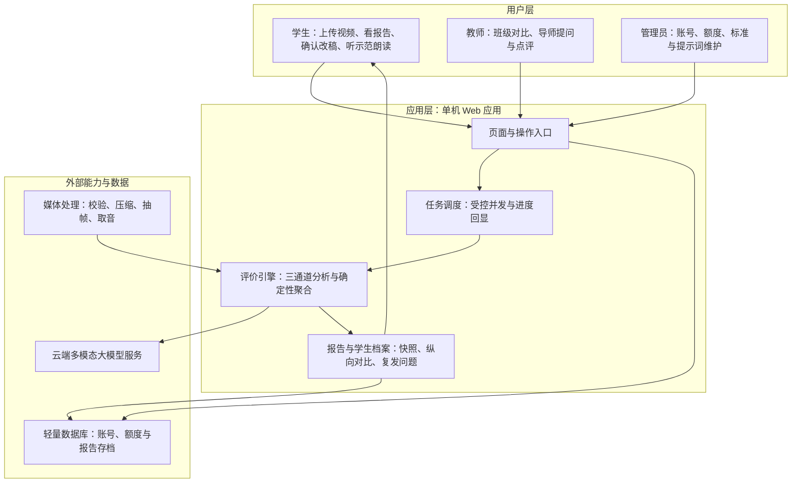

# 演讲视频评价系统 · 项目建议书及方案报告

| 项目 | 说明 |
| --- | --- |
| 项目名称 | 基于多模态人工智能的英语演讲视频智能评价系统建设与应用试点 |
| 项目性质 | 学校教学改革与教育数字化建设项目（应用研发＋应用试点） |
| 项目周期 | 12 个月（2026 年 10 月 — 2027 年 9 月） |
| 拟用经费 | 人民币 7.5 万元（估算，详见第 9 章） |
| 编制日期 | 2026 年 9 月 25 日 |
| 文档定位 | 立项申报用文件。技术细节不在此展开，参见配套的《详细设计报告》《云服务器部署手册》 |

---

## 目录

- [1. 项目概况](#1-项目概况)
- [2. 项目背景与立项必要性](#2-项目背景与立项必要性)
- [3. 建设目标与建设范围](#3-建设目标与建设范围)
- [4. 评价标准体系](#4-评价标准体系)
- [5. 总体建设方案](#5-总体建设方案)
- [6. 创新点与特色](#6-创新点与特色)
- [7. 实施计划与里程碑](#7-实施计划与里程碑)
- [8. 运行环境与资源需求](#8-运行环境与资源需求)
- [9. 经费估算](#9-经费估算)
- [10. 风险分析与对策](#10-风险分析与对策)
- [11. 预期成果与考核指标](#11-预期成果与考核指标)
- [12. 结论与建议](#12-结论与建议)
- [附录. 与现有文档体系的衔接](#附录-与现有文档体系的衔接)

---

## 1. 项目概况

### 1.1 项目名称与性质

本项目拟建设一套面向校内英语演讲教学的**演讲视频智能评价系统**，并依托它开展应用试点。项目属于教育数字化方向的应用研发与教学应用类项目，由任课教师团队提出并主持，信息中心提供运行环境支持，学生以使用者和助研身份参与。

### 1.2 项目摘要

学生在系统里上传一段英语演讲视频，系统在数分钟内返回一份结构化的评价报告：按**七个维度**（语言准确性、发音与语调、流利度与连贯性、内容与思想、主题契合度、态势语与舞台表现、结构与时间控制）给出分数、雷达图、逐维评语与改进建议，并附上从演讲原文中核验过的证据句。报告之后还有一段"训练闭环"：系统对转写文字稿逐条提出纠错与润色建议、由**学生逐条确认后才生效**，再生成一段符合演讲主题情感的**示范朗读**供学生跟读，学生重讲重评后，系统自动做纵向对比并追踪复发问题。

系统已完成功能原型（详见 2.4 已有工作基础），国内外同类产品的现状与本项目定位见 2.3 现状调研与分析，本项目申请的是**从原型走向正式运行**所需的部署、试点、校准、加固与总结经费。

### 1.3 编制依据

- 学校教学改革与教育数字化建设的相关立项要求；
- 教育部等五部门《"人工智能+教育"行动计划》、教育部等九部门《关于加快推进教育数字化的意见》（教办〔2025〕3 号）等国家层面政策文件，要点见 2.3.3；
- 课程组现行《英语演讲评价标准》（七维度、满分一百分，本文档第 4 章原文引用）；
- 已完成的《详细设计报告》《云服务器部署手册》与两份专项方案文档（见附录）；
- 项目组于 2026 年 9 月开展的国内外同类产品与学术进展调研（结论见 2.3）。

---

## 2. 项目背景与立项必要性

### 2.1 教学现状与痛点

英语演讲是"少数人上台、多数人旁观"的环节，评价环节长期存在五个具体问题：

1. **教师批改负荷重。** 一次演讲几分钟，认真评一份要十几分钟；一个班四五十人，一轮评价就占用教师大半个工作周，结果往往是评得粗、反馈短。
2. **反馈周期长，错过纠偏窗口。** 学生讲完往往要等数天才拿到评语，此时对当时语气、节奏的记忆已经模糊，改进建议难以落地。
3. **评分尺度不统一。** 多位教师、多个班级之间打分口径有差异，且纸面评语无法复核，学生对"分怎么来的"缺乏信任。
4. **学生缺少可重复的练习工具。** 发音、口头禅、站姿手势这类问题，学生自己回看视频很难自查；没有低成本的重讲重评渠道，"练"的环节实际是缺位的。
5. **过程数据没有沉淀。** 演讲成绩一次性给出，学生一学期的进步轨迹、共性薄弱维度，教学上没有可分析的数据资产。

### 2.2 政策与技术契机

- 国家层面推进教育数字化战略与人工智能赋能教育，鼓励在学校教学中开展智能评测、个性化学习工具的应用试点，本项目方向与之吻合。
- 多模态大模型技术近两年已具备实用能力：能听懂语音、看懂画面、读懂文稿，并按给定标准给出结构化判断，这使"机器评演讲"从不可用变为可用。
- 云计算与按量计费的模型服务把成本压到了院系级项目可承受的区间：无需自购显卡，一台两核两 G 的云服务器加按次计费的模型调用即可支撑一个年级的日常使用（成本量级见 9.3）。

需要强调的是：单纯"让大模型打个分"存在结果不稳定、无法复核的问题。本项目方案的立足点恰恰是**用工程设计约束模型**——评分标准以数据形式固化并加版本指纹，分数聚合完全确定、可复现，评语必须附原文证据，任何修改建议须经学生确认。这是系统与普通"AI 聊天给建议"的本质区别。

### 2.3 国内外现状调研与分析

项目组在编制本建议书前，从商用产品、学术前沿、政策导向三条线做了现状调研，用于回答两个问题：机器评价口语这件事别人已经做到什么程度，本项目还有没有立项价值。以下为调研结论。

#### 2.3.1 国内商用智能语音评测现状

**技术形态已经成熟。** 国内头部语音厂商的口语评测服务普遍提供"音素—单词—句子—段落"多层级打分，公开资料显示其评测维度覆盖完整度、准确度、流利度、韵律等七类，支持单词朗读、句子朗读、段落朗读、篇章复述等标准题型。

**应用规模最大。** 同批公开资料显示，此类评测技术与中高考英语听说考试同源，已服务十余个省份的高考、上百个地市的中考，年度实测达数百万人次、累计服务数千万人次，长期运行未出现考试安全事故；其日常教学版本已覆盖二十多个省份的高考、上百个地市中考和九千余所中学，同时也为雅思、大学英语四六级等考试的口语部分提供技术支持。

**成本与开放度存在硬约束。** 商用接口按调用量计费，公开报价大致落在每万次十几元至数十元区间，新用户与企业用户各有免费额度；但评分口径由厂商内置、学校不可调整，结果只有分数而无原文证据，闭源云端服务也无法在校内独立部署。

**调研判断一：商用评测解决的是"跟读模仿得像不像"，评的是声音本身。** 它不评价一段演讲讲了什么、结构是否完整、是否超时、态势语如何。"讲得好不好"这一层的机器评价，在国内校园里基本仍是空白。

#### 2.3.2 国际自动口语评测最新进展

**测评形态从单向独白走向对话式。** 以多邻国英语测试 2025 年 6 月上线的交互式口语题为代表，国际语言测评界正把口语题从"对着屏幕独白半分钟"改造为"与系统真人式对话"。公开发表的测评研究显示，借助项目反应理论做自适应出题，等效题量提升约三成、信度超过 0.90，且与雅思口语成绩的相关性略高于传统独白题型；其评分把口语拆为流利度、语法、发音、词汇、连贯性、任务完成度六项子技能，并使用大模型辅助生成题目与配套评分细则。

**多模态大模型评口语是学术热点，但结论是"可用而不可全信"。** 近两年多项研究报告了可参考的量化结果：多模态模型评分与人工评分的相关系数可达 0.7 以上；语音大模型在发音评测任务上超过既有基线模型；也有研究给出反向证据——微调后的多模态模型在整段总分上相关性很高，但在逐条细项一致性和音素级判别上仍然困难。

**调研判断二：国际经验说明大模型评口语在统计上可用，但端到端直接打分的细项一致性与可解释性不足。** 缺口不在算法而在工程约束，这正是本项目采用三通道评分、强制证据引用与确定性分数聚合的依据。

#### 2.3.3 政策导向与合规依据

- 教育部等五部门《"人工智能+教育"行动计划》（2026 年 4 月印发、4 月 10 日发布），坚持应用导向与智能向善，强调以人工智能辅助教学评价、减轻教师重复性工作负担；
- 教育部等九部门《关于加快推进教育数字化的意见》（教办〔2025〕3 号），对数字化教学应用场景落地与基础环境提出系统要求；
- 国家教育数字化战略行动 2025 年部署会（2025 年 3 月 28 日）以"人工智能与教育变革"为主题，发布国家智慧教育平台 2.0 智能版；公开报道显示国家智慧教育公共服务平台用户规模已达 1.78 亿，覆盖 200 多个国家和地区。

**调研判断三：政策鼓励的不是"外购一套系统"，而是"学校自己会用、能改标准、能沉淀数据"的应用研发型试点。** 本项目"标准即数据"的设计正落在政策鼓励的那一侧，且系统全部数据留存在校内可控的云服务器上，符合智能向善与学生数据保护要求。

#### 2.3.4 现状述评与本项目定位

| 对比项 | 国内商用评测产品 | 国际交互式口语测评 | 本项目 |
| --- | --- | --- | --- |
| 评价对象 | 跟读朗读的语音准确度 | 对话式口语的综合语言水平 | 一段完整演讲的内容、结构、表达与舞台表现 |
| 是否评价画面 | 否 | 否 | 是，态势语与舞台表现取自视频帧 |
| 是否评价内容思想 | 否 | 部分，仅任务完成度 | 是，内容与思想、主题契合度两个维度 |
| 评分标准可否校方自定 | 否，厂商内置 | 否，考试机构内置 | 是，标准以数据形式提供、网页可改、带版本指纹 |
| 分数可否复现与审计 | 不透明 | 不透明 | 是，同版本标准可逐份复算复现 |
| 评语是否附原文证据 | 否 | 否 | 是，评语必须引用转写稿证据句 |
| 改稿建议是否经学生确认 | 不涉及 | 不涉及 | 是，学生逐条确认后生效 |
| 成长过程追踪 | 单次成绩 | 单次成绩 | 是，跨次对比与复发问题指纹 |
| 部署与计费方式 | 闭源云端按次计费 | 商业考试服务 | 校内单机自部署、零运维，模型调用双轨记账 |

综合调研，本项目定位明确为**互补而非替代**，理由有三条：

1. **"评声音"已是红海，"评演讲"仍是空白。** 商用产品在语音准确度上已做到考试级，其题型设定决定了它无法覆盖演讲的内容、结构与态势语。本项目不重复建设语音准确度评测的底层算法，而是把它作为可调用的能力之一，重心放在商用产品不覆盖的评价层。
2. **可信度缺口靠工程补齐，这是本项目最有价值的贡献点。** 学术结论已表明端到端打分不稳，而数据化标准、确定性聚合、强制证据、版本指纹这套工程纪律可以把"AI 打分"变成"可复核的评价"。
3. **校园场景的独家资产是教学闭环与过程数据。** 商用产品交付的是一个分数，本系统交付的是报告之后的改稿确认、示范朗读、重讲重评与纵向追踪，这条闭环外购买不到，也只有校方自建才能按本班学情反复调整标准。

### 2.4 已有工作基础

截至建议书编制之日，项目组已完成功能原型，立项的技术风险已被大幅压缩：

| 方面 | 现状 |
| --- | --- |
| 功能范围 | 学生、教师、管理员三类角色的完整流程已实现，共十一个功能页面、三十一个功能入口 |
| 质量验证 | 自动化自检二百一十五项全部通过；网页端到端冒烟测试二百六十三项全部通过 |
| 部署验证 | 已编写完整的云服务器部署手册，按两核两 G 单机环境实测可上线 |
| 成本控制 | 系统内置每次评价的消耗估算与实际用量双轨记账，管理端可查看全站平均消耗 |
| 演示能力 | 系统带"零密钥演示模式"，不开通任何模型服务也能完整走通流程，便于向教学部门现场汇报 |
| 文档体系 | 设计报告、部署手册、两份专项方案已成套（见附录） |

### 2.5 立项必要性小结

痛点真实且长期存在，技术路径已经验证可行，原型已在手——现在缺的是**运行环境、试点组织、评分校准和加固推广**这四件需要立项支持的事。不立项，原型只能停留在演示状态，无法服务教学；立项投入的经费体量小（7.5 万元）、周期短（12 个月）、且每一步都有已验证的技术底座支撑，属于低风险、高确定性的投入。

---

## 3. 建设目标与建设范围

### 3.1 总体目标

建成"上传即评、评后可练、练完可比"的英语演讲智慧评价平台：对一门课的每一位学生，实现**人人有报告、次次有反馈、学期有轨迹**；对教师，把单份评价的人工耗时从十几分钟压缩到审核几分钟；对教学管理，沉淀可分析的过程性评价数据。

### 3.2 具体目标

1. 平台上线：完成正式部署并通过安全与压力检查，支撑不少于十个用户同时在线操作，月度可用率不低于百分之九十九点五。
2. 评价可信：七个维度全部有分数、评语和证据句；同一版本标准下报告可完全复现，换版本有据可查。
3. 教师与系统评分一致：试点期组织双评校准，系统总分与教师评分的相关系数不低于 0.8，据此校准提示词与权重。
4. 训练闭环落地：改稿确认、示范朗读、纵向对比三项能力在试点班级实际使用，人均完整使用不少于四次。
5. 试点规模：覆盖不少于三个教学班、一百二十名学生、累计六百次以上评价。
6. 满意度：学生与教师问卷满意度均不低于百分之八十五。
7. 成果固化：形成试点数据分析报告、软件著作权申请材料与教学改革论文各一套。

### 3.3 建设范围

本期建设内容包括六项：评价引擎正式化部署、试点班级开通与账号治理、评分校准与标准共建、安全与隐私加固、师资培训与教学融入、数据分析与成果总结。

### 3.4 不列入本期的内容

为保证范围可控，以下内容明确不在本期建设：多语种扩展（本期只评英语演讲）、移动端专用应用（网页自适应已够用）、与学校教务系统的正式对接（涉及第三方排期，列为下期方向）、模型微调与自研算法（本期完全使用成熟的云端模型服务）。

---

## 4. 评价标准体系

### 4.1 七个维度与分值

系统评价依据课程组现行标准执行，总分一百分：

| 序号 | 维度 | 分值 | 考察要点 |
| --- | --- | --- | --- |
| 1 | 语言准确性 | 15 | 语法与用词的准确性、多样性和得体性 |
| 2 | 发音与语调 | 15 | 发音清晰度、重音、语调与节奏 |
| 3 | 流利度与连贯性 | 15 | 语流是否顺畅、停顿与口头禅、衔接是否自然 |
| 4 | 内容与思想 | 20 | 内容实质性、观点深度、例证质量（分值最高，是重心） |
| 5 | 主题契合度 | 10 | 是否切题，内容是否联系现实并给出对行业或现象的看法 |
| 6 | 态势语与舞台表现 | 15 | 眼神、手势、站姿、台风与观众感 |
| 7 | 结构与时间控制 | 10 | 开场、主体、收尾的完整性与限时执行情况 |

### 4.2 评分原则

标准落地为四条工程化的评分原则，这也是"机器评分可信"的根基：

1. **三通道独立评判再融合。** 文本通道读演讲文字稿，语音通道听音频，画面通道看抽帧图像，各通道只为自己有资格评判的维度打分，按可信度融合，避免"让看图的评语法"。
2. **确定性聚合、可复现可审计。** 模型给出各维度判断后，总分的合成完全由固定规则完成；同一版本标准、同一份报告，任何时候重算结果一致。
3. **评语不得反向修改分数，且必须带证据。** 叙述层只能解释分数，不能改动分数；评语中引用的语句必须能在演讲原文中找到，找不到即判为无效评语。
4. **缺证折算而非粗暴归零。** 某维度因音频或画面质量确实无法评判时，按权重折算处理并明示原因，不给学生记零分。分数以零点五分为最小粒度，同时给出 A 至 E 等级。

### 4.3 标准的数字化与可维护性

评价标准不是写死在程序里的：九个分组共二十三块提示词以及维度分值，均可在管理端网页上修改并即时生效；每次标准变更生成版本指纹，历史报告按其生成时的版本原样保留，不会出现"改了标准、旧报告分数被悄悄重算"的情况。这保证了教学团队可以持续打磨标准，而评价档案始终保持可信。

---

## 5. 总体建设方案

### 5.1 系统定位与用户角色

系统是单机部署的校园 Web 应用，学生、教师、管理员通过浏览器使用，无需安装任何软件：

- **学生**：上传演讲视频、查看评价报告、逐条确认改稿建议、收听示范朗读、重讲重评并查看纵向进步曲线；
- **教师**：查看班级汇总与横向对比、基于报告向学生发起导师提问并点评作答、参与评价标准校准；
- **管理员**：开通与管理账号（支持名单批量导入）、设置每人评价额度、维护提示词与分值、查看全站消耗与运行状态。

### 5.2 总体架构

系统采用"一个应用、一层数据、两类外部能力"的简洁架构，便于院系级团队自主运维：

### 5.3 核心功能建设内容

1. **智能评价报告**：规格校验通过后自动完成转录与三通道分析，输出七维分数、雷达图、逐维评语、证据句与优先改进项；视频时长与规格在上传时即把关，超长视频先过压缩闸门，避免无谓消耗。
2. **文字稿纠错与小范围改稿**：系统对转写稿逐条给出同音字、术语、语法、口头语清除、润色五类建议，每条建议附带不得触碰的红线约束（例如单条修改幅度、原话实质内容），**全部由学生逐条确认后才写入**，学生不认可则一字不改。
3. **示范朗读**：改稿确认后，系统结合演讲主题分析情感基调，生成一段带情感与语速控制的示范朗读（现配置男声新闻腔风格），供学生跟读模仿，实现"评—改—读—讲"衔接。
4. **纵向对比与复发问题追踪**：默认对比最近三次评价，展示各维度走势；对反复出现的问题生成"复发指纹"并显式提醒，师生不用凭印象回忆。
5. **导师提问与作答点评**：评价完成后系统自动生成追问，学生作答后获得针对性点评，把一次性的评价延伸为一段师生对话。
6. **管理端治理**：消耗估算与实际用量双轨记账、全站平均消耗面板、账号与额度治理、演示模式巡检。

### 5.4 一次评价的完整闭环

### 5.5 技术选型与理由

| 层面 | 选型 | 立项角度的理由 |
| --- | --- | --- |
| 应用框架 | 主流 Python Web 框架加服务端渲染页面 | 技术栈成熟、学校信息中心熟悉、无前端构建链负担 |
| 数据图表 | 服务端直接生成图形 | 浏览器端零重负载，老旧设备也能流畅查看报告 |
| 存储 | 单文件轻量数据库 | 免运维、易备份、规模匹配；无外部数据库与消息中间件 |
| 智能内核 | 阿里云百炼平台的通义千问多模态模型（兼容开放接口协议） | 按量计费、无需自购显卡；接口通用，可低成本更换模型供应商 |
| 媒体处理 | 业界标准音视频工具链 | 免费开源、稳定可靠 |
| 可选组件 | 本地语音转录、画面人像检测、表格报表导出 | 均按开关启用，未开通模型服务时系统仍可完整演示 |
| 依赖规模 | 七个核心依赖加一个可选依赖 | 供应链面小，安全更新负担轻 |

### 5.6 数据安全与隐私保护

- 不开放注册，账号由管理员开通或按名单批量导入；每个用户只能看到自己的数据，教师与管理员按角色查看授权范围。
- 口令仅以强哈希加随机盐方式存储不可逆原文；登录状态经服务器密钥签名并限期失效（默认七天）。
- 每人默认评价额度（可调整），从源头控制数据增量与费用。
- 上传的视频与生成的报告保存在自有服务器，学生可申请删除；送往大模型服务的仅有抽帧图像与转写文本两项加工产物，不回传原始视频。
- 本期为校内教学场景使用，试点前完成学生知情同意与数据使用说明备案。

### 5.7 部署方案

一台两核两 G 的云服务器（或学校内网等价虚拟机）即可上线：应用、数据库、媒体处理同机完成，配置域名与加密传输后对全校开放。每日自动备份数据库与在途文件；模型服务密钥仅在服务器端配置一份，任何页面不暴露。部署过程已在部署手册中逐命令固化，信息中心人员照手册可独立完成。

---

## 6. 创新点与特色

本章回答评审最关心的问题：与市面上的口语评测产品和"直接让大模型打分"的做法相比，本项目新在哪里。

### 6.1 主要创新点

**创新点一：三通道证据化评分与确定性聚合，使机器分数可复现、可审计。**
通行的省事做法是把整段视频交给大模型"打个分、写句评语"，同一段演讲两次评价可能给出不同结果，教师无从复核。本系统把评价拆成三条相互独立的证据通道：听觉通道只依据音频评发音、语调与流利度，视觉通道只依据抽取的画面帧评态势语与舞台表现，文本通道只依据转写文稿评内容、结构与主题契合度；每条通道都必须引用自己看到的证据，最终分数由固定算法聚合、不再经模型二次判断。效果是**同一份视频、同一版本标准，任何时候重算都得到同一个分数**，任何一分争议都能回查到具体证据。学术调研（见 2.3.2）表明端到端直接打分的细项一致性不足，本创新点正是针对该缺口的工程解法。

**创新点二：学生确认门，人工智能无权擅改学生原话。**
系统对转写文字稿会提出纠错与润色建议，但所有建议默认不生效——学生必须在网页上逐条选择接受或拒绝，被接受的部分才进入定稿，且每一次接受或拒绝都留痕可查。这一设计把"AI 替我改"变成"AI 出方案、我做决定"：既规避了机器代写的学术诚信争议，又迫使学生逐句审视自己的表达，使改稿本身成为一次深度学习。国内商用评测产品与国际口语测评均无此环节（见 2.3.4 对照表）。

**创新点三：复发问题指纹与纵向成长追踪。**
系统在每次评价中提取问题的类型指纹（例如口头禅的具体类型、时态错误的类型、结构缺陷的类型），并与该学生的历史记录比对：同一问题第二次出现即被标记为"复发"并在报告中升级提示，第三次出现自动汇入教师端的班级共性问题分析。评价因此从"一次性给分"变成"一学期一条成长轨迹"，学生看得到自己是否真的改正，教师看得到全班该讲哪一课。

**创新点四：先判主题情感、再调语速韵律的自适应示范朗读。**
系统的朗读功能不是通用的文字转语音，而是"演讲示范"：先由模型分析本篇演讲的主题与应有的情感基调，再据此生成语速、重音与停顿的调控指令，交由具备指令控制能力的语音合成模型执行，音色固定为沉稳的新闻播报式男声。学生拿到的不只是一句"你的节奏太平"，而是一段可以直接跟读的、符合本篇演讲场合的标准示范；跟读后重讲重评，形成"听到—讲到—比到"的完整训练回路。

**创新点五：标准即数据，评分口径由教师在线维护并带版本指纹。**
七个维度的评分细则不写在程序代码里，而是组织为九个分组、共二十三块可编辑的提示词文本，教师与管理员在网页上修改后即可生效；每次发布自动生成版本指纹，任何一份历史报告都能反查"当时依据的是哪一版标准"。配合长视频的成本闸门（超过阈值自动降帧再评并留档说明），学校既可以按本班学情自主演化评价标准，又不会出现"标准一改、旧报告全部作废"的失控局面。

### 6.2 创新点与问题的对应关系

| 创新点 | 针对的真实问题 | 行业现有做法 | 本项目的验证方式 |
| --- | --- | --- | --- |
| 三通道评分与确定性聚合 | AI 打分不稳定、教师不敢用 | 端到端一次出分，结果不可复现 | 同一视频同版本标准重复复算，分数必须一致；试点期与教师评分做双评相关分析 |
| 学生确认门 | 机器代写引发诚信争议、学生不看建议 | 直接给出修改后的文本 | 定稿与原始转写稿的差异必须全部对应学生的一次确认动作 |
| 复发问题指纹追踪 | 反馈一次性、进步不可见 | 单次成绩单 | 报告与教师端可展示跨次对比与复发标记 |
| 主题情感自适应示范朗读 | 只有扣分没有样例，学生不知怎么算好 | 通用朗读或不提供朗读 | 同一文稿在不同主题情感下生成不同语速与韵律的示范音 |
| 标准即数据与版本指纹 | 评价口径写死在代码里、教师无法参与 | 厂商内置标准、校方不可改 | 管理员网页改标准即时生效，报告标注所用标准版本 |

### 6.3 项目特色

1. **教学可用性优先。** 系统提供零密钥演示模式，不开通任何模型服务也能完整走通全部流程，便于向教学部门现场汇报；教师端支持批量查看与导出，报告以雷达图和证据句呈现，不要求使用者具备任何技术背景。
2. **成本可控、可预算、可核查。** 每次评价同时记录"事前估算消耗"与"实际发生消耗"两轨数据，管理端可查看全站平均值；长视频设有成本闸门，超出阈值自动降帧再评。院系级项目最担心的"模型费用失控"在本系统中是可预测、可复盘的（测算见 9.3）。
3. **工程纪律与文档成套。** 原型阶段已有二百一十五项自动化自检与二百六十三项端到端冒烟测试全部通过，设计报告、部署手册与两份专项方案配套齐备，交付物可核查、可交接，不依赖单一开发者。
4. **可复制、可推广。** 由于评价标准以数据形式存在，本系统的方法论可平移到语文朗诵、思政课宣讲、毕业答辩演练等同类场景——更换的是评分标准与提示词，不是程序。本期按 3.4 范围承诺只建设英语演讲一个学科，多场景复制列为下一期方向。

---

## 7. 实施计划与里程碑

### 7.1 项目周期与阶段划分

项目周期十二个月，按"先环境、再校准、后试点、终推广"排布为五个阶段。由于功能原型已完成，开发性工作主要剩余加固与校准，计划以试点组织为主线：

| 阶段 | 时间 | 主要工作 |
| --- | --- | --- |
| 阶段一：环境落地与方案细化 | 2026 年 10 月—11 月 | 服务器采购与正式部署；域名、加密传输与备份上线；账号治理与知情同意流程建立 |
| 阶段二：评分校准与安全加固 | 2026 年 12 月—2027 年 2 月 | 组织教师双评、计算一致性并校准提示词与分值；完成安全检查与压力检查；修复试点前问题 |
| 阶段三：第一轮试点 | 2027 年 3 月—5 月 | 三个教学班开课使用；每周回收问题清单；管理端监测消耗与可用率 |
| 阶段四：优化与第二轮试点 | 2027 年 6 月—7 月 | 依据试点数据调整额度、报告呈现与训练闭环细节；扩展班级验证改动 |
| 阶段五：总结与验收推广 | 2027 年 8 月—9 月 | 汇总过程性数据形成分析报告；完成软件著作权申请与论文投稿；向教研组移交运维 |

### 7.2 里程碑与交付物

| 里程碑 | 时点 | 交付物与验收方式 |
| --- | --- | --- |
| M1 平台正式上线 | 2026 年 11 月底 | 外网可访问的生产环境；部署检查单逐项签字 |
| M2 评分通过校准 | 2027 年 2 月底 | 双评一致性分析报告，相关系数不低于 0.8 的结论证明 |
| M3 第一轮试点完成 | 2027 年 5 月底 | 试点运行报告：使用量、可用率、问题闭环清单、满意度中期数据 |
| M4 全部试点完成 | 2027 年 7 月底 | 累计评价不少于六百次的使用证明与学生成长轨迹样例集 |
| M5 项目验收 | 2027 年 9 月底 | 结题报告、数据分析报告、软著申请材料、论文、移交文档 |

### 7.3 组织与人员分工

项目设负责人一名，统筹进度与对外协调；任课教师两名，负责标准共建、双评校准与试点组织；学生开发助研若干名，负责功能迭代与测试（原型即由学生团队在教师指导下完成，延续同一队伍可降低交接成本）；信息中心工程师一名，负责服务器、备份与安全巡检。经费使用按学校项目管理规定执行，专款专用。

---

## 8. 运行环境与资源需求

### 8.1 计算与存储资源

| 资源 | 规格 | 说明 |
| --- | --- | --- |
| 云服务器 | 2 vCPU、2 GiB 内存、40 GiB 以上系统盘 | 已实测满足上线要求；随试点规模可平滑升配 |
| 对象与磁盘存储 | 首年按 100 GiB 规划 | 视频为临时加工件，报告快照为长期数据，占用可控 |
| 网络带宽 | 按量计费公网带宽 | 上传集中发生在课前，日常浏览负载很轻 |
| 备份 | 每日自动备份，保留三十天 | 数据库与在途媒体文件双份 |

### 8.2 网络与外部服务

系统对外只依赖一项付费服务：阿里云百炼平台的大模型调用（含多模态理解、文本生成与语音合成），按量计费、无最低消费。学校如统一采购该服务或已有教育合作额度，本项目该项经费可等额调减。

### 8.3 并发能力与容量规划

设计基线为不少于十个用户同时在线操作；评测任务以受控并发调度，忙时排队并向用户回显进度，不压垮服务器。以三个班一百二十人、人均五次计算，全周期约六百次评价，单次数分钟完成，容量余量充足。

---

## 9. 经费估算

### 9.1 估算依据

经费按"基础设施从简、模型调用按实测口径估算、人员与工作量的钱放在刀刃上"的原则编制。其中模型调用成本依据系统内置的计价口径测算：画面每抽取一张图按约一千个词元计费，默认每次评价抽取八至二十九张，极限一百张封顶；音频仅取前十五分钟；文字稿与提示词为常规文本量。

### 9.2 费用汇总表

| 序号 | 科目 | 测算说明 | 金额（万元） |
| --- | --- | --- | --- |
| 1 | 云服务与存储 | 两核两 G 服务器、带宽与备份，首年费用 | 0.45 |
| 2 | 大模型调用费 | 约六百次试点评价及校准、演示复算，按 9.3 口径上浮五成余量 | 1.20 |
| 3 | 开发与集成 | 学生助研津贴、功能加固与接口对接工作量 | 2.50 |
| 4 | 测试与安全 | 回归测试、安全检查、数据合规审查 | 0.80 |
| 5 | 师资培训与助教津贴 | 试点教师双评工作量、助教答疑 | 0.90 |
| 6 | 资料与成果 | 文档印制、软著申请、论文版面 | 0.40 |
| 7 | 专家咨询与验收 | 方案论证、中期指导、结题验收 | 0.60 |
| 8 | 不可预见费 | 约前七项之和的一成 | 0.65 |
| — | **合计** | — | **7.50** |

### 9.3 大模型调用成本测算

单次评价的词元消耗量级如下（画面通道为主要变量）：

| 抽帧档位 | 画面通道输入 | 单次评价合计（含文本与语音通道） |
| --- | --- | --- |
| 经济档（八帧） | 约 0.8 万 | 约 2 万至 4 万 |
| 常规档（二十九帧） | 约 2.9 万 | 约 5 万至 8 万 |
| 高配档（一百帧封顶） | 约 10 万 | 约 15 万以内 |

按当前主流多模态服务"每一百万词元个位数元级"的公开价格区间折算，单次评价直接成本通常在一元上下、高配模式数元以内。全周期按六百次评价加校准复算与价格波动余量，科目二安排 1.20 万元充足；系统自带的实际用量记账面板逐月核对，超出预期即下调抽帧档位，费用始终可控可查。

### 9.4 经费使用与管理

经费按阶段拨付：阶段一与阶段二使用约四成（环境与校准），试点期使用约四成（调用与人员），验收期使用约两成（总结与成果）。所有科目凭据报销，模型调用费以平台账单与系统记账面板双账对照，结余按学校规定处理。

---

## 10. 风险分析与对策

### 10.1 风险识别与应对

| 风险 | 可能性 | 影响 | 应对措施 |
| --- | --- | --- | --- |
| 机器评分与教师判断存在系统性偏差 | 中 | 高 | 阶段二双评校准为强制里程碑，相关系数不达标不进试点；提示词与分值网页可调，校准成本低 |
| 模型服务价格调整或接口变更 | 中 | 中 | 采用通用开放接口协议，更换供应商只改配置不改代码；系统保留抽帧数量与额度两个成本阀门 |
| 学生视频与声音数据引发隐私关切 | 低 | 高 | 不开放注册、数据隔离、不回传原始视频、可删除、试点前完成知情同意；万一出现争议可整体停用而不影响其他教学系统 |
| 试点组织不力、使用量不足 | 中 | 中 | 把"上传—看报告—确认改稿"计入课程平时环节；管理端实时可见使用量，连续两周偏低即介入 |
| 单机故障造成服务中断 | 低 | 中 | 每日备份、部署手册固化恢复步骤；目标可用率允许每月约三小时计划内停机 |
| 高峰期并发不足 | 低 | 低 | 任务排队与进度回显保证不丢单；升配云主机为参数级操作 |
| 复发问题追踪被"同义改写"干扰 | 高 | 低 | 属已知算法局限，试点期以人工抽检校准提醒文案，不影响分数正确性 |

### 10.2 已知局限与消解安排

设计文档如实记录了当前的十多项已知限制，其中对立项决策有影响的四条及消解安排：一是定位为单机构轻量部署，不追求大规模分布式，本期百余人规模恰好匹配；二是不内置邮件与找回密码，由管理员重置口令代替，试点规模下成本可接受；三是提示词修改暂不参与版本指纹，本期以管理端操作登记制度弥补；四是词元统计含粗估成分，以平台实际账单逐月对齐。上述局限全部在可接受、可监控、可改进范围内，无一影响"评价可信"这一核心主张。

---

## 11. 预期成果与考核指标

### 11.1 成果形式

1. **一套可用平台**：正式上线运行的演讲视频智能评价系统，含完整源代码、文档与备份恢复预案；
2. **一组标准资产**：数字化、可维护、带版本指纹的七维英语演讲评价标准及二十三块提示词库；
3. **一份试点报告**：两个学期轮次、六百次以上评价的过程性数据分析与学生成长轨迹案例集；
4. **一批固化成果**：软件著作权申请一项、教学改革论文一至两篇、向其他语种和课程迁移的使用指南一份。

### 11.2 考核指标

| 类别 | 指标 | 目标值 |
| --- | --- | --- |
| 平台 | 月度可用率 | 不低于 99.5% |
| 平台 | 三分钟视频出报告时长 | 不超过 5 分钟 |
| 平台 | 同版本标准下报告复现 | 完全一致、有据可查 |
| 质量 | 系统总分与教师评分相关系数 | 不低于 0.8 |
| 应用 | 覆盖教学班 / 学生数 / 累计评价次数 | 不少于 3 个 / 120 人 / 600 次 |
| 应用 | 学生人均完整使用次数 | 不低于 4 次 |
| 闭环 | 定稿改动中经学生确认的比例 | 百分之百，无未经确认的改动 |
| 闭环 | 示范朗读使用率与重讲重评完成率 | 均不低于 60% |
| 闭环 | 复发问题追踪与跨次对比覆盖 | 试点班级学生全覆盖 |
| 标准 | 教师参与修改评分标准的组数 | 不少于 3 组，且有版本记录 |
| 评价 | 师生问卷满意度 | 均不低于 85% |
| 经费 | 模型调用实际支出对预算 | 不超支且有账单核对记录 |

### 11.3 应用推广与可持续性

系统"评价标准是数据不是代码"的设计，意味着向语文朗读、思政宣讲、答辩演练等场景推广时，只需在网页上更换标准与提示词，无需二次开发。运行费用主要为按量计费的模型调用与千元级的服务器年费，试点结束后可并入院系常规信息化预算维持运行；学生助研梯队逐年换届交接文档齐备，不存在"人走系统停"的风险。

---

## 12. 结论与建议

### 12.1 结论

本项目痛点真实、方案经过原型验证、经费体量小、风险均有对策，具备立项条件。建议按本报告第 7 章计划批准立项，支持系统于 2026 年秋季学期末完成正式部署、2027 年春季学期进入第一轮试点。

### 12.2 建议事项

1. 批准项目立项及 7.5 万元经费估算（如学校已统一采购大模型服务，则相应调减科目二并等额核减总额）；
2. 请信息中心协调云服务器资源与域名备案，纳入学校资产管理；
3. 请教学管理部门将试点班级与双评教师工作量计入教学安排；
4. 建议以本项目成果为基础，两年内评估向其他口语类课程推广的可行性。

---

## 附录. 与现有文档体系的衔接

本文档为立项申报文件，与既有工程文档的关系如下，评审专家可按需溯源：

| 文档 | 用途 | 可核验的本文档论断 |
| --- | --- | --- |
| 详细设计报告 | 系统架构、评分算法、页面与配置的完整工程设计 | 第 4 章评分原则、第 5 章方案细节、10.2 条已知局限清单 |
| 云服务器部署手册 | 两核两 G 单机上线的逐命令操作与运维规程 | 8.1 资源规格、5.7 部署方案、9.2 科目一测算 |
| 方案：版本指纹与压缩闸门 | 发布链路防错与长视频成本闸门的专项设计 | 5.4 闭环中的压缩闸门、4.3 版本指纹 |
| 方案：文字稿纠错与朗读合成 | 改稿五类建议、学生确认门与示范朗读的专项设计 | 5.3 条第 2、3 项功能 |
| 评价标准原文 | 课程组现行七维度评分标准 | 4.1 表格全部维度与分值 |
| 外部公开资料 | 商用口语评测产品与考试服务的公开数据、国际自适应口语测评的公开研究、教育部等部委政策文件 | 2.3 各节现状判断与 6.2 对照表中的行业现有做法 |
